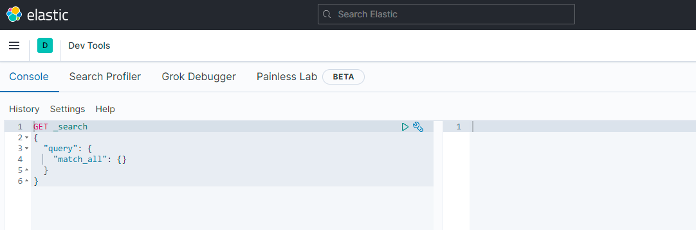
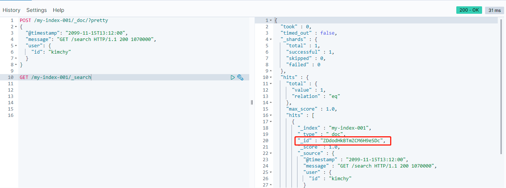
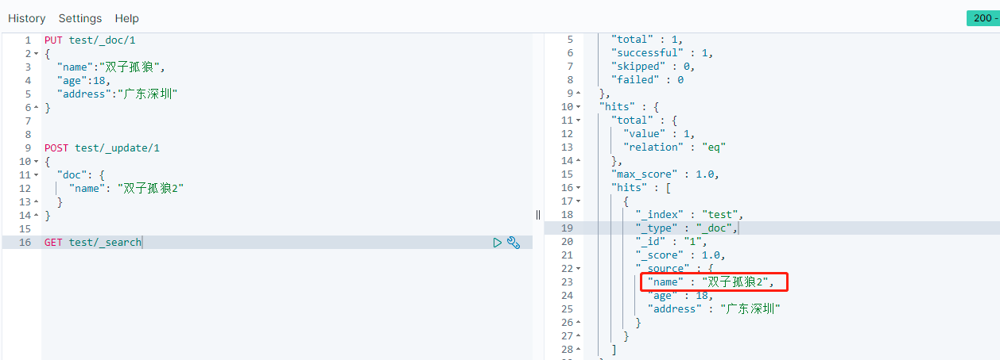

[TOC]

# 前言

`Elasticsearch` 是由 `Shay Banon` 发起的一个开源的分布式搜索服务，自 `2010` 年 `2` 月发布以来，该项目已发展成为搜索和数据分析解决方案领域中极其重要的一员，广泛应用于声名卓著或鲜为人知的搜索应用程序。此外，由于其分布式性质和实时功能，许多人把它作为文档数据库。

# 可视化工具

正如关系型数据库一样，我们使用 `Elasticsearch` 时也需要一款可视化工具，最常用的就是 `kibana`，而这也是 `ELK` 组建中的 `K`，剩下的 `L` 就是 `Logstash`。

## kibana

`Kibana` 是一款非常强大的工具，使用 `kibana`，我们可以做以下三件事：

1. 搜索，观察和保护： 从发现文档到分析日志再到发现安全漏洞，Kibana是您访问这些功能及其他功能的门户。
2. 可视化即数据分析：分析在图表，仪表，地图等发现的数据，并将它们组合到仪表板。
3. 管理监控即保护 `Elastic Stack`：管理索引和提取管道，监视Elastic Stack集群的运行状况，并控制哪些用户可以访问哪些功能。

## kibana 的安装

`kibana` 的安装也比较简单，[点击这里](https://www.elastic.co/guide/en/kibana/current/targz.html#targz-layout)下载对应版本，并进行解压，解压后的主目录即为 `$KIBANA_HOME` 路径：


同样的，我们需要进入 `config` 目录下，修改 `kibana` 的配置文件 `kibana.yml`。

### kibana 配置

和 `Elasticsearch` 一样，安装好 `kibana` 之后，我们也需要对其中一些重要的配置文件进行配置：

- elasticsearch.hosts

配置需要连接的 `Elasticsearch` 服务，如果配置多个服务，则必须属于同一个 `Elasticsearch` 集群，默认值为：

```yaml
elasticsearch.hosts: ["http://localhost:9200"]
```

- server.name

标识当前 `kibana` 的唯一实例，默认是主机名，这个只是起到一个描述标识作用。

- server.host

指定 `kibana` 的主机名，默认 `localhost`，表示只允许本机访问。如果需要远程连接，则需要将此配置修改为外网 `ip` 地址或者域名等非本地回环地址，或者可以使用 `0.0.0.0` 允许所有远程主机连接。

- server.port

配置 `kibana` 的端口号，默认是 `5601`。

- elasticsearch.requestTimeout

等待后台或者等待 `Elasticsearch` 响应的毫秒数，默认值为：30000.

- elasticsearch.pingTimeout

等待 `Elasticsearch` 的 `ping` 的返回毫秒数，默认值等于 `elasticsearch.requestTimeout` 配置的时间。

- elasticsearch.username 和 elasticsearch.password

如果 `Elasticsearch` 配置了账号密码，则需要在这里配置上账号和密码。

- path.data

`Kibana` 中存储没有保存在 `Elasticsearch` 中的持久化数据的路径。

- logging.dest

指定 `log` 路径，默认为 `stdout`。

- server.basePath

指定访问 `kibana` 的基础路径，默认为 `/`，一般如果要通过 `nginx` 等中间件进行代理的话，会设置基础路径。

- server.rewriteBasePath

重定向之后路径是否保留 `server.basePath` 路径，在 `kibana 6.3` 及更早的版本默认是 `false`，在 `kibana 7.0` 之后的版本中默认为 `true`。

## kibana 的启动

配置完只要配置文件之后，就可以进入 `bin` 目录执行命令 `./kibana` 启动 `kibana`，如果想要在后台启动，则可以执行命令 `./kibana &`。

启动之后就可以访问 `kibana`：`http://ip:5601/{basePath}`

访问之后，打开左边的 `Dev Tools`，就可以开始执行属于 `Elasticsearch` 的 "sql 语句" 进行增删改查等操作了：



除了 `Dev Tools` 之外，`kibana` 还有许多其他强大的功能，大家可以自行去尝试操作。

# Elasticsearch 入门操作

经过一系列操作，终于可以开始操作 `Elasticsearch` 了，`Elasticsearch` 中的 `API` 遵循了 `REST` 风格，利用其提供的 `REST API` 可以管理索引，更改实例参数，检查节点和集群状态，并且对索引中的文档数据数据进行 `CRUD` 操作。

## 操作 index

索引相当于数据库，所以我们先来学习一下索引的基本操作。

### 创建 index

创建索引一般使用 `PUT` 方法：

```java
PUT /my-index-001
```

如果有定义 `mapping`，则可以在创建索引的同时带上 `mapping`：

```java
PUT /my-index-002
{
  "mappings": {
    "properties": {
      "field1": { "type": "text" }
    }
  }
}
```

同时，创建索引的时候还可以给索引创建别名：

```java
PUT /my-index-003
{
  "mappings": {
    "properties": {
      "field1": { "type": "text" }
    }
  },
  "aliases": {
    "alias_name": {}
  }
}
```

有了别名之后，查询索引可以使用别名进行查询。

#### 索引别名有什么用

索引别名其实在某些场景的时候是非常有用的，比如当我们上线之后，如果因为某些业务变动，导致需要修改字段，那么这时候在 `Elasticsearch` 中就需要重建索引。重建索引的时候我们可以指定一个相同的别名，而如果我们的代码中就是通过别名进行查询时，这时候重建索引后就可以实现无缝衔接了。

### 删除索引

删除索引采用 `DELETE` 方法。

```java
DELETE /my-index-0001
```

### 查询索引

查询索引信息采用 `GET` 方法，这个可以返回索引的 `setting`，`mapping`，`aliases` 以及分片等信息。

```java
GET /my-index-001
```

### exist 索引

判断索引是否存在，采用的是 `HEAD` 方法。

```java
HEAD /my-index-001
```

- clone index

克隆索引之前，必须要先把一个索引改成只读（同时需保证集群状态为绿色）：

```java
PUT /my-index-004/_settings
{
  "settings": {
    "index.blocks.write": true
  }
} 
```

改成只读后，就可以使用 `POST` 方法进行克隆索引：

```java
POST /my-index-004/_clone/cloned-my-index-004
```

## 操作 document

学会了 `index` 的基本操作，接下来就就可以学习一下 `document`（数据） 的基本操作。

### 插入 document

插入 `document` 采用的是 `POST` 方法：

```java
POST /my-index-001/_doc/?pretty
{
  "@timestamp": "2099-11-15T13:12:00",
  "message": "GET /search HTTP/1.1 200 1070000",
  "user": {
    "id": "kimchy"
  }
}
```

上面的语句中因为没有生成 `id`，所以 `Elasticsearch` 会自动生成一个 `id` 值。

插入指定 `id` 文档，则可以使用 `_resource` 语句：

```java
PUT my-index-001/_create/1
{
  "@timestamp": "2099-11-15T13:12:00",
  "message": "GET /search HTTP/1.1 200 1070000",
  "user": {
    "id": "kimchy"
  }
}
```

或者指定 `op_type=create`：

```java
PUT my-index-001/_doc/2?op_type=create
{
  "@timestamp": "2099-11-15T13:12:00",
  "message": "GET /search HTTP/1.1 200 1070000",
  "user": {
    "id": "kimchy"
  }
}
```

### 查询 document

简单的查询语句可以使用 `GET` 方法：

```java
GET /my-index-001/_search
```

查询之后得到如下结果（我们的源数据在 `hits` 里面，外面的字段是 `Elasticsearch` 自带的通用字段）：



如果想只查询特定 `id` 文档则可以使用如下语句：

```java
GET /my-index-001/_doc/1
```

而如果我们想指定返回字段或者指定不返回字段，则可以使用 `_source` 等参数（下面这句话则表示只返回 `*.id` 的字段且不返回 `@timestamp` 字段）：

```java
GET my-index-001/_doc/1?_source_includes=*.id&_source_excludes=@timestamp
```

有些有时候如果针对我们自己存储的字段，一个都不想返回，则可以使用如下语句：

```java
GET my-index-001/_doc/1?_source=false
```

### 删除 document

删除文档使用 `DELETE` 方法，删除语法为：`DELETE /<index>/_doc/<_id>`。

指定 `id` 删除，超时时间为 `5` 分钟：

```java
DELETE /my-index-001/_doc/1?timeout=5m
```

如果想删除所有字段，则可以使用 `delete_by_query` 语句：

```java
POST my-index-001/_delete_by_query
{
  "query": {
    "match_all": {}
  }
}
```

同样的，`delete_by_query` 也可以指定条件删除：

```java
POST /my-index-001/_delete_by_query
{
  "query": {
    "match": {
      "user.id": "elkbee"
    }
  }
}
```

### 更新 document

更新 `document` 一般使用 `POST` 方法，使用 `_update` 类型，下面我们来演示一个更新语句：

- 插入一条数据到 `test` 索引：

```java
PUT test/_doc/1
{
  "name":"双子孤狼",
  "age":18,
  "address":"广东深圳"
}
```

- 对 `name` 字段进行更新：

```java
POST test/_update/1
{
  "doc": {
    "name": "双子孤狼2"
  }
}
```

- 执行查询语句 `GET test/_search` 进行查询，则发现 `name` 字段已被更新：



#### 使用脚本更新 document

更新语句还可以使用 `script` 来实现更灵活的操作（如下则表示将 `age` 字段增加 `4`）：

```java
POST test/_update/1
{
  "script" : {
    "source": "ctx._source.age += params.count",
    "lang": "painless",
    "params" : {
      "count" : 4
    }
  }
}
```

和 `delete_by_query` 语句一样，更新语句也可以使用 `update_by_query` 语句：

```java
POST test/_update_by_query
{
  "script": {
    "source": "ctx._source.age += params.count",
    "lang": "painless",
    "params" : {
      "count" : 4
    }
  },
  "query": {
    "match": {
      "name": "双子孤狼2"
    }
  }
}
```

## reindex 操作

有时候我们需要将一个索引的数据复制到另一个索引，那么这时候就可以使用 `reindex` 操作，这个操作和前面的 `clone` 操作的区别是 `reindex` 操作只会迁移文档数据，而不会将 `setting`，`mapping`以及分片等信息迁移到新索引，而且在执行 `reindex` 操作时不需要将旧索引设置为只读状态。

```java
POST _reindex?wait_for_completion=false
{
  "source": {
    "index": "old-index"
  },
  "dest": {
    "index": "new-index"
  }
}
```

`wait_for_completion` 参数默认为 `true`，表示当前操作会一直阻塞直到成功为止，如果到了超时时间还没有完成则会报错，所以如果数据量比较大可以修改 `wait_for_completion` 参数为 `false`。

# 总结

本文主要介绍了 `kibana` 的安装及一些主要的配置，并通过 `kibana` 介绍了 `Elasticsearch` 中对 `index` 和 `document` 的一些基本的增删改查操作。当然，如果想要深入使用 `Elasticsearch`，这些语句是远远不够的，`Elasticsearch` 的一些高级查询及分析语句才是 `Elasticsearch` 的核心。