[TOC]


# 前言

本文从 `ConcurrentHashMap` 常见的面试问题引入话题，并逐步揭开其设计原理，相信读完本文，对面试中的相关问题会有很大的帮助。

`HashMap` 在我们日常的开发中使用频率最高的一个工具类之一，然而使用 `HashMap` 最大的问题之一就是它是线程不安全的，如果我们想要线程安全应该怎么办呢？这时候就可以选择使用 `ConcurrentHashMap`，`ConcurrentHashMap` 和 `HashMap` 的功能是基本一样的，`ConcurrentHashMap` 是 `HashMap` 的线程安全版本。

因 `ConcurrentHashMap` 和 `HashMap` 排除线程的安全性方面，所以有很多相同的设计思想本文不会做太多重复介绍，如果大家不了解 `HashMap` 底层实现原理，建议在阅读本文可以先阅读 [手把手轻松读懂HashMap源码](https://zhouwenxing.github.io/corejava/手把手轻松读懂HashMap源码) 了解 `HashMap` 的设计思想。

# ConcurrentHashMap 原理

`ConcurrentHashMap` 是 `HashMap` 的线程安全版本，其内部和 `HashMap` 一样，也是采用了数组 + 链表 + 红黑树的方式来实现。

如何实现线程的安全性？加锁。但是这个锁应该怎么加呢？在 `HashTable` 中，是直接在 `put` 和 `get` 方法上加上了 `synchronized`，理论上来说 `ConcurrentHashMap` 也可以这么做，但是这么做锁的粒度太大，会非常影响并发性能，所以在 `ConcurrentHashMap ` 中并没有采用这么直接简单粗暴的方法，其内部采用了非常精妙的设计，大大减少了锁的竞争，提升了并发性能。

`ConcurrentHashMap` 中的初始化和 `HashMap` 中一样，而且容量也会调整为 2 的 N 次幂，在这里不做重复介绍这么做的原因。

## JDK1.8 版本 ConcurrentHashMap 做了什么改进

在 `JDK1.7` 版本中，`ConcurrentHashMap` 由数组 + Segment + 分段锁实现，其内部氛围一个个段（`Segment`）数组，Segment`` 通过继承 `ReentrantLock` 来进行加锁，通过每次锁住一个 `segment` 来降低锁的粒度而且保证了每个 `segment` 内的操作的线程安全性，从而实现全局线程安全。下图就是 `JDK1.7` 版本中 `ConcurrentHashMap` 的结构示意图：

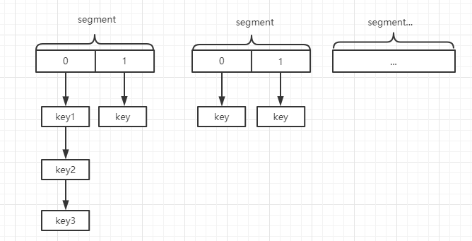

但是这么做的缺陷就是每次通过 `hash` 确认位置时需要 `2` 次才能定位到当前 `key` 应该落在哪个槽：

1. 通过 `hash` 值和 `段数组长度-1` 进行位运算确认当前 `key` 属于哪个段，即确认其在 `segments` 数组的位置。
2. 再次通过 `hash` 值和 `table` 数组（即 `ConcurrentHashMap` 底层存储数据的数组）长度 - 1进行位运算确认其所在桶。

为了进一步优化性能，在 `jdk1.8` 版本中，对 `ConcurrentHashMap ` 做了优化，取消了分段锁的设计，取而代之的是通过 `cas` 操作和 `synchronized` 关键字来实现优化，而扩容的时候也利用了一种分而治之的思想来提升扩容效率，在 `JDK1.8` 中 `ConcurrentHashMap` 的存储结构和 `HashMap` 基本一致，如下图所示：

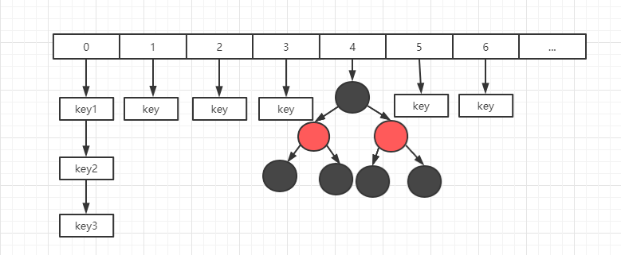

## 为什么 key 和 value 不允许为 null

在 `HashMap` 中，`key` 和 `value` 都是可以为 `null` 的，但是在 `ConcurrentHashMap` 中却不允许，这是为什么呢？

作者 `Doug Lea` 本身对这个问题有过回答，在并发编程中，`null` 值容易引来歧义， 假如先调用 `get(key)` 返回的结果是 `null`，那么我们无法确认是因为当时这个 `key` 对应的 `value` 本身放的就是 `null`，还是说这个 `key` 值根本不存在，这会引起歧义，如果在非并发编程中，可以进一步通过调用 `containsKey` 方法来进行判断，但是并发编程中无法保证两个方法之间没有其他线程来修改 `key` 值，所以就直接禁止了 `null` 值的存在。

而且作者 `Doug Lea` 本身也认为，假如允许在集合，如 `map` 和 `set` 等存在 `null` 值的话，即使在非并发集合中也有一种公开允许程序中存在错误的意思，这也是 `Doug Lea` 和 `Josh Bloch`（`HashMap`作者之一） 在设计问题上少数不同意见之一，而 `ConcurrentHashMap` 是 `Doug Lea` 一个人开发的，所以就直接禁止了 `null` 值的存在。

 ## ConcurrentHashMap 如何保证线程的安全性

在 `ConcurrentHashMap` 中，采用了大量的分而治之的思想来降低锁的粒度，提升并发性能。其源码中大量使用了 `cas` 操作来保证安全性，而不是和 `HashTable` 一样，不论什么方法，直接简单粗暴的使用 `synchronized`关键字来实现，接下来的原理分析中，部分和 `HashMap` 类似之处本文就不在重复，本文主要从安全性方面来分析 `ConcurrentHashMap` 的设计。

### 如何用 CAS 保证数组初始化的安全

下面就是初始化的方法：

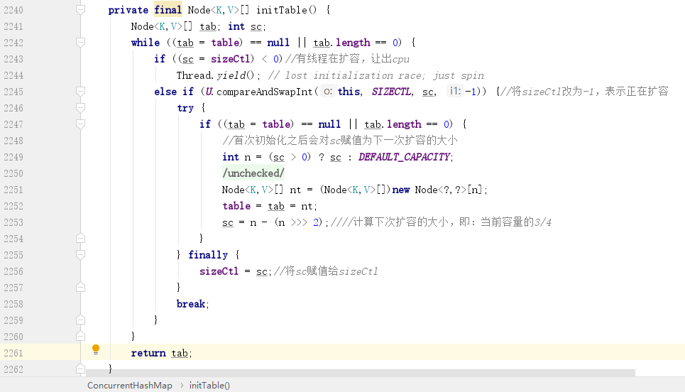

这里面有一个非常重要的变量 `sizeCtl`，这个变量对理解整个 `ConcurrentHashMap ` 的原理非常重要。

`sizeCtl` 有四个含义：

- `sizeCtl<-1` 表示有 `N-1` 个线程正在执行扩容操作，如 `-2` 就表示有 `2-1` 个线程正在扩容。
- `sizeCtl=-1` 占位符，表示当前正在初始化数组。
- `sizeCtl=0` 默认状态，表示数组还没有被初始化。
- `sizeCtl>0` 记录下一次需要扩容的大小。

知道了这个变量的含义，上面的方法就好理解了，第二个分支采用了 `CAS` 操作，因为 `SIZECTL` 默认为 `0`，所以这里如果可以替换成功，则当前线程可以执行初始化操作，`CAS` 失败，说明其他线程抢先一步把 `sizeCtl` 改为了 `-1`。扩容成功之后会把下一次扩容的阈值赋值给 `sc`，即 `sizeClt`。

### put 操作如何保证数组元素的可见性

`ConcurrentHashMap ` 中存储数据采用的 `Node` 数组是采用了 `volatile` 来修饰的，但是这只能保证数组的引用在不同线程之间是可用的，并不能保证数组内部的元素在各个线程之间也是可见的，所以这里我们判定某一个桶是否有元素，并不能直接通过下标来访问，那么应该如何访问呢？源码给你答案：

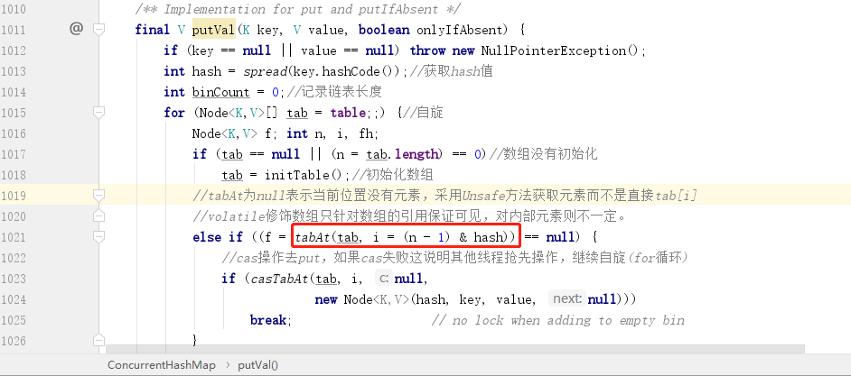

可以看到，这里是通过 `tabAt` 方法来获取元素，而 `tableAt` 方法实际上就是一个 `CAS` 操作：

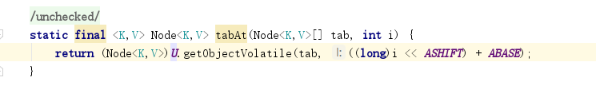

如果发现当前节点元素为空，也是通过 `CAS` 操作（`casTabAt`）来存储当前元素。

如果当前节点元素不为空，则会使用 `` 关键字锁住当前节点，并进行对应的设值操作：

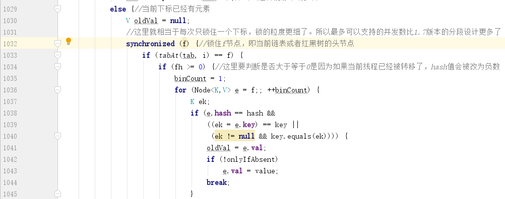

### 精妙的计数方式

在 `HashMap` 中，调用 `put` 方法之后会通过 `++size` 的方式来存储当前集合中元素的个数，但是在并发模式下，这种操作是不安全的，所以不能通过这种方式，那么是否可以通过 `CAS` 操作来修改 `size` 呢？

直接通过 `CAS` 操作来修改 `size` 是可行的，但是假如同时有非常多的线程要修改 `size` 操作，那么只会有一个线程能够替换成功，其他线程只能不断的尝试 `CAS`，这会影响到 `ConcurrentHashMap ` 集合的性能，所以作者就想到了一个分而治之的思想来完成计数。

作者定义了一个数组来计数，而且这个用来计数的数组也能扩容，每次线程需要计数的时候，都通过随机的方式获取一个数组下标的位置进行操作，这样就可以尽可能的降低了锁的粒度，最后获取 `size` 时，则通过遍历数组来实现计数：

```java
//用来计数的数组，大小为2的N次幂，默认为2
private transient volatile CounterCell[] counterCells;

@sun.misc.Contended static final class CounterCell {//数组中的对象
        volatile long value;//存储元素个数
        CounterCell(long x) { value = x; }
    }
```

#### addCount 计数方法

接下来我们看看 `addCount` 方法：

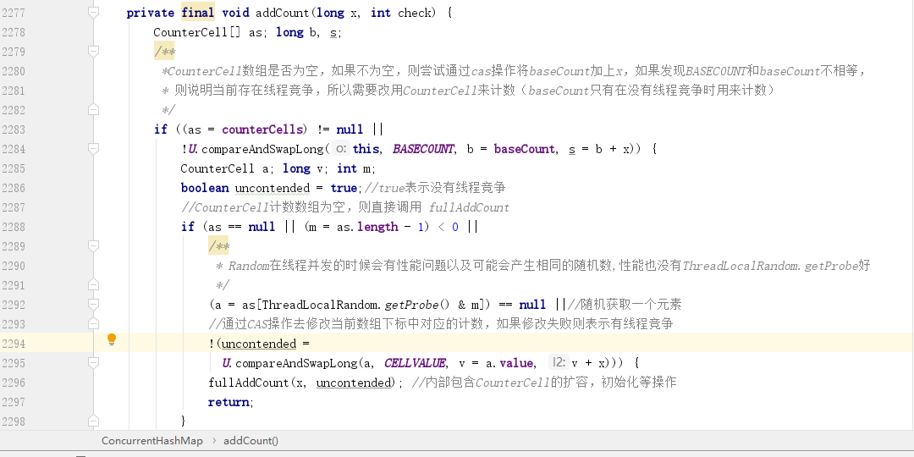

首先会判断 `CounterCell` 数组是不是为空，需要这里的是，这里的 `CAS` 操作是将 `BASECOUNT` 和 `baseCount` 进行比较，如果相等，则说明当前没有其他线程过来修改 `baseCount`（即 `CAS` 操作成功），此时则不需要使用 `CounterCell` 数组，而直接采用 `baseCount` 来计数。

假如 `CounterCell` 为空且 `CAS` 失败，那么就会通过调用 `fullAddCount` 方法来对 `CounterCell` 数组进行初始化。

#### fullAddCount 方法

这个方法也很长，看起来比较复杂，里面包含了对 `CounterCell` 数组的初始化和赋值等操作。 

##### 初始化 CounterCell 数组

我们先不管，直接进入出初始化的逻辑：

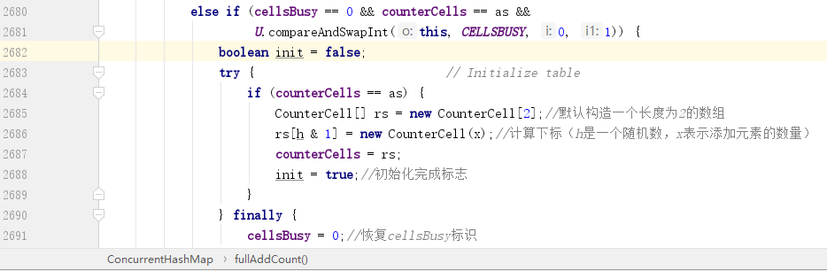

这里面有一个比较重要的变量 `cellsBusy`，默认是 `0`，表示当前没有线程在初始化或者扩容，所以这里判断如果 `cellsBusy==0`，而 `as` 其实在前面就是把全局变量 `CounterCell` 数组的赋值，这里之所以再判断一次就是再确认有没有其他线程修改过全局数组 `CounterCell`，所以条件满足的话就会通过 `CAS` 操作修改 `cellsBusy` 为 `1`，表示当前自己在初始化了，其他线程就不能同时进来初始化操作了。

最后可以看到，默认是一个长度为 `2` 的数组，也就是采用了 `2` 个数组位置进行存储当前 `ConcurrentHashMap` 的元素数量。

##### CounterCell 如何赋值

初始化完成之后，如果再次调用 `put` 方法，那么就会进入 `fullAddCount` 方法的另一个分支：

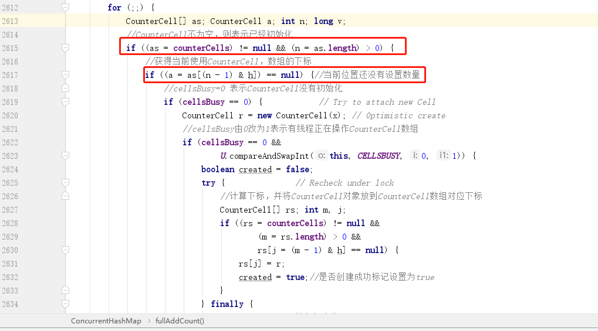

这里面首先判断了 `CounterCell` 数组不为空，然后会再次判断数组中的元素是不是为空，因为如果元素为空，就需要初始化一个 `CounterCell` 对象放到数组，而如果元素不为空，则只需要 `CAS` 操作替换元素中的数量即可。

所以这里面的逻辑也很清晰，初始化 `CounterCell` 对象的时候也需要将 `cellBusy` 由 `0` 改成 `1`。

##### 技数数组 CounterCell 也能扩容吗

最后我们再继续看其他分支：

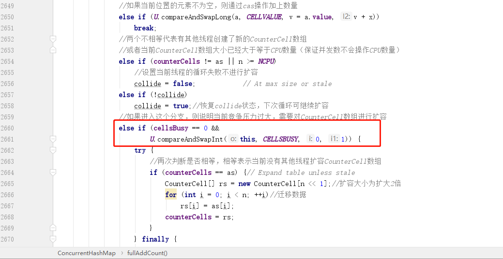

主要看上图红框中的分支，一旦会进入这个分支，就说明前面所有分支都不满足，即：

- 当前 `CounterCell` 数组已经初始化完成。
- 当前通过 `hash` 计算出来的 `CounterCell` 数组下标中的元素不为 `null`。
- 直接通过 `CAS` 操作修改 `CounterCell` 数组中指定下标位置中对象的数量失败，说明有其他线程在竞争修改同一个数组下标中的元素。
- 当前操作不满足不允许扩容的条件。
- 当前没有其他线程创建了新的 `CounterCell` 数组，且当前 `CounterCell` 数组的大小仍然小于 `CPU` 数量。

所以接下来就需要对 `CounterCell` 数组也进行扩容，这个扩容的方式和 `ConcurrentHashMap` 的扩容一样，也是将原有容量乘以 `2`，所以其实 `CounterCell` 数组的容量也是满足 2 的 N 次幂。

### ConcurrentHashMap 的扩容

接下来我们需要回到 `addCount` 方法，因为这个方法在添加元素数量的同时，也会判断当前 `ConcurrentHashMap` 的大小是否达到了扩容的阈值，如果达到，需要扩容。

#### 扩容也能支持并发吗

这里可能令大家有点意外的是，`ConcurrentHashMap` 扩容也支持多线程同时进行，这又是如何做到的呢？接下来就让我们回到 `addCount` 方法一探究竟。

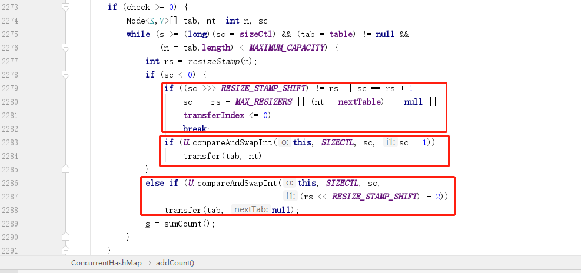

这里 `check` 是传进来的链表长度，`>=0` 才开始检查是否需要扩容，紧挨之后是一个 `while` 循环，主要是满足两个条件：

- 前面我们提到，`sizeCtl`在初始化的时候会被赋值为下一次扩容的大小（扩容之后也会），所以 `>=sizeCtl` 表示的就是是否达到扩容阈值。
- `table` 不为 `null` 且当前数组长度小于最大值 2 的 30 次方。

##### 扩容戳有什么用

当满足扩容条件之后，首先会先调用一个方法来获取扩容戳，这个扩容戳比较有意思，要理解扩容戳，必须从二进制的角度来分析。`resizeStamp` 方法就一句话，其中 `RESIZE_STAMP_BITS` 是一个默认值 `16`。

```java
 static final int resizeStamp(int n) {
        return Integer.numberOfLeadingZeros(n) | (1 << (RESIZE_STAMP_BITS - 1));
    }
```

这里面关键就是 `Integer.numberOfLeadingZeros(n)` 这个方法，这个方法源码就不贴出来了，实际上这个方法就是做一件事，那就是**获取当前数据转成二进制后的最高非 `0` 位前的 `0` 的个数**。

这句话有点拗口，我们举个例子，就以 `16` 为准，`16` 转成二进制是 `10000`，最高非 `0` 位是在第 `5` 位，因为 `int` 类型是 `32` 位，所以他前面还有 `27` 位，而且都是 `0`，那么这个方法得到的结果就是 `27`（`1` 的前面还有 `27` 个 `0`）。

然后 `1 << (RESIZE_STAMP_BITS - 1)` 在当前版本就是 `1<<15`，也就是得到一个二进制数 `1000000000000000`，这里也是要做一件事，把这个 **`1` 移动到第 `16` 位**。最后这两个数通过 `|` 操作一定得到的结果就是第 `16` 位是 `1`，因为 `int` 是 `32` 位，最多也就是 `32` 个 `0`，而且因为 `n` 的默认大小是 `16`（`ConcurrentHashMap` 默认大小），所以实际上最多也就是 `27`（`11011`）个 `0`，执行 `|` 运算最多也就是影响低 `5` 位的结果。

`27` 转成二进制为 `0000000000000000000000000011011`，然后和 `00000000000000001000000000000000` 执行 `|` 运算，最终得到的而结果就是 `00000000000000010000000000011011`，

注意：这里之所以要保证第 `16` 位为 `1`，是为了保证 `sizeCtl` 变量为负数，因为前面我们提到，这个变量为负数才代表当前有线程在扩容，至于这个变量和 `sizeCtl` 的关系后面会介绍。

##### 首次扩容为什么计数要 +2 而不是 +1

首次扩容一定不会走前面两个条件，而是走的最后一个红框内条件，这个条件通过 `CAS` 操作将 `rs` 左移了 `16`（RESIZE_STAMP_SHIFT）位，然后加上一个 `2`，这个代表什么意思呢？为什么是加 `2` 呢？

要回答这个问题我们先回答另一个问题，上面通过方法获得的扩容戳 `rs` 究竟有什么用？实际上这个扩容戳代表了两个含义：

- 高 `16` 为代表当前扩容的标记，可以理解为一个纪元。
- 低 `16` 代表了扩容的线程数。

知道了这两个条件就好理解了，因为 `rs` 最终是要赋值给 `sizeCtl` 的，而 `sizeCtl` 负数才代表扩容，而将 `rs` 左移 `16` 位就刚好使得最高位为 `1`，此时低 `16` 位全部是 `0`，而因为低 `16` 位要记录扩容线程数，所以应该 `+1`，但是这里是 `+2`，原因是 `sizeCtl` 中 `-1` 这个数值已经被使用了，用来代替当前有线程准备扩容，所以如果直接 `+1` 是会和标志位发生冲突。

所以继续回到上图中的第二个红框，就是正常继续 `+1` 了，只有初始化第一次记录扩容线程数的时候才需要 `+2`。

##### 扩容条件

接下来我们继续看上图中第一个红框，这里面有 `5` 个条件，代表是满足这 `5` 个条件中的任意一个，则不进行扩容：

1. `(sc >>> RESIZE_STAMP_SHIFT) != rs` 这个条件实际上有 `bug`，在 `JDK12` 中已经换掉。
2. `sc == rs + 1` 表示最后一个扩容线程正在执行首位工作，也代表扩容即将结束。
3. `sc == rs + MAX_RESIZERS` 表示当前已经达到最大扩容线程数，所以不能继续让线程加入扩容。
4. 扩容完成之后会把 `nextTable`（扩容的新数组） 设为 `null`。
5. `transferIndex <= 0` 表示当前可供扩容的下标已经全部分配完毕，也代表了当前线程扩容结束。

#### 多并发下如何实现扩容

在多并发下如何实现扩容才不会冲突呢？可能大家都想到了采用分而治之的思想，在 `ConcurrentHashMap` 中采用的是分段扩容法，即每个线程负责一段，默认最小是 `16`，也就是说如果 `ConcurrentHashMap` 中只有 `16` 个槽位，那么就只会有一个线程参与扩容。如果大于 `16` 则根据当前 `CPU` 数来进行分配，最大参与扩容线程数不会超过 `CPU` 数。

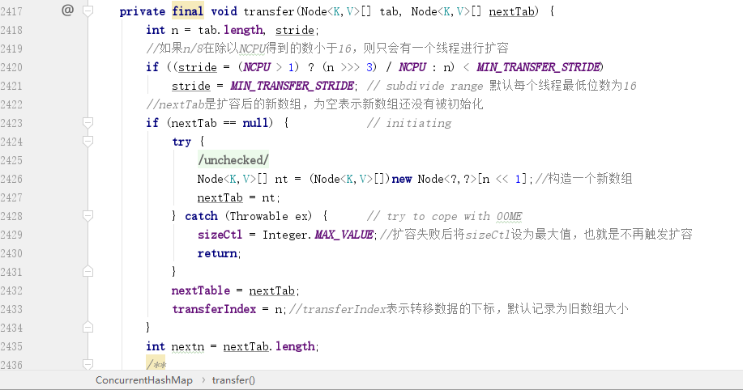

扩容空间和 `HashMap` 一样，每次扩容都是将原空间大小左移一位，即扩大为之前的两倍。注意这里的 `transferIndex` 代表的就是推进下标，默认为旧数组的大小。

#### 扩容时的数据迁移如何保证安全性

初始化好了新的数组，接下来就是要准备确认边界。也就是要确认当前线程负责的槽位，确认好之后会从大到小开始往前推进，比如线程一负责 `1-16`，那么对应的数组边界就是 `0-15`，然后会从最后一位 `15` 开始迁移数据：

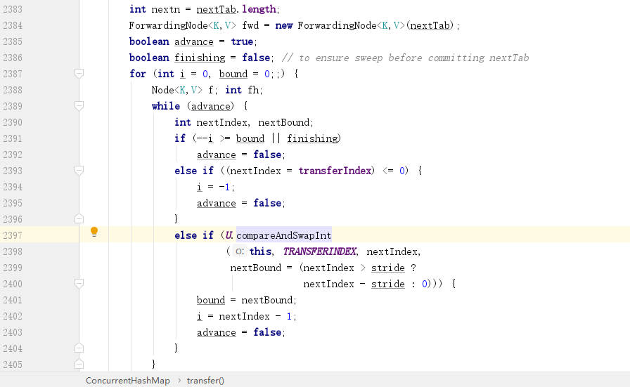

这里面有三个变量比较关键：

- `fwd` 节点，这个代表的是占位节点，最关键的就是这个节点的 `hash` 值为 `-1`，所以一旦发现某一个节点中的 `hash` 值为 `-1` 就可以知道当前节点已经被迁移了。
- `advance`：代表是否可以继续推进下一个槽位，只有当前槽位数据被迁移完成之后才可以设置为 `true`
- `finishing`：是否已经完成数据迁移。

知道了这几个变量，再看看上面的代码，第一次一定会进入 `while` 循环，因为默认 `advance` 为 `true`，第一次进入循环的目的为了确认边界，因为边界值还没有确认，所以会直接走到最后一个分支，通过 `CAS` 操作确认边界。

确认边界这里直接表述很难理解，我们通过一个例子来说明：

假设说最开始的空间为 `16`，那么扩容后的空间就是 `32`，此时 `transferIndex` 为旧数组大小 `16`，而在第二个 `if`判断中，`transferIndex` 赋值给了 `nextIndex`，所以 `nextIndex` 为 `1`，而 `stride` 代表的是每个线程负责的槽位数，最小就是 `16`，所以 `stride` 也是 `16`，所以 `nextBound= nextIndex > stride ? nextIndex - stride : 0` 皆可以得到：`nextBound=0` 和 `i=15` 了，也就是当前线程负责 `0-15` 的数组下标，且从 `0` 开始推进，确认边界后立刻将 `advance` 设置为 `false`，也就是会跳出 `while` 循环，从而执行下面的数据迁移部分逻辑。

PS：因为 `nextBound=0`，所以 `CAS` 操作实际上也是把 `transferIndex` 变成了 `0`，表示当前扩容的数组下标已经全部分配完毕，这也是前面不满足扩容的第 `5` 个条件。

数据迁移时，会使用 `synchronized` 关键字对当前节点进行加锁，也就是说锁的粒度精确到了每一个节点，可以说大大提升了效率。加锁之后的数据迁移和 `HashMap` 基本一致，也是通过区分高低位两种情况来完成迁移，在本文就不重复讲述。

当前节点完成数据迁移之后，`advance` 变量会被设置为 `true`，也就是说可以继续往前推进节点了，所以会重新进入上面的 `while` 循环的前面两个分支，把下标 `i` 往前推进之后再次把 `advance` 设置为 `false`，然后重复操作，直到下标推进到 `0` 完成数据迁移。

`while` 循环彻底结束之后，会进入到下面这个 `if` 判断，红框中就是当前线程自己完成了迁移之后，会将扩容线程数进行递减，递减之后会再次通过一个条件判断，这个条件其实就是前面进入扩容前条件的反推，如果成立说明扩容已经完成，扩容完成之后会将 `nextTable` 设置为 `null`，所以上面不满足扩容的第 `4` 个条件就是在这里设置的。

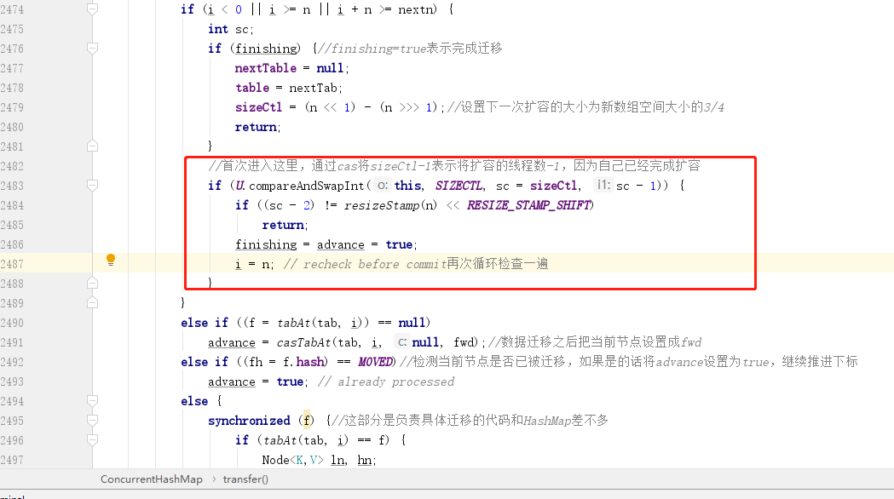

# 总结

本文主要讲述了 `ConcurrentHashMap` 中是如何保证安全性的，并且挑选了一些比较经典的面试常用问题进行分析解答，在整个 `ConcurrentHashMap` 中，整个思想就是降低锁的粒度，减少锁的竞争，所以采用了大量的分而治之的思想，比如多线程同时进行扩容，以及通过一个数组来实现 `size` 的计数等。