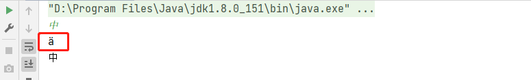
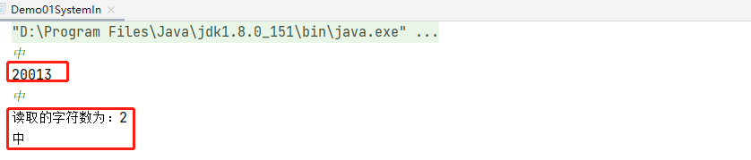
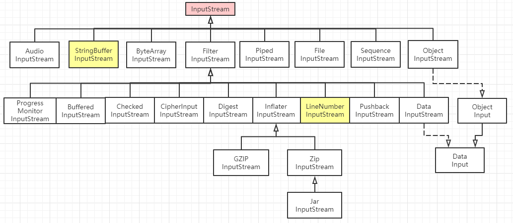
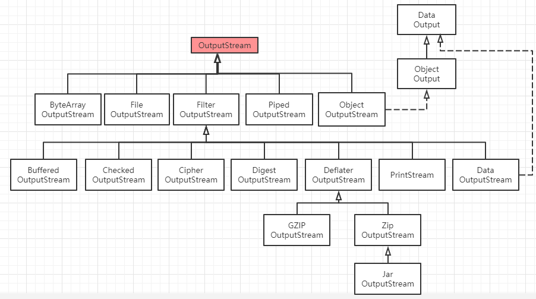
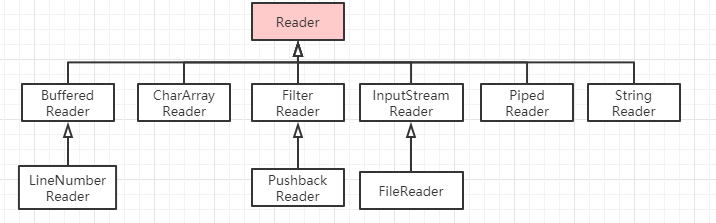
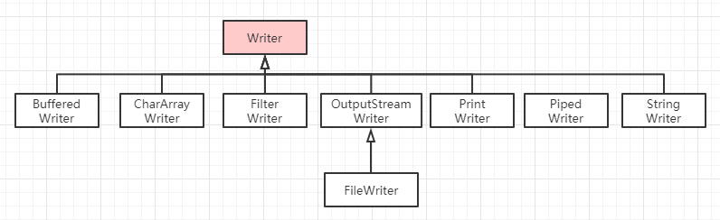

[TOC]

# 从接收输入值说起

在日常的开发应用中，有时候需要直接接收外部设备如键盘等的输入值，而对于这种数据的接收方式，我们一般有三种方法：字节流读取，字符流读取，`Scanner` 工具类读取。

## 字节流读取

直接看一个例子：

```java
public class Demo01SystemIn {
    public static void main(String[] args) throws IOException {
        int a = System.in.read();
        System.out.println(a);
        char c = 'a';
        System.out.println((int) c);
    }
}
```

运行程序之后，会被 `read` 方法阻塞，这时候在控制台输入一个字符 `a`，那么上面的程序两句话都会输出 `97`，这个没问题，因为小写字母 `a` 对应的就是 `97`，那么假如我们输入一个中文会出现什么结果呢？

把上面示例中的 `a` 修改为 `中`，然后运行程序，在控制台同样输入 `中`，则会得到 `228` 和 `20013`，这就说明我们控制台输入的 `中` 并没有全部读取，原因就是 `read` 只能读取 `1` 个字节，为了进一步验证结论，我们将上面的例子进行改写：

```java
public class Demo01SystemIn {
    public static void main(String[] args) throws IOException {
        char a = (char) System.in.read();//读取一个字节
        System.out.println(a);
        char c = '中';
        System.out.println(c);
    }
}
```

运行之后得到如下结果：



可以看到，第一个输出乱码了，因为 `System.in.read()` 一次只能读取一个字节，而中文在 `utf-8` 编码下占用了 `3` 个字节。正因为 `read` 方法一次只能读取一个字节，所以其范围只能在 `-1~255` 之间，`-1` 表示已经读取到了结尾。

那么如果想要完整的读取中文应该怎么办呢？

## 字符流读取

我们先看下面一个例子：

```java
public class Demo01SystemIn {
    public static void main(String[] args) throws IOException {
        InputStreamReader inputStreamReader1 = new InputStreamReader(System.in);
        int b = inputStreamReader1.read();//只能读一个字符
        System.out.println(b);

        InputStreamReader inputStreamReader2 = new InputStreamReader(System.in);
        char[] chars = new char[2];
        int c = inputStreamReader2.read(chars);//读入到指定char数组，返回当前读取到的字符数
        System.out.println("读取的字符数为：" + c);
        System.out.println(chars[0]);
        System.out.println(chars[1]);
    }
}

```

运行之后，输出结果如下所示：



这个时候我们已经能完成的读取到一个字符了，当然，有时候为了优化，我们需要使用 `BufferedReader` 进行进一步的包装：

```java
BufferedReader bufferedReader = new BufferedReader(new InputStreamReader(System.in));
```

这种方式虽然解决了读取中文会乱码问题，但是使用起来也不是很方便，所以一般读取键盘输入信息我们都会采用 `Scnner` 来读取。

## Scanner 读取

`Scanner` 实际上还是对 `System.in` 进行了封装，并提供了一系列方法来读取不同的字符类型，比如 `nextInt`，`nextFloat`，以及 `next` 等。

```java
public class Demo02Scnner {
    public static void main(String[] args) {
        Scanner scanner = new Scanner(System.in);
        while (scanner.hasNextInt()){
            System.out.println(scanner.nextInt());
        }
    }
}
```

# 什么是 IO 流

流是一种抽象概念，它代表了数据的无结构化传输（摘自百度百科）。`IO` 流对应的就是 `InPut` 和 `Output`，也就是输入和输出。输入和输出这个概念是针对于应用程序而言，比如当前程序中需要读取文件中的内容，那么这就是输入，而如果需要将应用程序本身的数据发送到其他应用，就对应了输出。

## 字节流和字符流

根据流的处理方式又可以将流可以分为两种类型：字节流和字符流。

## 字节流

字节流读取的基本单位为字节，采用的是 `ASCII` 编码，通常用来处理二进制数据，其顶层抽象类为 `InputStream` 和 `OutputStream`，比如上面示例中的 `System.in` 实际上就是获取到了一个 `InputStream` 类。

`Java` 中的流家族非常庞大，提供了非常多的具有不同功能的流，在实际应用中我们可以选择不同的组合达到目的。

### 字节输入流

下图为字节输入流家族关系示意图：



从上图可以看出这些结构非常清晰，首先是一个最顶层的接口，其次就是一些不同功能的基础流，比如我们最常用的 `FileInputStream` 就是用来读取文件的，这其中有一个 `FilterInputStream` 流，这个流主要是用来扩展基础流功能，其本身只是简单的覆盖了父类 `InputStream` 中的所有方法，并没有做什么特殊处理，真正的功能扩展需要依赖于其众多的子类，比如最常用的 `BufferedInputStream` 提供了数据的缓冲，从而提升读取流的效率，而 `DataInputStream` 是可以用来处理二进制数据等等。

通过这些众多不同功能的流来组合，可以灵活的读取我们需要的数据。比如当我们需要读取一个二进制文件，那么就需要使用 `DataInputStream`，而 `DataInputStream` 本身不具备直接读取文件内容的功能，所以需要结合 `FileInputStream`：

```java
FileInputStream fin = new FileInputStream("E:\\test.txt");
DataInputStream din = new DataInputStream(fin);
System.out.println(din.readInt());
```

同时，如果我们想要使用缓冲机制，又可以进一步组装 `BufferedInputStream`：

```java
FileInputStream fin = new FileInputStream("E:\\test.txt");
DataInputStream din = new DataInputStream(new BufferedInputStream(fin));
System.out.println(din.readInt());
```

还有一种流比较有意思，那就是 `PushbackInputStream`，这个流可以将读出来的数据重新推回到流中：

```java
public class Demo03 {
    public static void main(String[] args) throws IOException {
        FileInputStream fin = new FileInputStream("E:\\test.txt");//文档内存储 abcd
        PushbackInputStream pin = new PushbackInputStream(new BufferedInputStream(fin));

        int a = pin.read();//读取到a
        System.out.println(a);
        if (a != 'b'){
            pin.unread(a);//将 a 推回流中
        }
        System.out.println(pin.read());//再次读取到 a
        System.out.println(pin.read());//读取到 b
        System.out.println(pin.read());// 读取到 c
    }
}
```

### 字节输出流

下图为字节输出流家族关系示意图：



这个结构和输入流的结构基本类似，同样的我们也可以通过组合来实现不同的输出。

比如普通的输出文件，可以使用 `FileOutputStream` 流：

```java
FileOutputStream fout = new FileOutputStream("E:\\test2.txt");
fout.write(1);
fout.write(2);
```

如果想要输出二进制格式，那么就可以组合 `DataOutputStream` 流：

```java
FileOutputStream fout = new FileOutputStream("E:\\test2.txt");
DataOutputStream dout = new DataOutputStream(fout);
dout.write(9);
dout.write(10);
```

### 缓冲流的原理

`IO` 操作是一个比较耗时的操作，而字节流的 `read` 方法一次只能返回一个字节，那么当我们需要读取多个字节时就会出现每次读取都要进行一次 `IO` 操作，而缓冲流内部定义了一个大小为 `8192` 的 `byte` 数组，当我们使用了缓冲流时，读取数据的时候则会一次性最多读取 `8192` 个字节放到内存，然后一个个依次返回，这样就大大减少了 `IO` 次数；同样的，写数据时，缓冲流会将数据先写到内存，当我们写完需要写的数据时再一次性刷新到指定位置，如磁盘等。

## 字符流

字符流读取的基本单位为字符，采用的是 `Unicode` 编码，其 `read` 方法返回的是一个 `Unicode` 码元（0~65535）。

字符流通常用来处理文本数据，其顶层抽象类为 `Reader` 和 `Write`，比如文中最开始的示例中的 `InputStreamReader` 就是继承自 `Reader` 类。

### 字符输入流

下图为字符输入流家族关系示意图：



上图可以看出，除顶层 `Reader` 类之外，字符流也提供了一些基本的字符流来处理文本数据，比如我们需要从文本读取内容：

```java
public class Demo05Reader {
    public static void main(String[] args) throws Exception {
        //字节流
        FileInputStream fin = new FileInputStream("E:\\test.txt");//文本内容为“双子孤狼”
        System.out.println(fin.read());//372
        //字符流
        InputStreamReader ir = new InputStreamReader(new FileInputStream("E:\\test.txt"));//文本内容为“双子孤狼”
        System.out.println(ir.read());//21452
        char s = '双';
        System.out.println((int)s);//21452
    }
}
```

输出之后可以很明显看出区别，字节流一次读入一个字节，而字符流一次读入一个字符。

当然，我们也可以采用自由组合的方式来更灵活的进行字符读取，比如我们结合 `BufferedReader` 来读取一整行数据：

```java
public class Demo05Reader {
    public static void main(String[] args) throws Exception {
        InputStreamReader ir = new InputStreamReader(new FileInputStream("E:\\test.txt"));//文本内容为“双子孤狼”
        BufferedReader br = new BufferedReader(ir);
        String s;
        while (null != (s = br.readLine())){
            System.out.println(s);//输出双子孤狼
        }
    }
}
```

### 字符输出流

下图为字符输出流家族关系示意图：



文本输出，我们用的最多的就是 `PrintWriter`，这个类我想绝大部分朋友都使用过：

```java
public class Demo06Writer {
    public static void main(String[] args) throws Exception{
        PrintWriter printWriter = new PrintWriter("E:\\test3.txt");
        printWriter.write("双子孤狼");
        printWriter.flush();
    }
}
```

这里和字节流的区别就是写完之后需要手动调用 `flush` 方法，否则数据就会丢失，并不会写到文件中。

### 为什么字符流需要 flush，而字节流不需要

字节流不需要 `flush` 操作是因为字节流直接操作的是字节，中途不需要做任何转换，所以直接就可以操作文件，而字符流，说到底，其底层还是字节流，但是字符流帮我们将字节转换成了字符，这个转换需要依赖字符表，所以就需要在字符和字节完成转换之后通过 `flush` 操作刷到磁盘中。

需要注意的是，字节输出流最顶层类 `OutputStream` 中也提供了 `flush` 方法，但是它是一个空的方法，如果有子类有需要，也可以实现 `flush` 方法。

## RandomAccessFile

`RandomAccessFile` 是一个随机访问文件类，其可以在文件中的任意位置查找或者写入数据。

```java
public class Demo07RandomAccessFile {
    public static void main(String[] args) throws Exception {
        //文档内容为 lonely wolf
        RandomAccessFile inOut = new RandomAccessFile(new File("E:\\test.txt"),"rw");
        System.out.println("当前指针在：" + inOut.getFilePointer());//默认在0
        System.out.println((char) inOut.read());//读到 l
        System.out.println("当前指针在：" + inOut.getFilePointer());
        inOut.seek(7L);//指针跳转到7的位置
        System.out.println((char) inOut.read());//读到 w
        inOut.seek(7);//跳回到 7
        inOut.write(new byte[]{'c','h','i','n','a'});//写入 china,此时 wolf被覆盖
        inOut.seek(7);//继续跳回到 7
        System.out.println((char) inOut.read());//此时因为 wolf 被 china覆盖，所以读到 c
    }
}
```

根据上面的示例中的输出结果，可以看到 `RandomAccessFile` 类可以随机指定指针，并随机进行读写，功能非常强大。

另外需要说明的是，构造 `RandomAccessFile` 时需要传入一个模式，模式主要有 `4` 种：

- r：只读模式。此时调用任何 `write` 相关方法，会抛出 `IOException`。
- rw：读写模式。支持读写，如果文件不存在，则会创建。
- rws：读写模式。每当进行写操作，会将**内容**或者**元数据**同步刷新到磁盘。
- rwd：读写模式。每当进行写操作时，会将变动的**内容**用同步刷新到磁盘。

# 总结

本文主要将 `Java` 中的 `IO` 流进行了梳理，通过将其分成字节流和字符流，以及输入流和输出流分别统计，来建立一个对 `Java` 中 `IO` 流全局的概念，最后通过一些实例来演示了如何通过不同类型的流来组合实现强大灵活的输入和输出，最后，介绍了同时支持输入和输出的 `RandomAccessFile`。