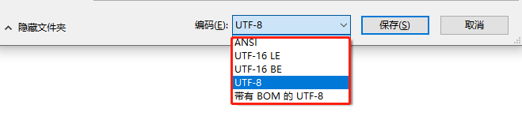

[TOC]


# 前言

在日常开发中，乱码问题可以说曾经都困扰过我们，那么为什么会有乱码发生呢？为什么全世界不统一使用一套编码呢？本文将会从字符集的发展历史来解答这两个问题，看完本篇，相信大家对乱码现象会有本质上的认识。

# 一个故事来理解为什么要编码

现在有两个人，张三和李四，张三只会中文，李四只会英文，那么这时候他们怎么沟通？解决办法是他们可以找个翻译，这个翻译的过程就可以理解为编码，也就是说从中文到英文或者从英文到中文这就是一个编码的过程，编码的本质就是为了让对方能读懂自己的语言。

人类的各种官方语言和方言数不胜数，所以在应用到在计算机时总不能两两互相编码吧？而且最重要的是人类的语言并不适合计算机使用，所以就需要发明一种适合计算机的语言，这就是二进制。二进制就是当今世界计算机的语言，当然，曾经前苏联也发明过三进制计算机，但是没有普及，这个感兴趣的可以自己去了解下。

有了二进制这种计算机能读懂的语言就好办了，当我们想和计算机沟通的时候，先转成二进制（编码），计算机处理完成之后，再转换回人类语言（解码），这就是需要编码的原因。

# 为什么会乱码

但是为什么会乱码呢？还是用上面的故事中张三李四来举例，假如有一次张三说了一个生僻词，然后翻译从来没见过这个词，这时候翻译就不知道怎么翻译了，没有办法，就直接翻译成了 `??`，也就是乱码了。

在计算机的世界也是同理，比如我们想从一个程序 `A` 发送 `双子孤狼` 四个字到另一个程序 `B`，这时候计算机数据传输的时候会转成二进制，传输过去之后，因为二进制不适合人类阅读，所以 `B` 就需要进行解码，可是现在 `B` 并不知道 `A` 用的是什么语言进行的编码，所以就胡乱用英文进行解码，解码出来的字符英文肯定是不存在的，也就是在英文字符集里面找不到 `双子孤狼` 这个单词，这时候就会发生乱码。

所以乱码的本质其实就是当前编码无法解析接收到的二进制数据。

# 字符集的历史

知道了为什么要编码以及乱码的原因之后，不禁又有另一个疑问了，如果说全世界都统一用一种编码，那在正常情况下也就没有乱码问题了，可是现实情况却是各种编码犹如八仙过海各显神通，整的我们程序员头晕脑胀，一不留神乱码就出来了。不过要回答这个问题那么就需要了解一下字符集的发展历史了。

## ASCII 编码的诞生

计算机最开始诞生于美国，而且计算机只能识别二进制，所以我们就需要把常用语言和二进制关联起来。美国人把英文里面常用的字符以及一些控制字符转换成了二进制数据，比如我们耳熟能详的小写字母 `a`，对应的十进制是 `97`，二进制就是 `01100001`。而一个字节有 `8` 位，即最大能表示 `255` 个字符，但是英语的常用字符比较少，常用的字母以及一些常用符号列出来就是 `128` 个，所以美国人就占用了这 `0-127` 的位置，形成了一个编码对应关系表，这就是 `ASCII`（American Standard Code for Information Interchange，美国标准信息交换码） 编码，`ASCII` 编码表的对应关系如果大家想知道的可以自己去查一下，这里就不列举了。

## IOS-8859 编码家族诞生

随着计算机的普及，计算机传到了欧洲，这时候发现欧洲的常用字符也需要进行编码，于是国际标准化组织（ISO）及国际电工委员会（IEC）决定联合制定另一套字符集标准。于是 `ISO-8859-1` 字符集就诞生了。

因为 `ASCII` 只用到了 `0-127` 个位置，另外 `128-255` 的位置并没有被占用（也就是一个字节的最高位并没有被使用），于是欧洲人就把第 `8` 位利用了起来，从此 这`128-255` 就被西欧常用字符占用了，`ISO-8859-1` 字符也叫做 `Latin1` 编码。

慢慢的，随着时间的推移，欧洲越来越多国家的字符需要编码，所以就衍生了一系列的字符集，从 `ISO-8859-1` 到 `ISO-8859-16` 经过了一系列的微调，但是这些都属于 `ISO-8859` 标准。

需要注意的是，`ISO-8859` 标准是向下兼容 `ASCII` 字符集的，所以平常我们见到的许多场景下默认都是用的 `ISO-8859-1` 编码比较多，而不会直接使用 `ASCII` 编码。

## GB2312 和 GBK 等双字节编码诞生

慢慢的，随着时间的推移，计算机传到了亚洲，传到了中国以及其他国家，这时候许多国家都针对自己国家的常用文字制定了自己国家的编码，中国也不例外。

但是这个时候却发现，一个字节的 `8` 位已经全部被占用了，于是只能再扩展一个字节，也就是用 `2` 个字节来存储。但是两个字节来存储又有一个问题，那就是比如我读取了两个字节出来，这两个字节到底是表示两个单字节字符还是表示的是双字节的中文呢？

于是我们伟大的中国人民就决定制定一套中文编码，用来兼容 `ASCII`，因为 `ASCII` 编码中的单字节字符一定是小于 `128` 的，所以最后我们就决定，中文的双字节字符都从 `128` 之后开始，也就是当发现字符连续两位都大于 `128` 时，就说明这是一个中文，指定了之后我们就把这种编码方式称之为 `GB2312` 编码。

需要注意的是 `GB2312` 并不兼容 `ISO-8859-n` 编码集，但是兼容 `ASCII` 编码。

`GB2312` 编码收录了常用的汉字 `6763` 个和非汉字图形字符 `682` （包括拉丁字母、希腊字母、日文平假名及片假名字母、俄语西里尔字母在内的全角字符）个。

随着计算机的更进一步普及，`GB2312` 也暴露出了问题，那就是 `GB2312` 中收录的中文汉字都是简体字和常用字，对于一些生僻字以及繁体字没有收录，于是乎 `GBK` 出现了。

`GB2312` 编码因为两个字节采用的都是高位，就算全部对应上，最大也只能存储 `16384` 个汉字，而我国汉字如果加上繁体字和生僻字是远远不够的，于是 `GBK` 的做法就是只要求第一位是大于 `128`，第二位可以小于 `128`，这就是说只要发现一个字节大于 `128`，那么紧随其后的一个字节就是和其作为一个整体作为中文字符，这样最多就能存储 `32640` 个汉字了。当然，`GBK` 并没有全部用完，`GBK` 共收入 `21886` 个汉字和图形符号，其中汉字（包括部首和构件）`21003` 个，图形符号 `883` 个。

后面随着计算机的再进一步普及，我们也慢慢扩展了其他的中文字符集，比如 ` GB18030` 等，但是这些都属于双字节字符。

到这里希望大家明白，为什么英文是一个字符，中文是两个甚至更多字符了。一个原因就是低位被用了，另一个就是常用中文字符太多了，一个字节是远远存不完的。

## Unicode 字符诞生

其实计算机在发展过程中，不单单是美国，欧洲和中国，其他许多国家都有自己的字符，比如日本，韩国等都有自己的字符集，可以说很混乱，于是有关部门看不下去了，决定结束这种世界大战的混乱局面，重新制定另一套字符标准，这就是 `Unicode`。

从一出生开始，`Unicode` 就觉得除了自己，其他各位都是渣渣。所以它压根就没准备兼容其他编码，直接另起炉灶来了一套标准。`Unicode` 字符最开始采用的是 `UCS-2` 标准，`UCS-2` 标准规定一个字符至少使用 `2` 个字节来表示。当然，`2` 个字节即使全被利用也只能存储 `65536` 个字符，这肯定容纳不了世界上所有的语言和符号以及控制字符，所以后面又有了 `UCS-4` 标准，可以用 `4` 个字节来存储一个字符，四个字节来存储全世界所有语言文字和控制字符是基本没有问题了。

需要注意的是：`Unicode` 编码只是定义了字符集，对于字符集具体应该如何存储并没有做要求。站在我们开发的角度，相当于 `Unicode` 只定义了接口，但是没有具体的实现。

## UTF 编码家族诞生

`UTF` 系列编码就是对 `Unicode` 字符集的实现，只不过实现的方式有所区别，其中主要有：`UTF-8`，`UTF-16`，`UTF-32` 等类型。

### UTF-32 编码

`UTF-32` 编码基本按照 `Unicode`字符集标准来实现，任何一个符号都占用 `4` 个字节。可以想象，这会浪费多大空间，对英文而言，空间扩大了四倍，中文也扩大了两倍，所以这种编码方式也导致了 `Unicode` 在最初并没有被大家广泛的接受。

### UTF-16 编码

`UTF-16` 编码相比较 `UTF-32` 做了一点改进，其采用 `2` 个字节或者 `4` 个字节来存储。大部分情况下 `UTF-16` 编码都是采用 `2` 个字节来存储，而当 `2` 个字节存储时，`UTF-16` 编码会将 `Unicode` 字符直接转成二进制进行存储，对于另外一些生僻字或者使用较少的符号，`UTF-16` 编码会采用 `4` 个字节来存储，但是采用四个字节存储时需要做一次编码转换。

下表就是 `UTF-16` 编码的存储格式：

| Unicode 编码范围（16 进制） | UTF-16 编码的二进制存储格式         |
| --------------------------- | ----------------------------------- |
| 0x0000 0000 - 0x0000 FFFF   | xxxxxxxx xxxxxxxx                   |
| 0x0001 0000 - 0x0010 FFFF   | 110110xx xxxxxxxx 110111xx xxxxxxxx |

这个表先不解释，后面解释 `UTF-8` 编码时会一起说明。

### UTF-8 编码

`UTF-8` 是一种变长的编码，兼容了 `ASCII` 编码，为了实现变长这个特性，那么就必须要有一个规范来规定存储格式，这样当程序读了 `2` 个或者多个字节时能解析出这到底是表示多个单字节字符还是一个多字节字符。

`UTF-8` 编码的存储规范如下表所示：

| Unicode 编码范围（16 进制） | UTF-8 编码的二进制存储格式          |
| --------------------------- | ----------------------------------- |
| 0x0000 0000 - 0x0000 007F   | 0xxxxxxx                            |
| 0x0000 0080 - 0x0000 07FF   | 110xxxxx 10xxxxxx                   |
| 0x0000 0800 - 0x0000 FFFF   | 1110xxxx 10xxxxxx 10xxxxxx          |
| 0x0001 0000 - 0x0010 FFFF   | 11110xxx 10xxxxxx 10xxxxxx 10xxxxxx |

接下来我们以 `双` 字为例来进行说明：

双：对应的 `Unicode` 编码为 `\u53cc`，转成二进制就是：`101001111001100`，这时候表格中的第一行只有 `7` 位存不下去，第二列也只有 `11` 位，也不够存储，所以只能存储到第三列，第三列有 `16` 位，从后往前依次填补 `x` 的位置，填完之后还有一位空余，直接补 `0`，最终得到：**1110**0101 **10**001111 **10**001100，所以`双` 字就占用了 `3` 个字节，当然，有些生僻字会占用到四个字节。

所以上面的 `UTF-16` 编码也是同理，如果当前字符采用的是两字节存储，那么直接转成二进制存储即可，位数不足直接补 `0` 即可，而当采用 `4` 个字节存储时，则需要和 `UTF-8` 一样进行一次转换，也就是说只能将其填充到 `x` 的位置，`x` 之外的是固定格式。

需要注意的是：在 `UTF-16` 编码中，`2` 个字节也可能出现 `4` 字节中 `110110xx` 或者 `110111xx` 开头的格式，这两部分对应的区间分别是：`D800~DBFF` 和 `DC00~DFFF`，所以为了避免这种歧义的发生，这两部分区间是是专门空出来的，没有进行编码。

# 为什么有时候乱码都是 ? 号

在 `Java` 开发中，经常会碰到乱码显示为 `?` 号，比如下面这个例子：

```java
String name = "双子孤狼";
byte[] bytes = name.getBytes(StandardCharsets.ISO_8859_1);
System.out.println(new String(bytes));//输出：????
```

这个输出结果的原因是中文无法用 `ISO_8859_1` 编码进行存储，而示例中却强制用 `ISO_8859_1` 编码进行解码。

在 `Java` 中提供了一个 `ISO_8859_1` 类用来解码，解码时当发现当前字符转成十进制之后大于 `255` 时就会直接不进行解码，转而直接赋一个默认值 `63`，所以上面的示例中的 `byte` 数组结果就是 `63 63 63 63`，而`63` 在 `ASCII` 中就恰好就对应了 `?` 号。

所以一般我们看到编码出现 `?` 基本就说明当前是采用 `ISO_8859_1` 进行的解码，而当前的字符又大于 `255`。

# 拓展知识

了解了编码发展历史之后，同样的有一些其他相关联的知识需要了解。

## 代码点和代码单元

在 `Java` 中的字符串是由 `char` 序列组成，而 `char` 又是采用 `UTF-16` 表示的 `Unicode` 代码点的代码单元。这句话里面涉及到了代码点和代码单元，初次接触的朋友可能会有点迷惑，但是了解了 `Unicode` 字符集标准和 `UTF-16` 的编码方式之后就比较好理解。

- 代码点：一个代码点等同于一个 `Unicode` 字符。
- 代码单元：在 `UTF-16` 中，两个字节表示一个代码单元，代码单元是最小的不可拆分的部分。

平常我们调用字符串的 `length()` 方法，返回的就是代码单元数量，而不是代码点数量，所有如果碰到一些需要用 `4` 个字节来表示的繁体字，那么代码单元数就会小于代码点数，而想要获取代码点数量，可以通过其他方法获取，获取方式如下：

```java
String name = "𤭢";//\uD852\uDF62
System.out.println(name.length());//代码单元数，输出2
System.out.println(name.codePointCount(0, name.length()));//代码点数，输出1
```

## 大端模式和小端模式

在计算机中，数据的存储是以字节为单位的，那么当一个字符需要使用多个字节来表示的时候，就会产生一个问题，那就是多字节字符应该从前往后组合还是从后往前组合。

还是以 `双` 字为例，转成二进制为：`0101001111001100`，以一个字节为单位，就可以拆分成：`01010011` 和 `11001100`，其中第一部分就称之为高位字节，第二部分就称之为低位字节，将这两部分顺序互换存储就产生了**大端模式**和**小端模式**。

- 大端模式（Big-endian）：顾名思义就是以高位字节结尾，低位在前（左），高位在后（右）。如 `双` 字就会存储为：`11001100  01010011`。
- 小端模式（Little-endian）：顾名思义就是以低位字节结尾，高位在前（左），低位在后（右）。如 `双` 字就会存储为：`01010011 11001100`（和我们平常计算二进制的逻辑一致，从右到左依次从 `2` 的 `0` 次方开始）。

注：在 `Java` 中默认采用的是大端模式，虽然底层的处理器可能会采用不同的模式存储字节，但是因为有 `JVM` 的存在，这些细节已经被屏蔽，所以平常大家可能也没有很关注这些。

## BOM

既然底层存储分为了大端和小端两种模式，那么假如我们现在有一个文件，计算机又是怎么知道当前是采用的大端模式还是小端模式呢？

`BOM` 即 `byte order mark`（字节顺序标记），出现在文本文件头部。`BOM` 就是用来标记当前文件采用的是大端模式还是小端模式存储。我想这个大家应该都见过，平常在使用记事本保存文档的时候，需要选择采用的是大端还是小端：



在 `UCS` 编码中有一个叫做 Zero Width No-Break Space（零宽无间断间隔）的字符，对应的编码是 `FEFF`。`FEFF` 是不存在的字符，正常来说不应该出现在实际数据传输中。

但是为了区分大端模式和小端模式，`UCS` 规范建议在传输字节流前，先传输字符 `Zero Width No-Break Space`。而且根据这个字符的顺序来区分大端模式和小端模式。

下表就是不同编码的 `BOM`：

| 编码   | 16 进制 BOM |
| ------ | ----------- |
| UTF-8  | EF BB BF    |
| UTF-16 | FE FF       |
| UTF-16 | FF FE       |
| UTF-32 | 00 00 FE FF |
| UTF-32 | FF FE 00 00 |

有了这个规范，解析文件的时候就可以知道当前编码以及其存储模式了。注意这里 `UTF-8` 编码比较特殊，因为本身 `UTF-8` 编码有特殊的顺序格式规定，所以 `UTF-8` 本身并没有什么大端模式和小端模式的区别.

根据 `UTF-8` 本身的特殊编码格式，在没有 `BOM` 的情况下也能被推断出来，但是因为微软是建议都加上 `BOM`，所以目前存在了带 `BOM` 的 `UTF-8` 文件和不带 `BOM` 的 `UTF-8` 文件，这两种格式在某些场景可能会出现不兼容的问题，所以在平常使用中也可以稍微留意这个问题。

# 总结

本文主要从编码的历史开始，讲述了编码的存储规则并且分析了产生乱码的本质原因，同时也分析了字节的两种存储模型以及 `BOM` 相关问题，通过本文相信对于项目中出现的乱码问题，大家会有一个清晰的思路来分析问题。

