# 前言

`HashMap` 对每一个学习 `Java` 的人来说熟悉的不能再熟悉了，然而就是这么一个熟悉的东西，真正深入到源码层面却有许多值的学习和思考的地方，现在就让我们一起来探索一下 `HashMap` 的源码。

# HashMap 源码分析

`HashMap` 基于哈希表，且实现了 `Map` 接口的一种 `key-value` 键值对存储数据结构，其中的 `key` 和 `value` 均允许 `null` 值，在 `HashMap` 中，不保证顺序，线程也不安全。

## HashMap 中的数据存储

在 `HashMap` 中，每次 `put` 操作都会对 `key` 进行哈希运算，根据哈希运算的结果然后再经过位运算得到一个指定范围内的下标，这个下标就是当前 `key` 值存放的位置，既然是哈希运算，那么肯定就会有哈希冲突，对此在 `jdk1.7` 及其之前的版本，每个下标存放的是一个链表，而在 `jdk1.8` 版本及其之后的版本，则对此进行了优化，当链表长度大于 `8` 时，会转化为红黑树存储，当红黑树中元素从大于等于 `8` 降低为 小于等于 `6` 时，又会从红黑树重新退化为链表进行存储。

下图就是 `jdk1.8` 中一个 `HashMap` 的存储结构示意图（每一个下标的位置称之为 `桶`）：

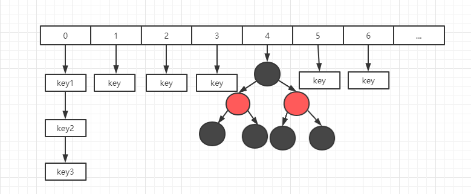

在 `HashMap` 中是通过数组 + 链表 + 红黑树来实现数据的存储（`jdk1.8`），而在更早的版本中则仅仅采用了数组 + 链表的方式来进行存储。

## 为什么建议初始化 HashMap 时指定大小

`HashMap` 初始化的时候，我们通常都会建议预估一下可能大小，然后在构造 `HashMap` 对象的时候指定容量，这是为什么呢？要回答这个问题就让我们看一下 `HashMap` 是如何初始化的。

下图就是当我们不指定任何参数时创建的 `HashMap` 对象：

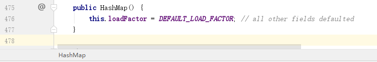

### 负载因子

可以看到有一个默认的 `DEFAULT_LOAD_FACTOR`（负载因子），这个值默认是 `0.75`。负载因子的作用就是当 `HashMap` 中使用的容量达到总容量大小的 `0.75` 时，就会进行自动扩容。然后从上面的源码可以看到，当我们不指定大小时，`HashMap` 并不会初始化一个容量，那么我们就可以大胆的猜测当我们调用 `put` 方法时肯定会有判断当前 `HashMap` 是否被初始化，如果没有初始化，就会先进行初始化。

### HashMap 默认容量

`put` 方法中会判断当前 `HashMap` 是否被初始化，如果没有被初始化，则会调用 `resize` 方法进行初始化，`resize` 方法不仅仅用于初始化，也用于扩容，其中初始化部分主要是下图中红框部分：

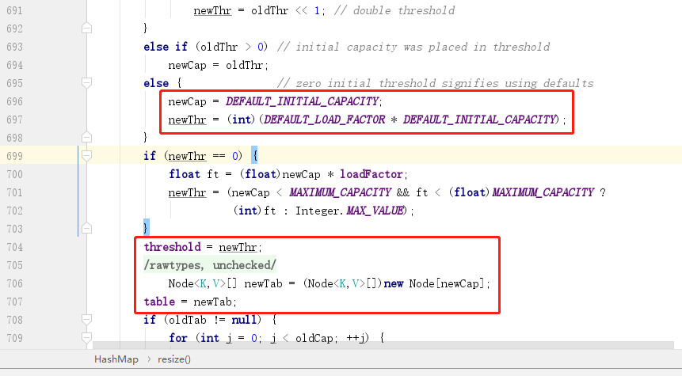

可以看到，初始化 `HashMap` 时，主要是初始化了 `2` 个变量：一个是 `newCap`，表示当前 `HashMap` 中有多少个桶，数组的一个下标表示一个桶；一个是 `newThr`，主要是用于表示扩容的阈值，因为任何时候我们都不可能等到桶全部用完了才去扩容，所以要设置一个阈值，达到阈值后就开始扩容，这个阈值就是总容量乘以负载因子得到。

上面我们知道了默认的负载因子是 `0.75`，而默认的桶大小是 `16`，所以也就是当我们初始化 `HashMap` 而不指定大小时，当桶使用了 `12` 时就会自动扩容（如何扩容我们在后面分析）。扩容就会涉及到旧数据迁移，比较消耗性能，所以在能预估出 `HashMap` 需要存储的总元素时，我们建议是提前指定  `HashMap` 的容量大小，以避免扩容操作。

PS：需要注意的是，一般我们说 `HashMap` 中的容量都是指的有多少个桶，而每个桶能放多少个元素取决于内存，所以并不是说容量为 `16` 就只能存放 `16` 个 `key` 值。

## HashMap 最大容量是多少

当我们手动指定容量初始化 `HashMap` 时，总是会调用下面的方法进行初始化：

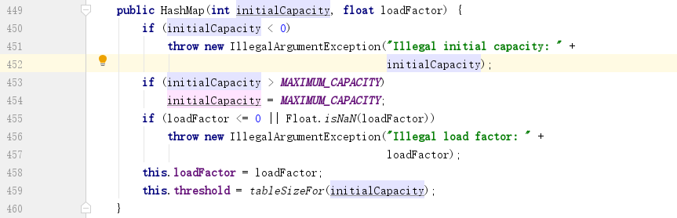

看到 `453` 行，当我们指定的容量大于 `MAXIMUM_CAPACITY` 时，会被赋值为 `MAXIMUM_CAPACITY`，而这个 `MAXIMUM_CAPACITY` 又是多少呢？

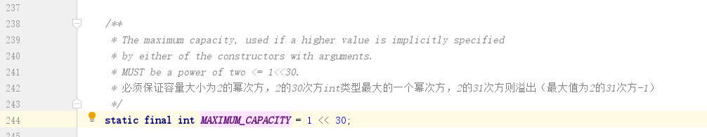

上图中我们看到，`MAXIMUM_CAPACITY` 是 2 的 30 次方，而 `int` 的范围是 2 的 31 次方减 1，这岂不是把范围给缩小了吗？看上面的注释可以知道，这里要保证 `HashMap` 的容量是 `2` 的 N 次幂，而 `int` 类型的最大正数范围是达不到 2 的 31 次幂的，所以就取了2 的 30 次幂。

我们再回到前面的带有参数的构造器，最后调用了一个 `tableSizeFor` 方法，这个方法的作用就是调整 `HashMap` 的容量大小：

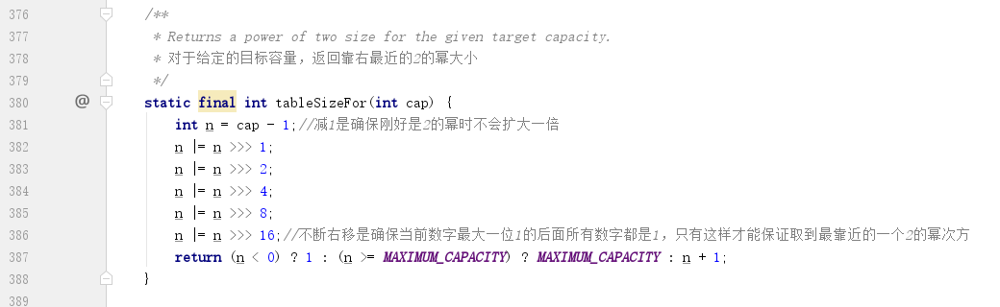

这个方法如果大家不了解位运算，可能就会看不太明白这个到底是做什么操作，其实这个里面就做了一件事，那就是把我们传进来的指定容量大小调整为 2 的 N 次幂，所以在最开始要把我们传进去的容量减 `1`，就是为了统一调整。

我们来举一个简单的例子来解释一下上面的方法，位运算就涉及到二进制，所以假如我们传进来的容量是一个 `5`，那么转化为二进制就是 `0000 0000 0000 0000 0000 0000 0000 0101`，这时候我们要保证这个数是 2 的 N 次幂，那么最简单的办法就是把我们当前二进制数的最左边的 `1` 开始，一直到最右边，所有的位都是 `1`，那么得到的结果就是得到对应的 2 的 N 次幂减 1，比如我们传的 `5` 进来，要确保是 2 的 N 次幂，那么肯定是需要调整为 2 的 3 次 幂，即：`8`，这时候我么需要做的就是把后面的 `3` 位 `101` 调整为 `111` ，就可以得到 2 的 3 次幂减 1，最后的总容量再加上 1 就可以调整成为 2 的 N 次幂。

还是以 `5` 为例，无符号右移 `1` 位，得到 `0000 0000 0000 0000 0000 0000 0000 0010`，然后再与原值 `0000 0000 0000 0000 0000 0000 0000 0101` 执行 `|` 操作（只有两边同时为 `0`，结果才会为 `0`），就可以得到结果 `0000 0000 0000 0000 0000 0000 0000 0111`，也就是把第二位变成了 `1`，这时候不论再右移多少位，右移多少次，结果都不会变，保证了后三位为 `1`，而后面还要依次右移，是为了确保当一个数的第 `31` 位为 `1` 时，可以保证除了最高位之外的 `31` 位全部为 `1` 。

到这里，大家应该就会有疑问了，为什么要如此大费周章的来保证 `HashMap` 的容量，即桶的个数为 2 的 N 次幂呢？

## 为什么 HashMap 容量大小要为 2 的 N 次幂

之所以要确保 `HashMap` 的容量为 2 的 N 次幂的原因其实很简单，就是为了尽可能避免哈希分布不均匀而导致每个桶中分布的数据不均匀，从而出现某些桶中元素过多，影响到查询效率。

我们继续看一下 `put` 方法，下图中红框部分就是计算下标位置的算法，就是通过当前数组（`HashMap` 底层是采用了一个 `Node` 数组来存储元素）的`长度 - 1` 再和 `hash` 值进行 `&` 运算得到的：

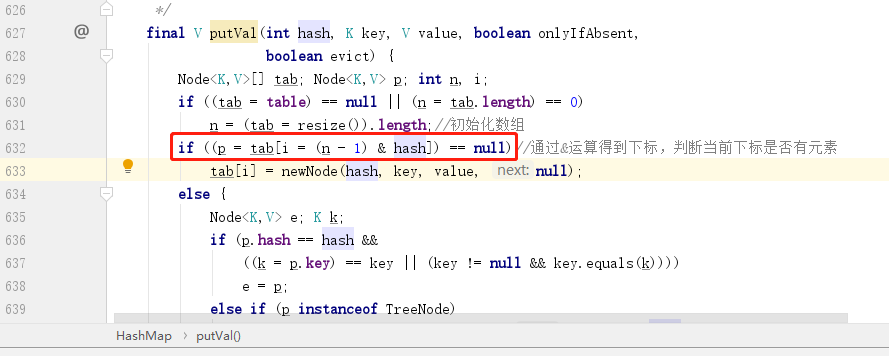

`&` 运算的特点就是只有两个数都是 `1` 得到的结果才是 `1`，那么假如 `n-1` 转化为二进制中含有大量的 `0`，如 `1000`，那么这时候再和 `hash` 值去进行 `&` 运算，最多只有 `1` 这个位置是有效的，其余位置全部是 `0`，相当于无效，这时候发生哈希碰撞的概率会大大提升。而假如换成一个 `1111` 再和 `hash` 值进行 `&` 运算，那么这四位都有效参与了运算，大大降低了发生哈希碰撞的概率，这就是为什么最开始初始化的时候，会通过一系列的 `|` 运算来将其第一个 `1` 的位置之后所有元素全部修改为 `1` 的原因。

## 谈谈 HashMap 中的哈希运算

上面谈到了计算一个 `key` 值最终落在哪个位置时用到了一个 `hash` 值，那么这个 `hash` 值是如何得到的呢？

下图就是 `HashMap` 中计算 `hash` 值的方法：

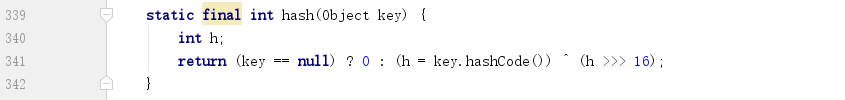

我们可以看到这个计算方法很特别，它并不仅仅只是简单通过一个 `hashCode` 方法来得到，而是还同时将 `hashCode` 得到的结果无符号右移 `16` 位之后再进行异或运算，得到最终结果。

这么做的目的就是为了将高 `16` 位也参与运算，进一步避免哈希碰撞的发生。因为在 `HashMap` 中容量总是 2 的 N 次幂，所以如果仅仅只有低 `16` 位参与运算，那么有很大一部分情况其低 `16` 位都是 `1`，所以将高 `16` 位也参与运算可以一定程度避免哈希碰撞发生。而后面之所以会采用异或运算而不采用 `&` 和 `|` 的原因是如果采用 `&` 运算会使结果偏向 `1`，采用 `|` 运算会使结果偏向 `0`，`^` 运算会使得结果能更好的保留原有特性。

## put 元素流程

`put` 方法前面的流程上面已经提到，如果 `HashMap` 没有初始化，则会进行初始化，然后再判断当前 `key` 值的位置是否有元素，如果没有元素，则直接存进去，如果有元素，则会走下面这个分支：

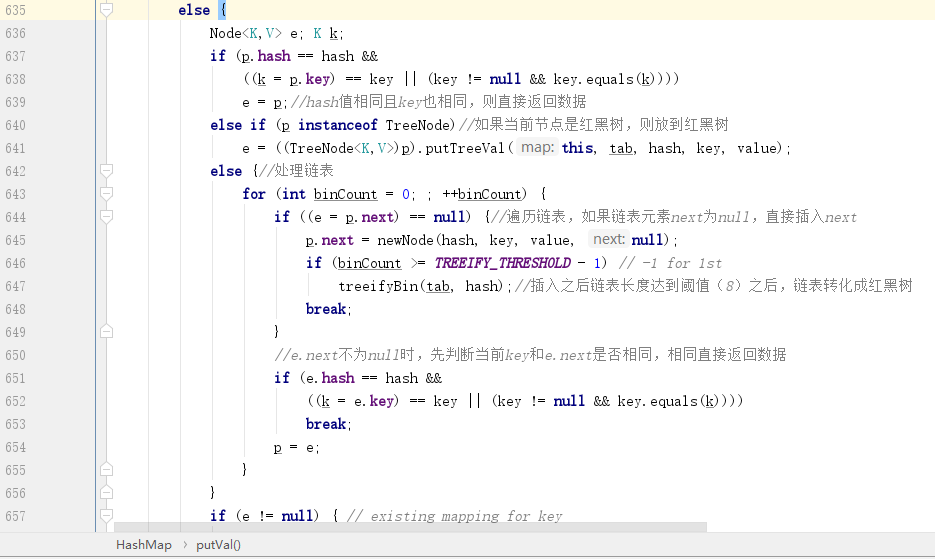

这个 `else` 分支主要有 `4` 个逻辑：

1. 判断当前 `key` 和原有 `key` 是否相同，如果相同，直接返回。
2. 如果当前 `key` 和原有 `key` 不相等，则判断当前桶存储的元素是否是 `TreeNode` 节点，如果是则表示当前是红黑树，则按照红黑树算法进行存储。
3. 如果当前 `key` 和原有 `key` 不相等，且当前桶存放的是一个链表，则依次遍历每个节点的 `next` 节点是否为空，为空则直接将当前元素放进链表，不为空则先判断两个 `key` 是否相等，相等则直接返回，不相等则继续判断 `next` 节点，直到 `key` 相等，或者 `next` 节点为空。
4. 插入链表之后，如果当前链表长度大于 `TREEIFY_THRESHOLD`，默认是 `8`，则会将链表进行切换到红黑树存储。

处理完之后，最后还有一个判断就是判断是否覆盖旧元素，如果 `e != null`，则说明当前 `key` 值已经存在，则继续判断 `onlyIfAbsent`  变量，这个变量默认就是 `false`，表示覆盖旧值，所以接下来会进行覆盖操作，然后再把旧值返回。

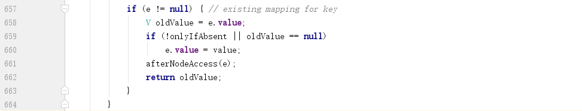

## 扩容

当 `HashMap` 中存储的数据量大于阈值（负载因子 * 当前桶数量）之后，会触发扩容操作：

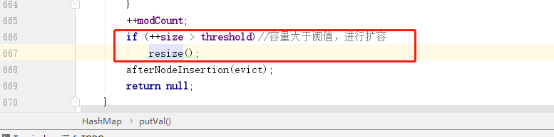

所以接下来让我们看看 `resize` 方法：

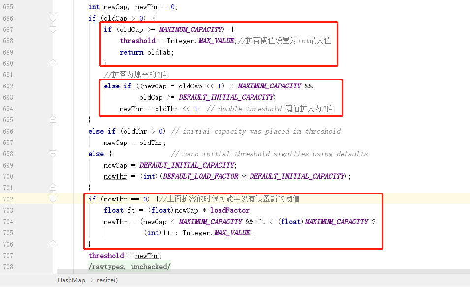

第一个红框就是判断当前容量是否已经达到了 `MAXIMUM_CAPACITY`，这个值前面提到了是 2 的 30 次幂，如果达到了这个值，就会将扩容阈值修改为 `int` 类型存储的最大值，也就是不会再出发扩容了。

第二个红框就是扩容，扩容的大小就是将旧容量左移 `1` 位，也就是扩大为原来的 `2` 倍。当然，扩大之后的容量如果不满足第二个红框中的条件，则会在第三个红框中被设置。

### 扩容之后原有数据怎么处理

扩容很简单，关键是原有的数据应该如何处理呢？不看代码，我们可以大致梳理出迁移数据的场景，没有数据的场景不做考虑：

1. 当前桶位置只有自己，也就是下面没有其他元素。
2. 当前桶位置下面有元素，且是链表结构。
3. 当前桶位置下面有元素，且是红黑树。

接下来让我们看看源码中的 `resize` 方法中的数据迁移部分：

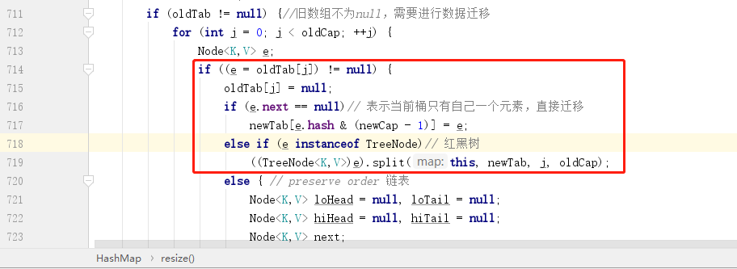

红框部分比较好理解，首先就是看当前桶内元素是否是孤家寡人，如果是，直接重新计算下标然后赋值到新数据即可，如果是红黑树，则打散了重组，这部分暂且略过，最后一个 `else` 部分就是处理链表部分，接下来就让我们重点看一下链表的处理。

#### 链表数据处理

链表的处理有一个核心思想：**链表中元素的下标要么保持不变，要么在原先的基础上在加上一个 `oldCap` 大小**。

链表的数据处理完整部分源码如下图所示：

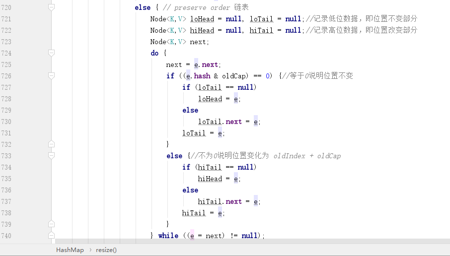

关键条件就是 `e.hash & oldCap`，为什么这个结果等于 `0` 就表示元素的位置没有发生改变呢？

在解释这个问题之前，需要先回忆一下 `tableSizeFor` 方法，这个方法会将 `n-1` 调整为类似 `00001111` 的数据结构，举个例子：比如初始化容量为 `16`，长度 `n-1` 就是 `01111`，而 `n` 就是 `10000`，所以如果 `e.hash & oldCap ==0` 就说明 `hash` 值的第 `5` 位是 `0`，`10000` 扩容之后得到的就是 `100000`，对应的 `n-1` 就是 `011111`，和原先旧的 `n-1` 的差异之处就是第 `5` 位（第 `6` 位是 `0` 不影响计算结果），所以当 `e.hash & oldCap==0` 就说明第 `5` 位对结果也没有影响，那么就说明位置不会变，而如果 `e.hash & oldCap !=0`，就说明第 `5` 位数影响到了结果，而第 `5` 位如果计算结果为 `1`，则得到下标的位置恰好多出了一个 `oldCap` 的大小，即 `16`。其他位置扩容也是同样的道理，所以只要 `e.hash & oldCap==0`，说明下标位置不变，而如果不等于 `0`，则下标位置应该再加上一个 `oldCap`。

最后的循环完节点之后，处理源码如下所示：

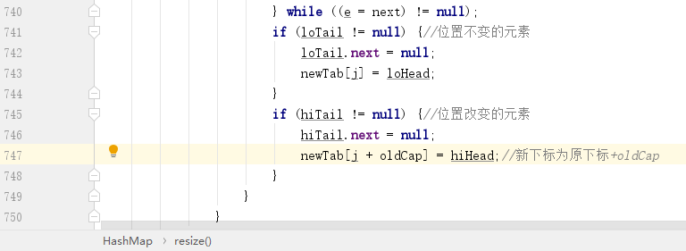

同理的 `32` 就是 `100000`，这就说明了一件事，那就是只需要关注最高位的 `1` 即可，因为只有这一位数和 `e.hash` 参与 `&` 运算时可能得到 `1`，

# 总结

本文主要分析了 `HashMap` 中是如何进行初始化，以及 `put` 方法是如何进行设置，同时也介绍了为了防止哈希冲突，将 `HashMap` 的容量设置为 2 的 N 次幂，最后介绍了 `HashMap` 中的扩容。