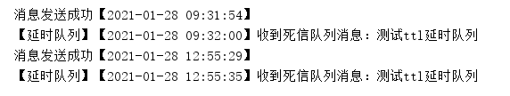

[TOC]


# 前言

在 `jdk` 的 `juc` 工具包中，提供了一种延时队列 `DelayQueue`。延时队列用处非常广泛，比如我们最常见的场景就是在网购或者外卖平台中发起一个订单，如果不付款，一般 `15` 分钟后就会被关闭，这个直接用定时任务是不好实现的，因为每个用户下单的时间并不确定，所以这时候就需要用到延时队列。

# 什么是延时队列

延时队列本身也是队列，只不过这个队列是延时的，意思就是说当我们把一条消息放入延时队列，消息并不会立刻出队，而是会在到达指定时间之后（或者说过了指定时间）才会出队，从而被消费者消费。

## 利用死信队列实现延迟队列

`RabbitMQ` 中的死信队列就是用来存储特定条件下的消息，那么假如我们把这个条件设定为指定时间过期（设定带`TTL` 的消息或者队列），就可以用来实现延迟队列的功能。

1. 新建一个 `TtlDelayRabbitConfig` 配置类（省略了包名和导入），消息最开始发送至 `ttl` 消息队列，这个队列中所有的消息在 `5` 秒后过期，后期后会进入死信队列：

```java
@Configuration
public class TtlDelayRabbitConfig {

    //路由ttl消息交换机
    @Bean("ttlDelayFanoutExchange")
    public FanoutExchange fanoutExchange(){
        return new FanoutExchange("TTL_DELAY_FANOUT_EXCHANGE");
    }

    //ttl消息队列
    @Bean("ttlDelayQueue")
    public Queue ttlQueue(){
        Map<String, Object> map = new HashMap<String, Object>();
        map.put("x-message-ttl", 5000);//队列中所有消息5秒后过期
        map.put("x-dead-letter-exchange", "TTL_DELAY_DEAD_LETTER_FANOUT_EXCHANGE");//过期后进入死信队列
        return new Queue("TTL_QUEUE",false,false,false,map);
    }

    //Fanout交换机和productQueue绑定
    @Bean
    public Binding bindTtlFanoutExchange(@Qualifier("ttlDelayQueue") Queue queue, @Qualifier("ttlDelayFanoutExchange") FanoutExchange fanoutExchange){
        return BindingBuilder.bind(queue).to(fanoutExchange);
    }

    //fanout死信交换机
    @Bean("ttlDelayDeadLetterExchange")
    public FanoutExchange deadLetterExchange(){
        return new FanoutExchange("TTL_DELAY_DEAD_LETTER_FANOUT_EXCHANGE");
    }

    //死信队列
    @Bean("ttlDelayDeadLetterQueue")
    public Queue ttlDelayDeadLetterQueue(){
        return new Queue("TTL_DELAY_DEAD_LETTER_FANOUT_QUEUE");
    }

    //死信队列和死信交换机绑定
    @Bean
    public Binding deadLetterQueueBindExchange(@Qualifier("ttlDelayDeadLetterQueue") Queue queue, @Qualifier("ttlDelayDeadLetterExchange") FanoutExchange fanoutExchange){
        return BindingBuilder.bind(queue).to(fanoutExchange);
    }
}

```

2. 新建一个消费者 `TtlDelayConsumer` 类，监听死信队列，这里收到的消息都是生产者生产消息之后的 `5` 秒，也就是延迟了 `5` 秒的消息：

```java
@Component
@RabbitListener(queues = "TTL_DELAY_DEAD_LETTER_FANOUT_QUEUE")
public class TtlDelayConsumer {

    @RabbitHandler
    public void fanoutConsumer(String msg){
        SimpleDateFormat sdf = new SimpleDateFormat("yyyy-MM-dd HH:mm:ss");
        System.out.println("【延时队列】【" + sdf.format(new Date()) + "】收到死信队列消息：" + msg);
    }
}
```

3. 新建一个 `DelayQueueController` 类做生产者来发送消息：

```java
@RestController
@RequestMapping("/delay")
public class DelayQueueController {
    @Autowired
    private RabbitTemplate rabbitTemplate;

    @GetMapping(value="/ttl/send")
    public String clearVipInfo(@RequestParam(value = "msg",defaultValue = "no message") String msg){
        //交换机可以默认为空
        rabbitTemplate.convertAndSend("TTL_DELAY_FANOUT_EXCHANGE","",msg);
        SimpleDateFormat sdf = new SimpleDateFormat("yyyy-MM-dd HH:mm:ss");
        System.out.println("消息发送成功【" + sdf.format(new Date()) + "】");
        return "succ";
    }
}
```

4. 最后我们在浏览器输入地址 `http://localhost:8080/delay/ttl/send?msg=测试ttl延时队列` 进行测试，可以看到每条消息都是在发送 `5` 秒之后才能收到消息：



### 死信队列实现的延时队列缺点

使用死信队列来实现延时队列，有几个很明显的缺点：

- 如果有非常多的时间点（比如有的 `10` 分钟过期，有的 `20` 分钟过期等），则需要创建不同的交换机和队列来实现消息的路由。
- 单独设置消息的 `TTL` 时可能会造成消息的阻塞。因为当前一条消息没有出队，后一条消息即使到期了也不能出队。
- 消息可能会有一定的延迟（上面的示例中就可以看到有一点延迟）。

## 利用插件实现延迟队列

在 `RabbitMQ` 的 `3.5.7` 版本之后，提供了一个插件（`rabbitmq-delayed-message-exchange`）来实现延时队列 ，同时需保证 `Erlang/OPT` 版本为 `18.0` 之后。

1. `RabbitMQ`版本在 `3.5.7-3.7.x` 的可以执行以下命令进行下载（也可以直接通过浏览器下载）：

```java
wget https://bintray.com/rabbitmq/community-plugins/download_file?file_path=rabbitmq_delayed_message_exchange-0.0.1.ez
```

如果 `RabbitMQ` 是 `3.8` 之后的版本，可以[点击这里](https://www.rabbitmq.com/community-plugins.html)，找到延时队列的插件，然后下载。

2. 下载好之后，将插件上传到 `plugins` 目录下，执行 `rabbitmq-plugins enable rabbitmq_delayed_message_exchange` 命令启动插件。如果要禁止该插件，则可以执行命令 `rabbitmq-plugins disable rabbitmq_delayed_message_exchange`（注意需要重启 `RabbitMQ` 才会生效）。
3. 


# 总结