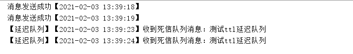

# 前言

在 `jdk` 的 `juc` 工具包中，提供了一种延迟队列 `DelayQueue`。延迟队列用处非常广泛，比如我们最常见的场景就是在网购或者外卖平台中发起一个订单，如果不付款，一般 `15` 分钟后就会被关闭，这个直接用定时任务是不好实现的，因为每个用户下单的时间并不确定，所以这时候就需要用到延迟队列。

# 什么是延迟队列

延迟队列本身也是队列，只不过这个队列是延迟的，意思就是说当我们把一条消息放入延迟队列，消息并不会立刻出队，而是会在到达指定时间之后（或者说过了指定时间）才会出队，从而被消费者消费。

## 利用死信队列实现延迟队列

`RabbitMQ` 中的死信队列就是用来存储特定条件下的消息，那么假如我们把这个条件设定为指定时间过期（设定带`TTL` 的消息或者队列），就可以用来实现延迟队列的功能。

1. 新建一个 `TtlDelayRabbitConfig` 配置类（省略了包名和导入），消息最开始发送至 `ttl` 消息队列，这个队列中所有的消息在 `5` 秒后过期，后期后会进入死信队列：

```java
@Configuration
public class TtlDelayRabbitConfig {

    //路由ttl消息交换机
    @Bean("ttlDelayFanoutExchange")
    public FanoutExchange fanoutExchange(){
        return new FanoutExchange("TTL_DELAY_FANOUT_EXCHANGE");
    }

    //ttl消息队列
    @Bean("ttlDelayQueue")
    public Queue ttlQueue(){
        Map<String, Object> map = new HashMap<String, Object>();
        map.put("x-message-ttl", 5000);//队列中所有消息5秒后过期
        map.put("x-dead-letter-exchange", "TTL_DELAY_DEAD_LETTER_FANOUT_EXCHANGE");//过期后进入死信队列
        return new Queue("TTL_QUEUE",false,false,false,map);
    }

    //Fanout交换机和productQueue绑定
    @Bean
    public Binding bindTtlFanoutExchange(@Qualifier("ttlDelayQueue") Queue queue, @Qualifier("ttlDelayFanoutExchange") FanoutExchange fanoutExchange){
        return BindingBuilder.bind(queue).to(fanoutExchange);
    }

    //fanout死信交换机
    @Bean("ttlDelayDeadLetterExchange")
    public FanoutExchange deadLetterExchange(){
        return new FanoutExchange("TTL_DELAY_DEAD_LETTER_FANOUT_EXCHANGE");
    }

    //死信队列
    @Bean("ttlDelayDeadLetterQueue")
    public Queue ttlDelayDeadLetterQueue(){
        return new Queue("TTL_DELAY_DEAD_LETTER_FANOUT_QUEUE");
    }

    //死信队列和死信交换机绑定
    @Bean
    public Binding deadLetterQueueBindExchange(@Qualifier("ttlDelayDeadLetterQueue") Queue queue, @Qualifier("ttlDelayDeadLetterExchange") FanoutExchange fanoutExchange){
        return BindingBuilder.bind(queue).to(fanoutExchange);
    }
}

```

2. 新建一个消费者 `TtlDelayConsumer` 类，监听死信队列，这里收到的消息都是生产者生产消息之后的 `5` 秒，也就是延迟了 `5` 秒的消息：

```java
@Component
public class TtlDelayConsumer {

    @RabbitHandler
    @RabbitListener(queues = "TTL_DELAY_DEAD_LETTER_FANOUT_QUEUE")
    public void fanoutConsumer(String msg){
        SimpleDateFormat sdf = new SimpleDateFormat("yyyy-MM-dd HH:mm:ss");
        System.out.println("【延迟队列】【" + sdf.format(new Date()) + "】收到死信队列消息：" + msg);
    }
}
```

3. 新建一个 `DelayQueueController` 类做生产者来发送消息：

```java
@RestController
@RequestMapping("/delay")
public class DelayQueueController {
    @Autowired
    private RabbitTemplate rabbitTemplate;

    @GetMapping(value="/ttl/send")
    public String clearVipInfo(@RequestParam(value = "msg",defaultValue = "no message") String msg){
        rabbitTemplate.convertAndSend("TTL_DELAY_FANOUT_EXCHANGE","",msg);
        SimpleDateFormat sdf = new SimpleDateFormat("yyyy-MM-dd HH:mm:ss");
        System.out.println("消息发送成功【" + sdf.format(new Date()) + "】");
        return "succ";
    }
}
```

4. 最后我们在浏览器输入地址 `http://localhost:8080/delay/ttl/send?msg=测试ttl延迟队列` 进行测试，可以看到每条消息都是在发送 `5` 秒之后才能收到消息：



### TTL 延迟队列的问题

假如我们实际中，有的消息是 `10` 分钟过期，有的是 `20` 分钟过期，这时候我们就需要建立多个队列，一旦时间维度非常庞大，那么就需要维护非常多的队列。说到这里，可能很多人会有疑问，我们可以针对单条信息设置过期时间，大可不必去定义多个队列？

然而事实真的是如此吗？接下来我们通过一个例子来验证下。

1. 把上面示例中 `TtlDelayRabbitConfig` 类中的队列定义函数 `x-message-ttl` 属性去掉，不过需要注意的是我们需要先把这个队列后台删除掉，否则同名队列重复创建无效：

```java
@Bean("ttlDelayQueue")
public Queue ttlQueue(){
    Map<String, Object> map = new HashMap<String, Object>();
    //        map.put("x-message-ttl", 5000);//注释掉这个属性，队列不设置过期时间
    map.put("x-dead-letter-exchange", "TTL_DELAY_DEAD_LETTER_FANOUT_EXCHANGE");//过期后进入死信队列
    return new Queue("TTL_QUEUE",false,false,false,map);
}
```

2. 然后将 `DelayQueueController` 类中的发送消息方法修改一下，对每条信息设置过期时间：

```java
@GetMapping(value="/ttl/send")
    public String ttlMsgSend(@RequestParam(value = "msg",defaultValue = "no message") String msg,
                             @RequestParam(value = "time") String millTimes){
        MessageProperties messageProperties = new MessageProperties();
        messageProperties.setExpiration(millTimes);//单条消息设置过期时间，单位：毫秒
        Message message = new Message(msg.getBytes(), messageProperties);
        rabbitTemplate.convertAndSend("TTL_DELAY_FANOUT_EXCHANGE","",message);
        SimpleDateFormat sdf = new SimpleDateFormat("yyyy-MM-dd HH:mm:ss");
        System.out.println("消息发送成功【" + sdf.format(new Date()) + "】");
        return "succ";
    }
```

3. 然后执行 `2` 条消息发送，一条 `10` 秒过期，一条 `5` 秒过期，先发送 `10` 秒的：

```java
http://localhost:8080/delay/ttl/send?msg=10秒过期消息&time=10000
http://localhost:8080/delay/ttl/send?msg=5秒过期消息&time=5000
```

4. 执行之后得到如下结果：


我们看到，两条消息都是 `10` 秒后过期，这是巧合吗？并不是，这是因为 `RabbitMQ` 中的机制就是如果前一条消息没有出队，那么即使后一条消息已经失效，也必须要等前一条消息出队之后才能出队，所以这就是为什么一般都尽量避免同一个队列单条消息设置不同过期时间的做法。

### 死信队列实现的延迟队列缺点

通过以上两个例子，使用死信队列来实现延迟队列，我们可以得到几个很明显的缺点：

- 如果有非常多的时间点（比如有的 `10` 分钟过期，有的 `20` 分钟过期等），则需要创建不同的交换机和队列来实现消息的路由。
- 单独设置消息的 `TTL` 时可能会造成消息的阻塞。因为当前一条消息没有出队，后一条消息即使到期了也不能出队。
- 消息可能会有一定的延迟（上面的示例中就可以看到有一点延迟）。

为了避免 `TTL` 和死信队列可能造成的问题，所以就非常有必要用一种新的更好的方案来替代实现延迟队列，这就是延时队列插件。

## 利用插件实现延迟队列

在 `RabbitMQ` 的 `3.5.7` 版本之后，提供了一个插件（`rabbitmq-delayed-message-exchange`）来实现延迟队列 ，同时需保证 `Erlang/OPT` 版本为 `18.0` 之后。

### 安装延迟队列插件

1. `RabbitMQ`版本在 `3.5.7-3.7.x` 的可以执行以下命令进行下载（也可以直接通过浏览器下载）：

```java
wget https://bintray.com/rabbitmq/community-plugins/download_file?file_path=rabbitmq_delayed_message_exchange-0.0.1.ez
```

如果 `RabbitMQ` 是 `3.8` 之后的版本，可以[点击这里](https://www.rabbitmq.com/community-plugins.html)，找到延迟队列对应版本的插件，然后下载。

2. 下载好之后，将插件上传到 `plugins` 目录下，执行 `rabbitmq-plugins enable rabbitmq_delayed_message_exchange` 命令启动插件。如果要禁止该插件，则可以执行命令 `rabbitmq-plugins disable rabbitmq_delayed_message_exchange`（启用插件后需要重启 `RabbitMQ` 才会生效）。

### 延迟队列插件示例

1. 新建一个 `PluginDelayRabbitConfig` 配置类：

```java
@Configuration
public class PluginDelayRabbitConfig {
    @Bean("pluginDelayExchange")
    public CustomExchange pluginDelayExchange() {
        Map<String, Object> argMap = new HashMap<>();
        argMap.put("x-delayed-type", "direct");//必须要配置这个类型，可以是direct,topic和fanout
        //第二个参数必须为x-delayed-message
        return new CustomExchange("PLUGIN_DELAY_EXCHANGE","x-delayed-message",false, false, argMap);
    }

    @Bean("pluginDelayQueue")
    public Queue pluginDelayQueue(){
        return new Queue("PLUGIN_DELAY_QUEUE");
    }

    @Bean
    public Binding pluginDelayBinding(@Qualifier("pluginDelayQueue") Queue queue,@Qualifier("pluginDelayExchange") CustomExchange customExchange){
        return BindingBuilder.bind(queue).to(customExchange).with("delay").noargs();
    }
}
```

2. 新建一个消费者类 `PluginDelayConsumer`：

```java
@Component
public class PluginDelayConsumer {

    @RabbitHandler
    @RabbitListener(queues = "PLUGIN_DELAY_QUEUE")//监听延时队列
    public void fanoutConsumer(String msg){
        SimpleDateFormat sdf = new SimpleDateFormat("yyyy-MM-dd HH:mm:ss");
        System.out.println("【插件延迟队列】【" + sdf.format(new Date()) + "】收到消息：" + msg);
    }
}
```

3. 在上面示例中的 `DelayQueueController` 类，新增一个方法：

```java
@GetMapping(value="/plugin/send")
public String pluginMsgSend(@RequestParam(value = "msg",defaultValue = "no message") String msg){
    MessageProperties messageProperties = new MessageProperties();
    messageProperties.setHeader("x-delay",5000);//延迟5秒被删除
    Message message = new Message(msg.getBytes(), messageProperties);
    amqpTemplate.convertAndSend("PLUGIN_DELAY_EXCHANGE","delay",message);//交换机和路由键必须和配置文件类中保持一致
    SimpleDateFormat sdf = new SimpleDateFormat("yyyy-MM-dd HH:mm:ss");
    System.out.println("消息发送成功【" + sdf.format(new Date()) + "】");
    return "succ";
}
```

4. 接下来就可以访问地址 `http://localhost:8080/delay/plugin/send?msg=插件延迟队列消息` 进行测试，可以看到，消息在延时 `5` 秒之后被消费：


# 总结

延迟队列的使用非常广泛，如果是单机部署，可以考虑使用 `jdk` 自带的 `DelayQueue`，分布式部署可以采用 `RabbitMQ`，`Redis` 等中间件来实现延迟队列。本文主要介绍了如何利用 `RabbitMQ` 实现两种延迟队列的两种方案，当然本文的例子只是引导，并没有开启回调等消息确认模式，如果想了解 `RabbitMQ` 消息的可靠性传输的，可以[点击这里](https://zhouwenxing.github.io/mq/rabbitmq/如何用RabbitMQ实现延迟队列)。

