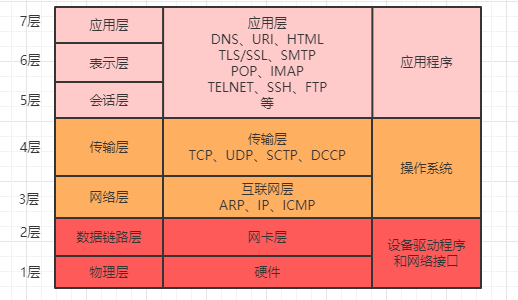

[TOC]

# 前言

任何一个服务，如果仅仅是单机部署，那么性能总是有上限的，`RabbitMQ` 也不例外，当单台 `RabbitMQ` 服务处理消息的能力到达瓶颈时，可以通过集群来实现高可用和负载均衡。

# RabbitMQ 集群知多少

通常情况下，在集群中我们把每一个服务称之为一个节点，在 `RabbitMQ` 集群中，节点类型可以分为两种：

- 内存节点：元数据存放于内存中。为了重启后能同步数据，内存节点会将磁盘节点的地址存放于磁盘之中，除此之外，如果消息被持久化了也会存放于磁盘之中，因为内存节点读写速度快，一般客户端会连接内存节点。
- 磁盘节点：元数据存放于磁盘中（默认节点类型），需要保证至少一个磁盘节点，否则一旦宕机，无法恢复数据，从而也就无法达到集群的高可用目的。

PS：元数据，指的是包括队列名字属性、交换机的类型名字属性、绑定信息、vhost等基础信息，不包括队列中的消息数据。

`RabbitMQ` 中的集群主要有两种模式：普通集群模式和镜像队列模式。

## 普通集群模式

在普通集群模式下，集群中各个节点之间只会相互同步元数据，也就是说，消息数据不会被同步。那么问题就来了，假如我们连接到 `A` 节点，但是消息又存储在 `B` 节点又怎么办呢？

不论是生产者还是消费者，假如连接到的节点上没有存储队列数据，那么内部会将其转发到存储队列数据的节点上进行存储。虽然说内部可以实现转发，但是因为消息仅仅只是存储在一个节点，那么假如这节点挂了，消息是不是就没有了？这个问题确实存在，所以这种普通集群模式并没有达到高可用的目的。

## 镜像队列模式

镜像队列模式下，节点之间不仅仅会同步元数据，消息内容也会在镜像节点间同步，可用性更高。这种方案提升了可用性的同时，因为同步数据之间也会带来网络开销从而在一定程度上会影响到性能。

# 基于 HAProxy + Keepalived 高可用集群

假如一个 `RabbitMQ` 集群中，有多个内存节点，我们应该连接到哪一个节点呢？这个选择的策略如果放在客户端做，那么会有很大的弊端，最严重的的就是每次扩展集群都要修改客户端代码，所以这种方式并不是很可取，所以我们在部署集群的时候就需要一个中间代理组件，这个组件要能够实现服务监控和转发，比如 `Redis` 中的 `Sentinel`（哨兵）集群模式，哨兵就可以监听 `Redis` 节点并实现故障转移。

在 `RabbitMQ` 集群中，通过 `Keepalived ` 和 `HAProxy ` 两个组件实现了集群的高可用性和负载均衡功能。

## HAProxy 

`HAProxy ` 是一个开源的、高性能的负载均衡软件，同样可以作为负载均衡软件的还有 `nginx`，`lvs` 等。 `HAproxy` 支持 `7` 层负载均衡和 `4` 层负载均衡。

### 负载均衡

所谓的 `7` 层负载均衡和 `4` 层负载均衡针对的是 `OSI` 模型而言，如下图所示就是一个 `OSI` 通信模型：

上图中看到，第 `7` 层对应了应用层，第 `4` 层对应了传输层。常用的负载均衡软件如 `nginx` 一般工作在第 `7` 层，`lvs`（Linux Virtual Server）一般工作在第 `4` 层。

- `4` 层负载：

`4` 层负载使用了 `NAT` （Network Address Translation）技术，即：网络地址转换。收到客户端请求时，可以通过修改数据包里的源 `IP` 和端口，然后把数据包转发到对应的目标服务器。`4` 层负载均衡只能根据报文中目标地址和源地址对请求进行转发，无法判断或者修改请求资源的具体类型。

- `7` 层负载：

根据客户端请求的资源路径，转发到不同的目标服务器。

### 高可用 HAProxy

`HAProxy ` 虽然实现了负载均衡，但是假如只是部署一个 `HAProxy`，那么其本身也存在宕机的风险。一旦 `HAProxy ` 宕机，那么就会导致整个集群不可用，所以我们也需要对 `HAProxy ` 也实现集群，那么假如 `HAProxy` 也实现了集群，客户端应该连接哪一台服务呢？问题似乎又回到了起点，陷入了无限循环中...

## Keepalived

为了实现 `HAProxy` 的高可用，需要再引入一个 `Keepalived` 组件，`Keepalived` 组件主要有以下特性：

- 具有负载功能，可以监控集群中的节点状态，如果集群中某一个节点宕机，可以实现故障转移。
- 其本身也可以实现集群，但是只能有一个 `master` 节点。
- `master` 节点会对外提供一个虚拟 `IP`，应用端只需要连接这一个 `IP` 就行了。可以理解为集群中的 `HAProxy` 节点会同时争抢这个虚拟 `IP`，哪个节点争抢到，就由哪个节点来提供服务。

### VRRP 协议

`VRRP` 协议即虚拟路由冗余协议（Virtual Router Redundancy Protocol）。`Keepalived` 中提供的虚拟 `IP` 机制就属于 `VRRP`，它是为了避免路由器出现单点故障的一种容错协议。

# RabbitMQ + HAProxy + Keepalived 集群搭建

接下来，我们就一起来搭建一个 `RabbitMQ` 集群。

Keepalived 下载地址 https://www.keepalived.org/download.html

http://download.openpkg.org/components/cache/haproxy/

1. 

# 总结