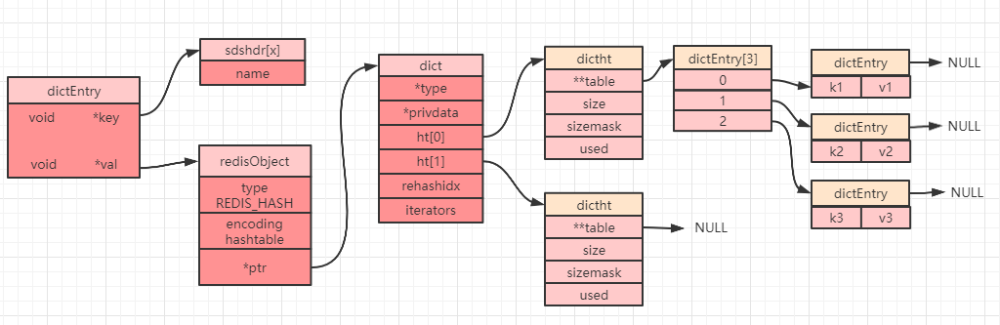
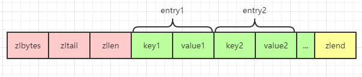
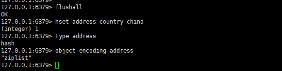
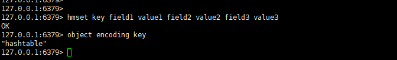

# 前言

`Redis` 是一个键值对数据库，其键是通过哈希进行存储的。整个 `Redis` 可以认为是一个外层哈希，之所以称为外层哈希，是因为 `Redis` 内部也提供了一种哈希类型，这个可以称之为内部哈希。当我们采用哈希对象进行数据存储时，对整个 `Redis` 而言，就经过了两层哈希存储。

# 哈希对象
哈希对象本身也是一个 `key-value` 存储结构，底层的存储结构也可以分为两种：`ziplist`（压缩列表） 和 `hashtable`（哈希表）。这两种存储结构也是通过编码来进行区分：

| 编码属性             | 描述                     | object encoding命令返回值 |
| -------------------- | ------------------------ | ------------------------- |
| OBJ_ENCODING_ZIPLIST | 使用压缩列表实现哈希对象 | ziplist                   |
| OBJ_ENCODING_HT      | 使用字典实现哈希对象     | hashtable                 |

## hashtable
`Redis` 中的 `key-value` 是通过 `dictEntry` 对象进行包装的，而哈希表就是将 `dictEntry` 对象又进行了再一次的包装得到的，这就是哈希表对象 `dictht`：

```c
typedef struct dictht {
    dictEntry **table;//哈希表数组
    unsigned long size;//哈希表大小
    unsigned long sizemask;//掩码大小，用于计算索引值，总是等于size-1
    unsigned long used;//哈希表中的已有节点数
} dictht;
```
注意：上面结构定义中的 `table` 是一个数组，其每个元素都是一个 `dictEntry` 对象。
### 字典
字典，又称为符号表（symbol table），关联数组（associative array）或者映射（map），字典的内部嵌套了哈希表 `dictht` 对象，下面就是一个字典 `ht` 的定义：
```c
typedef struct dict {
    dictType *type;//字典类型的一些特定函数
    void *privdata;//私有数据，type中的特定函数可能需要用到
    dictht ht[2];//哈希表(注意这里有2个哈希表)
    long rehashidx; //rehash索引，不在rehash时，值为-1
    unsigned long iterators; //正在使用的迭代器数量
} dict;
```
其中 `dictType ` 内部定义了一些常用函数，其数据结构定义如下：
```c
typedef struct dictType {
    uint64_t (*hashFunction)(const void *key);//计算哈希值函数
    void *(*keyDup)(void *privdata, const void *key);//复制键函数
    void *(*valDup)(void *privdata, const void *obj);//复制值函数
    int (*keyCompare)(void *privdata, const void *key1, const void *key2);//对比键函数
    void (*keyDestructor)(void *privdata, void *key);//销毁键函数
    void (*valDestructor)(void *privdata, void *obj);//销毁值函数
} dictType;
```
当我们创建一个哈希对象时，可以得到如下简图（部分属性被省略）：



### rehash 操作
`dict` 中定义了一个数组 `ht[2]`，`ht[2]` 中定义了两个哈希表：`ht[0]` 和 `ht[1]`。而 `Redis` 在默认情况下只会使用 `ht[0]`，并不会使用 `ht[1]`，也不会为 `ht[1]` 初始化分配空间。

当设置一个哈希对象时，具体会落到哈希数组（上图中的 `dictEntry[3]`）中的哪个下标，是通过计算哈希值来确定的，如果发生哈希碰撞，那么同一个下标就会有多个 `dictEntry`，从而形成一个链表（上图中最右边指向 `NULL` 的位置），不过需要注意的是最后插入元素的总是落在链表的最前面（即发生哈希冲突时，总是将节点往链表的头部放）。

当读取数据的时候遇到一个节点有多个元素，就需要遍历链表，故链表越长，性能越差。为了保证哈希表的性能，需要在满足以下两个条件中的一个时，对哈希表进行 `rehash`（重新散列）操作：

 - 负载因子大于等于 `1` 且 `dict_can_resize` 为 `1` 时。
 - 负载因子大于等于安全阈值（`dict_force_resize_ratio=5`）时。

PS：负载因子 = 哈希表已使用节点数 / 哈希表大小（即：`h[0].used/h[0].size`）。
### rehash 步骤
扩展哈希和收缩哈希都是通过执行 `rehash` 来完成，这其中就涉及到了空间的分配和释放，主要经过以下五步：
1. 为字典 `dict` 的 `ht[1]` 哈希表分配空间，其大小取决于当前哈希表已保存节点数（即：`ht[0].used`）：
   - 如果是扩展操作则 `ht[1]` 的大小为 `2 的 `n` 次方中第一个大于等于 `ht[0].used * 2` 属性的值（比如 `used=3`，此时`ht[0].used * 2=6`，故 `2` 的 `3` 次方为 `8` 就是第一个大于 `used * 2` 的值（2 的 2 次方 < 6 且 2 的 3 次方 > 6））。` 
   -  如果是收缩操作则 `ht[1]` 大小为 2 的 n 次方中第一个大于等于 `ht[0].used` 的值。

2. 将字典中的属性 `rehashix` 的值设置为 `0`，表示正在执行 `rehash` 操作。
3. 将 `ht[0]` 中所有的键值对依次重新计算哈希值，并放到 `ht[1]` 数组对应位置，每完成一个键值对的 `rehash`之后 `rehashix` 的值需要自增 `1`。
4. 当 `ht[0]` 中所有的键值对都迁移到 `ht[1]` 之后，释放 `ht[0]` ，并将 `ht[1]` 修改为 `ht[0]`，然后再创建一个新的 `ht[1]` 数组，为下一次 `rehash` 做准备。
5. 将字典中的属性 `rehashix` 设置为 `-1`，表示此次 `rehash` 操作结束，等待下一次 `rehash`。

### 渐进式 rehash
`Redis` 中的这种重新哈希的操作**因为不是一次性全部 `rehash`，而是分多次来慢慢的将 `ht[0]` 中的键值对 `rehash` 到 `ht[1]`，故而这种操作也称之为渐进式 `rehash`**。渐进式 `rehash` 可以避免集中式 `rehash` 带来的庞大计算量，是一种分而治之的思想。

在渐进式 `rehash` 过程中，因为还可能会有新的键值对存进来，此时** `Redis` 的做法是新添加的键值对统一放入 `ht[1]` 中，这样就确保了 `ht[0]` 键值对的数量只会减少**。

当正在执行 `rehash`操作时，如果服务器收到来自客户端的命令请求操作，则**会先查询 `ht[0]`，查找不到结果再到`ht[1]` 中查询**。
## ziplist
关于 `ziplist` 的一些特性，之前的文章中有单独进行过分析，想要详细了解的，可以[点击这里](https://blog.csdn.net/zwx900102/article/details/109595508)。但是需要注意的是哈希对象中的 `ziplist` 和列表对象中 `ziplist` 的有一点不同就是哈希对象是一个 `key-value` 形式，所以其 `ziplist` 中也表现为 `key-value`，`key` 和 `value` 紧挨在一起：


## ziplist 和 hashtable 的编码转换

当一个哈希对象可以满足以下两个条件中的任意一个，哈希对象会选择使用 `ziplist` 编码来进行存储：
 - 哈希对象中的所有键值对总长度（包括键和值）小于等于 `64`字节（这个阈值可以通过参数 `hash-max-ziplist-value` 来进行控制）。
 - 哈希对象中的键值对数量小于等于 `512` 个（这个阈值可以通过参数 `hash-max-ziplist-entries` 来进行控制）。

一旦不满足这两个条件中的任意一个，哈希对象就会选择使用 `hashtable` 编码进行存储。

## 哈希对象常用命令

- hset key field value：设置单个 `field`（哈希对象的 `key` 值）。
- hmset key field1 value1 field2 value2 ：设置多个 `field`（哈希对象的 `key` 值）。
- hsetnx key field value：将哈希表 `key` 中域 `field` 的值设置为 `value`，如果 `field` 已存在，则不执行任何操作。
- hget key field：获取哈希表 `key` 中的域 `field` 对应的 `value`。
- hmget key field1 field2：获取哈希表 `key` 中的多个域 `field` 对应的 `value`。
- hdel key field1 field2：删除哈希表 `key` 中的一个或者多个 `field`。
- hlen key：返回哈希表key中域的数量。
- hincrby key field increment：为哈希表 `key` 中的域 `field` 的值加上增量 `increment` ，`increment` 可以为负数，如果 `field` 不是数字则会报错。
- hincrbyfloat key field increment：为哈希表 `key` 中的域 `field` 的值加上增量 `increment`，`increment` 可以为负数，如果 `field` 不是 `float` 类型则会报错。
- hkeys key：获取哈希表 `key` 中的所有域。
- hvals key：获取哈希表中所有域的值。

了解了操作哈希对象的常用命令，我们就可以来验证下前面提到的哈希对象的类型和编码了，在测试之前为了防止其他 `key` 值的干扰，我们先执行 `flushall` 命令清空 `Redis` 数据库。

然后依次执行如下命令：

```java
hset address country china
type address
object encoding address
```

得到如下效果：



可以看到当我们的哈希对象中只有一个键值对的时候，底层编码是 `ziplist`。

```java
hmset key field1 value1 field2 value2 field3 value3
object encoding key
```

现在我们将 `hash-max-ziplist-entries` 参数改成 `2`，然后重启 `Redis`，最后再输入如下命令进行测试：



可以看到，编码已经变成了 `hashtable`。

# 总结

本文主要介绍了 `Redis` 中 `5` 种常用数据类型中的哈希类型底层的存储结构 `hashtable` 的使用，以及当 `hash` 分布不均匀时候 `Redis` 是如何进行重新哈希的问题，最后了解了哈希对象的一些常用命令，并通过一些例子验证了本文的结论。