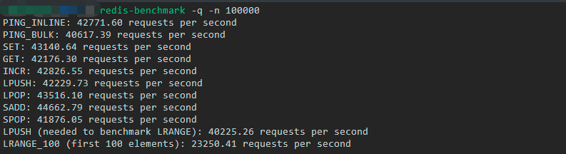
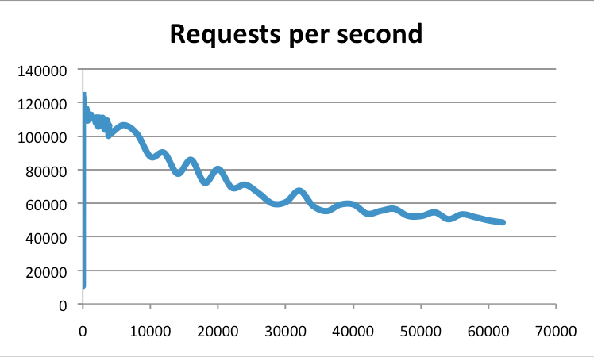
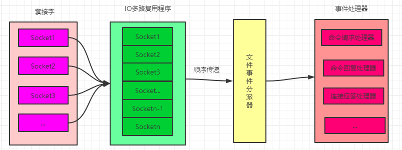

# 前言

在日常开发中，为了保证数据的一致性，我们一般都选择关系型数据库来存储数据，如 `MySQL`，`Oracle` 等，因为关系型数据库有着事务的特性。然而在并发量比较大的业务场景，关系型数据库却又往往会成为系统瓶颈，无法完全满足我们的需求，所以就需要使用到缓存，而非关系型数据库，即 `NoSQL` 数据库往往又会成为最佳选择。

`NoSQL` 数据库最常见的解释是 `non-relational`，也有人解释为 `Not Only SQL`。非关系型数据库不保证事务，也就是不具备事务 `ACID` 特性，这也是非关系型数据库和关系型数据库最大的区别，而我们即将介绍的 `Redis` 就属于 `NoSQL` 数据库的一种。

# 什么是 Redis

`Redis` 全称是：`REmote DIctionary Service`，即远程字典服务。`Redis` 是一个开源的（遵守 `BSD` 协议）、支持网络、可基于内存亦可持久化的日志型、`Key-Value` 数据库。
`Redis` 具有以下特性：

- 1、支持丰富的数据类型：字符串（strings），散列（hashes），列表（lists），集合（sets），有序集合（sorted sets），位图等。
- 2、功能丰富：提供了持久化机制，过期策略，订阅/发布等功能。
- 3、高性能，高可用且支持集群。
- 4、提供了多种语言的 `API`。

# Redis 的安装

- 1、下载对应版本的安装包，如：[Redis 5.0.5 版本](http://download.redis.io/releases/redis-5.0.5.tar.gz)，其他版本也可以[点击这里](http://download.redis.io/releases)进行下载。
- 2、下载好之后传到服务器指定目录，执行命令 `tar -zxvf redis-5.0.5.tar.gz` 进行解压。
- 3、解压成功之后，进入 `Redis` 主目录，执行命令 `make && make install PREFIX=/xxx/xxx/redis-5.0.5` 进行安装，如果不指定目录，则默认是安装在 `/usr/local` 目录下。
- 4、安装成功之后可以看到 `Redis` 主目录下多了一个 `bin` 目录，`bin` 目录内包含了一些可执行脚本。
- 5、回到 `Redis` 主目录下，找到 `redis.conf` 配置文件，将其中的配置 `daemonize no` 修改为 `daemonize yes`，表示在后台启动服务。
- 6、然后就可以执行命令 `/xxx/xxx/redis-5.0.5/bin/redis-server /xxx/xxx/redis-5.0.5/redis.conf` 启动 `Redis` 服务。

# Redis 到底有多快

大家可能都知道 `Redis` 很快，可是 `Redis` 到底能有多快呢，比如 `Redis` 的吞吐量能达到多少？我想这就不是每一个人都能说的上来一个具体的数字了。

`Redis` 官方提供了一个测试脚本，可以供我们测试 `Redis` 的 吞吐量。

-  `redis-benchmark -q -n 100000` 可以测试常用命令的吞吐量。
-  `redis-benchmark -t set,lpush -n 100000 -q` 测试 `Redis` 处理 `set` 和 `lpush` 命令的吞吐量。
- `redis-benchmark -n 100000 -q script load "redis.call('set','foo','bar')"` 测试 `Redis` 处理 `Lua` 脚本等吞吐量。

下图就是我这边执行第一条命令的自测结果，可以看到大部分命令的吞吐量都可以达到 `4` 万以上，也就是说每秒钟可以处理 `4` 万次以上请求：

但是如果你以为这就是 `Redis` 的真实吞吐量，那就错了。实际上，`Redis` 官方的测试结果是可以达到 `10` 万的吞吐量，下图就是官方提供的一个基准测试结果（纵坐标就是吞吐量，横坐标是连接数）：

# Redis 是单线程还是多线程

这个问题比较经典，因为在很多人的认知里，`Redis` 就是单线程的。然而 `Redis` 从 `4.0` 版本开始就有了多线程的概念，虽然处理命令请求的核心模块确实是保证了单线程执行，然而在其他许多地方已经有了多线程，比如：在后台删除对象，通过 `Redis` 模块实现阻塞命令，生成 `dump` 文件，以及 `6.0` 版本中网络 `I/O` 实现了多线程等，而且在未来 `Redis` 应该会有越来越多的模块实现多线程。

所谓的单线程，只是说 `Redis` 的处理客户端的请求（即执行命令）时，是单线程去执行的，并不是说整个 `Redis` 都是单线程。

# Redis 为什么选择使用单线程来执行请求

`Redis` 为什么会选择使用单线程呢？这是因为 `CPU` 成为 `Redis` 瓶颈的情况并不常见，成为 `Redis` 瓶颈的通常是内存或网络带宽。例如，在一个普通的 `Linux` 系统上使用 `pipelining` 命令，`Redis` 可以每秒完成 `100` 万个请求，所以如果我们的应用程序主要使用 `O(N)` 或 `O(log(N))` 复杂度的命令，它几乎不会使用太多的 `CPU`。

那么既然 `CPU` 不会成为瓶颈，理所当然的就没必要去使用多线程来执行命令，我们需要明确的一个问题就是多线程一定比单线程快吗？答案是不一定。因为多线程也是有代价的，最直接的两个代价就是线程的创建和销毁线程（当然可以通过线程池来一定程度的减少频繁的创建线程和销毁线程）以及线程的上下文切换。

在我们的日常系统中，主要可以区分为两种：`CPU` 密集型 和 `IO` 密集型。

- CPU 密集型：这种系统就说明 `CPU` 的利用率很高，那么使用多线程反而会增加上下文切换而带来额外的开销，所以使用多线程效率可能会不升反降。举个例子：假如你现在在干活，你一直不停的在做一件事，需要 `1` 分钟可以做完，但是你中途总是被人打断，需要花 `1` 秒钟时间步行到旁边去做另一件事，假如这件事也需要 `1` 分钟，那么你因为反复切换做两件事，每切换一次就要花 `1` 秒钟，最后做完这 `2` 件事的时间肯定大于 `2` 分钟（取决于中途切换的次数），但是如果中途不被打断，你做完一件事再去做另一件事，那么你最多只需要切换 `1` 次，也就是 `2` 分 `1` 秒就能做完。
- IO 密集型：`IO` 操作也可以分为磁盘 `IO` 和网络 `IO` 等操作。大部分 `IO` 操作的特点是比较耗时且 `CPU` 利用率不高，所以 `Redis 6.0` 版本网络 `IO` 会改进为多线程。至于磁盘 `IO`，因为 `Redis` 中的数据都存储在内存（也可以持久化），所以并不会过多的涉及到磁盘操作。举个例子：假如你现在给树苗浇水，你每浇完一次水之后就需要等别人给你加水之后你才能继续浇，那么假如这个等待过程需要 `5` 秒钟，也就是说你浇完一次水就可以休息 `5` 秒钟，而你切换去做另一件事来回只需要 `2` 秒，那么你完全可以先去做另一件事，做完之后再回来，这样就可以充分利用你空闲的 `5` 秒钟时间，从而提升了效率。

使用多线程还会带来一个问题就是数据的安全性，所以多线程编程都会涉及到锁竞争，由此也会带来额外的开销。

# 什么是  I/O 多路复用

`I/O` 指的是网络 `I/O`， 多路指的是多个 `TCP` 连接（如 `Socket`），复用指的是复用一个或多个线程。`I/O` 多路复用的核心原理就是不再由应用程序自己来监听连接，而是由服务器内核替应用程序监听。

在 `Redis` 中，其多路复用有多种实现，如：`select`，`epoll`，`evport`，`kqueue` 等。

我们用去餐厅吃饭为的例子来解释一下 `I/O` 多路复用机制（点餐人相当于客户端，餐厅的厨房相当于服务器，厨师就是线程）。

- 阻塞 `IO`：张三去餐厅吃饭，点了一道菜，这时候他啥事也不干了，就是一直等，等到厨师炒好菜，他就把菜端走开始吃饭了。也就是在菜被炒好之前，张三被阻塞了，这就是 `BIO`（阻塞 `IO`），效率会非常低下。
- 非阻塞 `IO`：张三去餐厅吃饭，点了一道菜，这时候张三他不会一直等，找了个位置坐下，刷刷抖音，打打电话，做点其他事，然后每隔一段时间就去厨房问一下自己的菜好了没有。这种就属于非阻塞 `IO`，这种方式虽然可以提高性能，但是如果有大量 `IO` 都来定期轮询，也会给服务器造成非常大的负担。
- 事件驱动机制：张三去餐厅吃饭，点了一道菜，这时候他找了个位置坐下来等：
  - 厨房那边菜做好了就会把菜端出来了，但是并不知道这道菜是谁的，于是就挨个询问顾客，这就是多路复用中的 `select` 模型，不过 `select` 模型最多只能监听 `1024` 个 `socket`（`poll` 模型解决了这个限制问题）。
  - 厨房做好了菜直接把菜放在窗口上，大喊一声，某某菜做好了，是谁的快过来拿，这时候听到通知的人就会自己去拿，这就是多路复用中的 `epoll` 模型。

需要注意的是在 `IO` 多路复用机制下，客户端可以阻塞也可以选择不阻塞（大部分场景下是阻塞 `IO`），这个要具体情况具体分析，但是在多路复用机制下，服务端就可以通过多线程（上面示例中可以多几个厨师同时炒菜）来提升并发效率。

# Redis 中 I/O 多路复用的应用

`Redis` 服务器是一个事件驱动程序，服务器需要处理两类事件：文件事件和时间事件。

- 文件事件：`Redis` 服务器和客户端（或其他服务器）进行通信会产生相应的文件事件，然后服务器通过监听并处理这些事件来完成一系列的通信操作。
- 时间事件：`Redis` 内部的一些在给定时间之内需要进行的操作。

`Redis` 的文件事件处理器以单线程的方式运行，其内部使用了 `I/O` 多路复用程序来同时监听多个套接字（`Socket`）连接，提升了性能的同时又保持了内部单线程设计的简单性。下图就是文件事件处理器的示意图：

`I/O` 多路复用程序虽然会同时监听多个 `Socket` 连接，但是其会将监听的 `Socket` 都放到一个队列里面，然后通过这个队列有序的，同步的将每个 `Socket` 对应的事件传送给文件事件分派器，再由文件事件分派器分派给对应的事件处理器进行处理，只有当一个 `Socket` 所对应的事件被处理完毕之后，`I/O`多路复用程序才会继续向文件事件分派器传送下一个 `Socket` 所对应的事件，这也可以验证上面的结论，处理客户端的命令请求是单线程的方式逐个处理，但是事件处理器内并不是只有一个线程。

# Redis 为什么这么快

`Redis` 为什么这么快的原因前面已经基本提到了，现在我们再进行总结一下：

- 1、`Redis` 是一款纯内存结构，避免了磁盘 `I/O` 等耗时操作。
- 2、`Redis` 命令处理的核心模块为单线程，减少了锁竞争，以及频繁创建线程和销毁线程的代价，减少了线程上下文切换的消耗。
- 3、采用了 `I/O` 多路复用机制，大大提升了并发效率。

