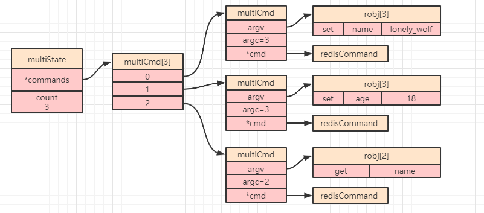
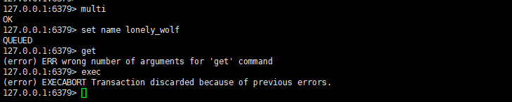
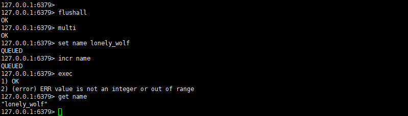
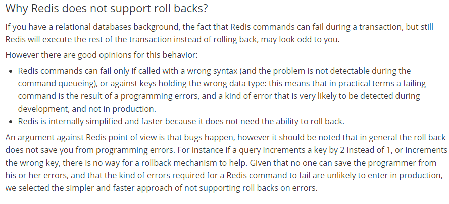

# 前言

事务是关系型数据库的特征之一，那么作为 `Nosql` 的代表 `Redis` 中有事务吗？如果有，那么 `Redis` 当中的事务又是否具备关系型数据库的 `ACID` 四大特性呢？

## Redis 有事务吗
这个答案可能会令很多人感到意外，`Redis` 当中是存在“事务”的。这里我把把 `Redis` 的事务带了引号，原因在后面分析。

`Redis` 当中的单个命令都是原子操作，但是如果我们需要把多个命令组合操作又需要保证数据的一致性时，就可以考试使用 `Redis` 提供的事务（或者使用前面介绍的 `Lua` 脚本）。

`Redis` 当中，通过下面 `4` 个命令来实现事务：

 - `multi`：开启事务
 - `exec`：执行事务
 - `discard`：取消事务
 - `watch`：监视

`Redis` 的事务主要分为以下 `3` 步：

1. 执行命令 `multi` 开启一个事务。
2. 开启事务之后执行的命令都会被放入一个队列，如果成功之后会固定返回 `QUEUED`。
3. 执行命令 `exec` 提交事务之后，`Redis` 会依次执行队列里面的命令，并依次返回所有命令结果（如果想要放弃事务，可以执行 `discard` 命令）。

接下来让我们依次执行以下命令来体会一下 `Redis` 当中的事务：

```java
multi //开启事务
set name lonely_wolf //设置 name，此时 Redis 会将命令放入队列
set age 18  //设值 age，此时 Redis 会将命令放入队列
get name  //获取 name，此时 Redis 会将命令放入队列
exec //提交事务，此时会依次执行队列里的命令，并依次返回结果
```

执行完成之后得到如下效果：


## Redis 事务实现原理

`Redis` 中每个客户端都有记录当前客户端的事务状态 `multiState `，下面就是一个客户端 `client` 的数据结构定义：

```c
typedef struct client {
    uint64_t id;//客户端唯一 id
    multiState mstate; //MULTI 和 EXEC 状态(即事务状态)
    //...省略其他属性
} client;
```
`multiState ` 数据结构定义如下：

```c
typedef struct multiState {
    multiCmd *commands;//存储命令的 FIFO 队列
    int count;//命令总数
    //...省略了其他属性
} multiState;
```
`multiCmd` 是一个队列，用来接收并存储开启事务之后发送的命令，其数据结构定义如下：

```c
typedef struct multiCmd {
    robj **argv;//用来存储参数的数组
    int argc;//参数的数量
    struct redisCommand *cmd;//命令指针
} multiCmd;
```
我们以上面事务的示例截图中事务为例，可以得到如下所示的一个简图：



## Redis 事务 ACID 特性
传统的关系型数据库中，一个事务一般都具有 `ACID` 特性。那么现在就让我们来分析一下 `Redis` 是否也满足这 `ACID` 四大特性。
### A - 原子性
在讨论事务的原子性之前，我们先来看 `2` 个例子。

- 模拟事务在执行命令前发生异常。依次执行以下命令：

```java
multi //开启事务
set name lonely_wolf //设置 name，此时 Redis 会将命令放入队列
get  //执行一个不完成的命令，此时会报错
exec //在发生异常后提交事务
```

最终得到了如下图所示的结果，我们可以看到，当命令入队的时候报错时，事务已经被取消了：



- 模拟事务在执行命令前发生异常。依次执行以下命令：

```java
flushall //为了防止影响，先清空数据库
multi //开启事务
set name lonely_wolf //设置 name，此时 Redis 会将命令放入队列
incr name  //这个命令只能用于 value 为整数的字符串对象，此时执行会报错
exec //提交事务，此时在执行第一条命令成功，执行第二条命令失败
get name //获取 name 的值
```

最终得到了如下图所示的结果，我们可以看到，当执行事务报错的时候，之前已经成功的命令并没有被回滚，也就是说**在执行事务的时候某一个命令失败了，并不会影响其他命令的执行，即 `Redis` 的事务并不会回滚**：



#### Redis 中的事务为什么不会滚
这个问题的答案在 `Redis` 官网中给出了明确的解释：



总结起来主要就是 `3` 个原因：

- `Redis` 作者认为发生事务回滚的原因大部分都是程序错误导致，这种情况一般发生在开发和测试阶段，而生产环境很少出现。
- 对于逻辑性错误，比如本来应该把一个数加 `1` ，但是程序逻辑写成了加 `2`，那么这种错误也是无法通过事务回滚来进行解决的。
- `Redis` 追求的是简单高效，而传统事务的实现相对比较复杂，这和 `Redis` 的设计思想相违背。

### C - 一致性
一致性指的就是事务执行前后的数据符合数据库的定义和要求。这一点 `Redis` 中的事务是符合要求的，上面讲述原子性的时候已经提到，不论是发生语法错误还是运行时错误，错误的命令均不会被执行。
### I - 隔离性
事务中的所有命令都会按顺序执行，在执行 `Redis` 事务的过程中，另一个客户端发出的请求不可能被服务，这保证了命令是作为单独的独立操作执行的。所以 `Redis` 当中的事务是符合隔离性要求的。
### D - 持久性
如果 `Redis` 当中没有被开启持久化，那么就是纯内存运行的，一旦重启，所有数据都会丢失，此时可以认为 `Redis` 不具备事务的持久性；而如果 `Redis` 开启了持久化，那么可以认为 `Redis` 在特定条件下是具备持久性的。
## watch 命令

上面我们讲述 `Redis` 中事务时，提到的的常用命令还有一个 `watch` 命令，这个又是做什么用的呢？我们还是先来看一个例子。

首先打开一个客户端一，依次执行以下命令：

```java
flushall  //清空数据库
multi     //开启事务
get name  //获取 name，此时正常返回 nil
set name lonely_wolf //设置 name
get name //获取 name，此时正常应该返回 lonely_wolf
```

得到如下效果图：


这时候我们先不执行事务，打开另一个客户端二，来执行一个命令 `set name zhangsan`：


客户端二执行成功了，这时候再返回到客户端一执行 `exec` 命令：


可以发现，第一句话返回了 `zhangsan`。也就是说，`name` 这个 `key` 值在入队之后到 `exec` 之前发生了变化，一旦发生这种情况，可能会引起很严重的问题，所以在关系型数据库可以通过锁来解决这种问题，那么 `Redis` 当中试如何解决的呢？

是的，在 `Redis` 当中就是通过 `watch` 命令来处理这种场景的。

### watch 命令的作用
`watch` 命令可以为 `Redis` 事务提供 `CAS` 乐观锁行为，它可以在 `exec` 命令执行之前，监视任意 `key` 值的变化，也就是说当多个线程更新同一个 `key` 值的时候，会跟原值做比较，一旦发现它被修改过，则拒绝执行命令，并且会返回 `nil` 给客户端。
下面还是让我们通过一个示例来演示一下。

打开一个客户端一，依次执行如下命令：

```java
flushall  //清空数据库
watch name //监视 name
multi     //开启事务
set name lonely_wolf //设置 name
set age 18 // 设置 age
get name   //获取 name
get age    //获取 age
```

执行之后得到如下效果图：


这时候再打开一个客户端二，执行 `set name zhangsan`命令：


然后再回到客户端一执行 `exec`命令。这时候会发现直接返回了 `nil`，也就是事务中所有的命令都没有被执行（即：只要检测到一个 `key` 值被修改过，那么整个事务都不会被执行）：


### watch 原理分析

下面是一个 `Redis` 服务的数据结构定义：
```c
typedef struct redisDb {
    dict *watched_keys;  //被 watch 命令监视的 key
    int id;           //Database ID
    //...省略了其他属性
} redisDb;
```
可以看到，`redisDb` 中的 `watched_keys` 存储了一个字典，这个字典当中的 `key` 存的就是被监视的 `key` ，然后字典的值存的就是客户端 `id`。然后每个客户端还有一个标记属性 `CLIENT_DIRTY_CAS`，一旦我们执行了一些如 `set`，`sadd` 等能修改 `key` 值对应 `value` 的命令，那么客户端的 `CLIENT_DIRTY_CAS` 标记属性将会被修改，后面执行事务提交命令 `exec` 时发现客户端的标记属性被修改过（乐观锁的体现），则会拒绝执行事务。

# 总结

本文主要介绍了 `Redis` 当中的事务机制，在介绍事务实现原理的同时从传统关系型数据库的 `ACID` 四大特性对比分析了 `Redis` 当中的事务，并最终了解到了 `Redis` 的事务似乎并不是那么“完美”。