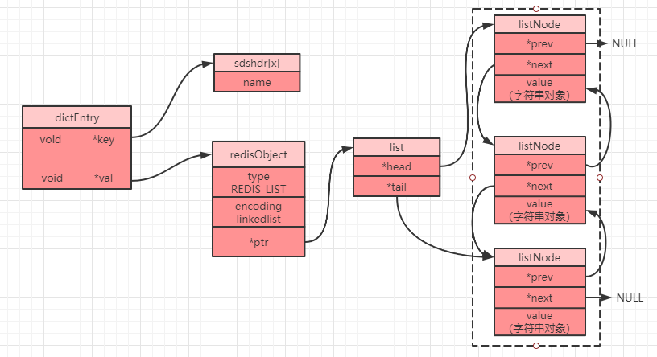
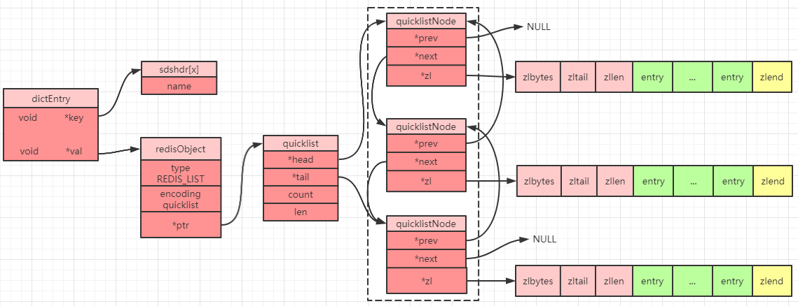
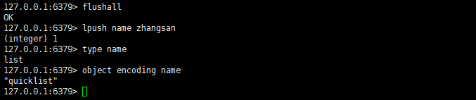

# 前言

列表对象是 `Redis` 中 `5` 种基础数据类型之一，在 `Redis 3.2` 版本之前，列表对象底层存储结构有两种：`linkedlist`（双端列表）和 `ziplist`（压缩列表），而在 `Redis 3.2` 版本之后，列表对象底层存储结构只有一种：`quicklist`（快速列表），难道通过精心设计的 `ziplist` 最终被 `Redis` 抛弃了吗？

# 列表对象

同字符串对象一样，列表对象到底使用哪一种数据结构来进行存储也是通过编码来进行区分：

| 编码属性                | 描述                           | object encoding命令返回值 |
| ----------------------- | ------------------------------ | ------------------------- |
| OBJ_ENCODING_LINKEDLIST | 使用 `linkedlist` 实现列表对象 | linkedlist                |
| OBJ_ENCODING_ZIPLIST    | 使用 `ziplist` 实现列表对象    | ziplist                   |
| OBJ_ENCODING_QUICKLIST  | 使用 `quicklist` 实现列表对象  | quicklist                 |

## linkedlist
`linkedlist` 是一个双向列表，每个节点都会存储指向上一个节点和指向下一个节点的指针。`linkedlist` 因为每个节点之间的空间是不连续的，所以可能会造成过多的内存空间碎片。

### linkedlist存储结构
链表中每一个节点都是一个 `listNode` 对象（源码 `adlist.h` 内），不过需要注意的是，列表中的 `value` 其实也是一个字符串对象，其他几种数据类型其内部最终也是会嵌套字符串对象，字符串对象也是唯一一种会被其他对象引用的基本类型：
```c
typedef struct listNode {
    struct listNode *prev;//前一个节点
    struct listNode *next;//后一个节点
    void *value;//值(字符串对象)
} listNode;
```
然后会将其再进行封装成为一个 `list` 对象（源码 `adlist.h` 内）：
```c
typedef struct list {
    listNode *head;//头节点
    listNode *tail;//尾节点
    void *(*dup)(void *ptr);//节点值复制函数
    void (*free)(void *ptr);//节点值释放函数
    int (*match)(void *ptr, void *key);//节点值对比函数
    unsigned long len;//节点数量
} list;
```
`Redis` 中对 `linkedlist` 的访问是以 `NULL` 值为终点的，因为 `head` 节点的 `prev` 节点为 `NULL`，`tail` 节点的 `next` 节点也为 `NULL`，所以从头节点开始遍历，当发现 `tail` 为 `NULL` 时，则可以认为已经到了列表末尾。

当我们设置一个列表对象时，在 `Redis 3.2` 版本之前我们可以得到如下存储示意图：



## ziplist

压缩列表在前面已经介绍过，想要详细了解的可以[点击这里](https://zhouwenxing.github.io/redis/牺牲速度来节省内存，Redis是觉得自己太快了吗)。

## linkedlist 和 ziplist 的选择

在 `Redis3.2` 之前，`linkedlist` 和 `ziplist` 两种编码可以进选择切换，如果需要列表使用 `ziplist` 编码进行存储，则必须满足以下两个条件：

 - 列表对象保存的所有字符串元素的长度都小于 `64` 字节。
 - 列表对象保存的元素数量小于 `512` 个。

一旦不满足这两个条件的任意一个，则会使用 `linkedlist` 编码进行存储。

PS：这两个条件可以通过参数 `list-max-ziplist-value` 和 `list-max-ziplist-entries` 进行修改。

这两种列表能在特定的场景下发挥各自的作用，应该来说已经能满足大部分需求了，然后 `Redis` 并不满足于此，于是一场改革引发了，`quicklist` 横空出世。

## quicklist

在 `Redis 3.2` 版本之后，为了进一步提升 `Redis` 的性能，列表对象统一采用 `quicklist` 来存储列表对象。`quicklist`存储了一个双向列表，每个列表的节点是一个 `ziplist`，所以实际上 `quicklist` 并不是一个新的数据结构，它就是`linkedlist` 和 `ziplist` 的结合，然后被命名为快速列表。

### quicklist 内部存储结构

`quicklist` 中每一个节点都是一个 `quicklistNode` 对象，其数据结构定义如下：

```c
typedef struct quicklistNode {
    struct quicklistNode *prev;//前一个节点
    struct quicklistNode *next;//后一个节点
    unsigned char *zl;//当前指向的ziplist或者quicklistLZF
    unsigned int sz;//当前ziplist占用字节
    unsigned int count : 16;//ziplist中存储的元素个数，16字节(最大65535个)
    unsigned int encoding : 2; //是否采用了LZF压缩算法压缩节点 1：RAW 2:LZF
    unsigned int container : 2; //存储结构，NONE=1, ZIPLIST=2
    unsigned int recompress : 1; //当前ziplist是否需要再次压缩(如果前面被解压过则为true，表示需要再次被压缩)
    unsigned int attempted_compress : 1;//测试用 
    unsigned int extra : 10; //后期留用
} quicklistNode;
```
然后各个 `quicklistNode` 就构成了一个快速列表 `quicklist`：
```c
typedef struct quicklist {
    quicklistNode *head;//列表头节点
    quicklistNode *tail;//列表尾节点
    unsigned long count;//ziplist中一共存储了多少元素，即:每一个quicklistNode内的count相加
    unsigned long len; //双向链表的长度，即quicklistNode的数量
    int fill : 16;//填充因子
    unsigned int compress : 16;//压缩深度 0-不压缩
} quicklist;
```
根据这两个结构，我们可以得到 `Redis 3.2` 版本之后的列表对象的一个存储结构示意图：



### quicklist 的 compress 属性

`compress` 是用来表示压缩深度，`ziplist` 除了内存空间是连续之外，还可以采用特定的 `LZF` 压缩算法来将节点进行压缩存储，从而更进一步的节省空间，压缩深度可以通过参数 `list-compress-depth` 控制：

 - 0：不压缩(默认值)
 - 1：首尾第1个元素不压缩
 - 2：首位前2个元素不压缩
 - 3：首尾前3个元素不压缩
-  以此类推

注意：之所以采取这种压缩两端节点的方式是因为很多场景都是两端的元素访问率最高的，而中间元素访问率相对较低，所以在实际使用时，我们可以根据自己的实际情况选择是否进行压缩，以及具体的压缩深度。

### quicklistNode 的 zl 指针

`zl` 指针默认指向了 `ziplist`，上面提到 `quicklistNode` 中有一个 `sz` 属性记录了当前 `ziplist` 占用的字节，不过这仅仅限于当前节点没有被压缩（通过`LZF` 压缩算法）的情况，如果当前节点被压缩了，那么被压缩节点的 `zl` 指针会指向另一个对象 `quicklistLZF`，而不会直接指向 `ziplist`。`quicklistLZF` 是一个 `4+N` 字节的结构：

```c
typedef struct quicklistLZF {
    unsigned int sz;// LZF大小，占用4字节
    char compressed[];//被压缩的内容，占用N字节
} quicklistLZF;
```

### quicklist 对比原始两种编码的改进

`quicklist` 同样采用了 `linkedlist` 的双端列表特性，然后 `quicklist` 中的每个节点又是一个 `ziplist`，所以`quicklist` 就是综合平衡考虑了 `linkedlist` 容易产生空间碎片的问题和 `ziplist` 的读写性能两个维度而设计出来的一种数据结构。使用 `quicklist` 需要注意以下 `2` 点：

 - 如果 `ziplist` 中的 `entry` 个数过少，最极端情况就是只有 `1` 个 `entry` 的压缩列表，那么此时 `quicklist` 就相当于退化成了一个普通的 `linkedlist`。
 - 如果 `ziplist` 中的 `entry` 过多，那么也会导致一次性需要申请的内存空间过大（`ziplist` 空间是连续的），而且因为 `ziplist` 本身的就是以时间换空间，所以会过多 `entry` 也会影响到列表对象的读写性能。

`ziplist` 中的 `entry` 个数可以通过参数 `list-max-ziplist-size` 来控制：

```java
list-max-ziplist-size 1
```
注意：这个参数可以配置正数也可以配置负数。正数表示限制每个节点中的 `entry` 数量，如果是负数则只能为 `-1~-5`，其代表的含义如下：
 - -1：每个 `ziplist` 最多只能为 `4KB`
 - -2：每个 `ziplist` 最多只能为 `8KB`
 - -3：每个 `ziplist` 最多只能为 `16KB`
 - -4：每个 `ziplist` 最多只能为 `32KB`
 - -5：每个 `ziplist` 最多只能为 `64KB`

## 列表对象常用操作命令

- lpush key value1 value2：将一个或者多个 `value` 插入到列表 `key` 的头部，`key` 不存在则创建 `key`（`value2` 在`value1` 之后）。
- lpushx key value1 value2：将一个或者多个 `value` 插入到列表 `key` 的头部，`key` 不存在则不做任何处理（`value2` 在`value1` 之后）。
- lpop key：移除并返回 `key` 值的列表头元素。
- rpush key value1 value2：将一个或者多个 `value` 插入到列表 `key` 的尾部，`key` 不存在则创建 `key`（`value2` 在`value1` 之后）。
- rpushx key value1 vaue2：将一个或者多个 `value` 插入到列表 `key` 的尾部，`key` 不存在则不做任何处理（`value2` 在`value1` 之后）。
- rpop key：移除并返回列表 `key` 的尾元素。
- llen key：返回列表 `key` 的长度。
- lindex key index：返回列表 `key` 中下标为 `index` 的元素。`index` 为正数（从 `0` 开始）表示从队头开始算，`index` 为负数（从-1开始）则表示从队尾开始算。
- lrange key start stop：返回列表 `key` 中下标 `[start,end]` 之间的元素。
- lset key index value：将 `value` 设置到列表 `key` 中指定 `index` 位置，`key` 不存在或者 `index` 超出范围则会报错。
- ltrim key start end：截取列表中 `[start,end]` 之间的元素，并替换原列表保存。

了解了操作列表对象的常用命令，我们就可以来验证下前面提到的列表对象的类型和编码了，在测试之前为了防止其他 `key` 值的干扰，我们先执行 `flushall` 命令清空 `Redis` 数据库。

接下来依次输入命令：

- `lpush name zhangsan`
- `type name`
- `object encoding name`



可以看到，通过 `type` 命令输出的是 `list`，说明当前 `name` 存的是一个列表对象，并且编码是 `quicklist`（示例中用的是 `5.0.5` 版本）。

# 总结

本文主要介绍了 `Redis` 中 `5` 种常用数据类型中的 列表对象，并介绍了底层的存储结构 `quicklist`，并分别对旧版本的两种底层数据 `linkedlist` 和 `ziplist` 进行了分析对比得出了为什么 `Redis` 最终要采用 `quicklist` 来存储列表对象。