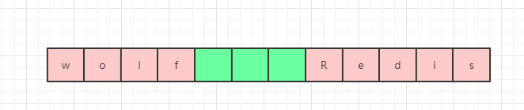
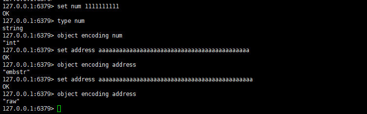
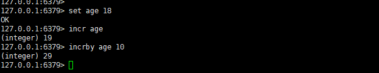
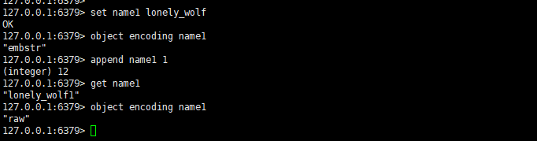

# Redis 的 9 种数据类型

`Redis` 中支持的数据类型到 `5.0.5` 版本，一共有 `9` 种。分别是：

- 1、Binary-safe strings(二进制安全字符串)
- 2、Lists(列表)
- 3、Sets(集合)
- 4、Sorted sets(有序集合)
- 5、Hashes(哈希)
- 6、Bit arrays (or simply bitmaps)(位图)
- 7、HyperLogLogs
- 8、 geospatial
- 9、Streams

虽然这里列出了 `9` 种，但是基础类型就是前面 `5` 种。后面的 `4` 种是基于前面 `5` 种基本类型及特定的算法来实现的特殊类型。

而在 `5` 种基础类型之中，又尤其以字符串类型最为常用，且 `key` 值只能为字符串对象，所以要想深入的了解 `Redis` 的特性，字符串对象是首先需要学习的。

# 五种基本数据类型之字符串对象

`Redis` 当中有五种基础数据类型，而字符串对象又是最重要最常用的一种类型。

## 二进制安全字符串

`Redis` 是基于 `C` 语言进行开发的，而 `C` 语言中的字符串是二进制不安全的，所以 `Redis` 就没有直接使用 `C` 语言的字符串，而是自己编写了一个新的数据结构来表示字符串，这种数据结构称之为：**简单动态字符串（Simple dynamic string），简称 `SDS`**。

## 什么是二进制安全的字符串

在 `C` 语言中，字符串采用的是一个 `char` 数组（柔性数组）来存储字符串，而且字符串必须要以一个空字符串 `\0` 来结尾。而且字符串并不记录长度，所以如果想要获取一个字符串的长度就必须遍历整个字符串，直到遇到第一个 `\0` 为止（`\0` 不会计入字符串长度），故而获取字符串长度的时间复杂度为 `O(n)`。

正因为 `C` 语言中是以遇到的第一个空字符 `\0` 来识别是否到了字符串末尾，因此其只能保存文本数据，不能保存图片，音频，视频和压缩文件等二进制数据，否则可能出现字符串不完整的问题，所以其是二进制不安全的。

`Redis` 中为了实现二进制安全的字符串，对原有 `C` 语言中的字符串实现做了改进。如下所示就是一个旧版本的 `sds` 字符串的结构定义：

```c
struct sdshdr{
  int len;//记录buf数组已使用的长度，即SDS的长度(不包含末尾的'\0')
  int free;//记录buf数组中未使用的长度
  char buf[];//字节数组，用来保存字符串
}
```

经过改进之后，如果想要获取 `sds` 的长度不用去遍历 `buf` 数组了，直接读取 `len` 属性就可以得到长度，时间复杂度一下就变成了 `O(1)`，而且因为判断字符串长度不再依赖空字符 `\0`，所以其能存储图片，音频，视频和压缩文件等二进制数据，不用担心读取到的字符串不完整。

需要注意的是，`sds` 依然遵循了 `C` 语言字符串以 `\0` 结尾的惯例，这么做是为了方便复用 `C` 语言字符串原生的一些API，换言之就是在 `C` 语言中会以碰到的第一个 `\0` 字符当做当前字符串对象的结尾，所以如果一些二进制数据就会可能出现读取字符串不完整的现象，而 `sds` 会以长度来判断是否到字符串末尾。

在 `Redis 3.2` 之后的版本，`Redis` 对 `sds` 又做了优化，按照存储空间的大小拆分成为了 `sdshdr5`、`sdshdr8`、`sdshdr16`、`sdshdr32`、`sdshdr64`，分别用来存储大小为：`32` 字节（`2` 的 `5` 次方）,`256` 字节（`2` 的 `8` 次方），`64KB`（`2` 的 `16` 次方），`4GB` 大小（`2` 的 `32` 次方）以及 `2` 的 `64` 次方大小的字符串（因为目前版本 `key` 和 `value` 都限制了最大 `512MB`，所以 `sdshdr64` 暂时并未使用到）。 `sdshdr5` 只被应用在了 `Redis` 中的 `key` 中，`value` 中不会被使用到，因为`sdshdr5`和其他类型也不一样，其并没有存储未使用空间，所以其是比较适用于使用大小固定的场景（比如 `key` 值）：


任意选择其中一种数据类型，其字段代表含义如下：

```c
struct __attribute__ ((__packed__)) sdshdr8 {
    uint8_t len; //已使用空间大小
    uint8_t alloc; //总共申请的空间大小(包括未使用的)
    unsigned char flags; //用来表示当前sds类型是sdshdr8还是sdshdr16等
    char buf[]; //真实存储字符串的字节数组
};
```

可以看到相比较于 `Redis 3.2` 版本之前的 `sds` 主要是修改了 `free` 属性然后新增了一个 `flags` 标记来区分当前的 `sds` 类型。

## sds 空间分配策略

`C` 语言中因为字符串内部没有记录长度，所以如果扩充字符串的时候非常容易造成**缓冲区溢出（buffer overflow）**。

请看下面这张图，假设下面这张图就是内存里面的连续空间，可以很明显的看到，此时 `wolf` 和 `Redis` 两个字符串之间只有三个空位，那么这时候如果我们要将 `wolf` 字符串修改为 `lonelyWolf`，那么就需要 `6` 个空间，这时候下面这个空间是放不下的，所以必须要重新申请空间，但是假如说程序员忘了申请空间，或者说申请到的空间依然不够，那么就会出现后面的 `Redis` 字符串中的 `Red` 被覆盖了：



同样的，假如要缩小字符串的长度，那么也需要重新申请释放内存。否则，字符串一直占据着未使用的空间，会造成**内存泄露**。

 `C` 语言避免缓存区溢出和内存泄露完全依赖于人为，很难把控，但是使用 `sds` 就不会出现这两个问题，因为当我们操作 `sds`时，其内部会自动执行**空间分配策略**，从而避免了上述两种情况的出现。

### 空间预分配

空间预分配指的是当我们通过 `api` 对 `sds` 进行扩展空间的时候，假如未使用空间不够用，那么程序不仅会为 `sds` 分配必须要的空间，还会额外分配未使用空间，未使用空间分配大小主要有两种情况：

 - 1、假如扩大长度之后的 `len` 属性小于等于 `1MB` （即 1024 * 1024），那么就会同时分配和 `len` 属性一样大小的未使用空间（**此时 `buf` 数组已使用空间 = 未使用空间**）。
 - 2、假如扩大长度之后的 `len` 属性大于 `1MB`，那么就会分配 `1MB` 未使用空间大小。

执行空间预分配策略的好处是**提前分配了未使用空间备用后，就不需要每次增大字符串都需要分配空间，减少了内存重分配的次数。**

### 惰性空间释放

惰性空间释放指的是当我们需要通过 `api` 减小 `sds` 长度的时候，程序并不会立即释放未使用的空间，而只是更新 `free` 属性的值，这样空间就可以留给下一次使用。而为了防止出现内存溢出的情况，`sds` 单独提供给了 `api` 让我们在有需要的时候去真正的释放内存。

## sds 和 C 语言字符串区别

下面表格中列举了 `Redis` 中的 `sds` 和 `C` 语言中实现的字符串的区别：
| C 字符串                                            | SDS                                                  |
| --------------------------------------------------- | ---------------------------------------------------- |
| 只能保存文本类不含空字符串 `\0` 数据                | 可以保存文本或者二进制数据，允许包含空字符串 `\0`    |
| 获取字符串长度的复杂度为 `O(n)`                     | 获取字符串长度的复杂度为 `O(1)`                      |
| 操作字符串可能会造成缓冲区溢出                      | 不会出现缓冲区溢出情况                               |
| 修改字符串长度 `N` 次，**必然需要** `N`次内存重分配 | 修改字符串长度 `N` 次，**最多需要** `N` 次内存重分配 |
| 可以使用 `C` 字符串相关的**所有**函数               | 可以使用 `C` 字符串相关的**部分**函数                |

# sds 是如何被存储的

在 `Redis` 中所有的数据类型都是将对应的数据结构再进行了再一次包装，创建了一个字典对象来存储的，`sds`也不例外。每次创建一个 `key-value` 键值对，`Redis` 都会创建两个对象，一个是键对象，一个是值对象。而且需要注意的是**在 `Redis` 中，值对象并不是直接存储，而是被包装成 `redisObject` 对象**，并同时将键对象和值对象通过 `dictEntry` 对象进行封装，如下就是一个 `dictEntry` 对象：

```c
typedef struct dictEntry {
    void *key;//指向key，即sds
    union {
        void *val;//指向value
        uint64_t u64;
        int64_t s64;
        double d;
    } v;
    struct dictEntry *next;//指向下一个key-value键值对(哈希值相同的键值对会形成一个链表，从而解决哈希冲突问题)
} dictEntry;
```

`redisObject` 对象的定义为：

```c
typedef struct redisObject {
    unsigned type:4;//对象类型（4位=0.5字节）
    unsigned encoding:4;//编码（4位=0.5字节）
    unsigned lru:LRU_BITS;//记录对象最后一次被应用程序访问的时间（24位=3字节）
    int refcount;//引用计数。等于0时表示可以被垃圾回收（32位=4字节）
    void *ptr;//指向底层实际的数据存储结构，如：sds等(8字节)
} robj;
```

当我们在 `Redis` 客户端中执行命令 `set name lonely_wolf ` ，就会得到下图所示的一个结构（省略了部分属性）：


看到这个图想必大家会有疑问，这里面的 `type` 和 `encoding` 到底是什么呢？其实这两个属性非常关键，`Redis` 就是通过这两个属性来识别当前的 `value` 到底属于哪一种基本数据类型，以及当前数据类型的底层采用了何种数据结构进行存储。

## type 属性

`type` 属性表示对象类型，其对应了 `Redis` 当中的 `5` 种基本数据类型：

| 类型属性     | 描述         | type 命令返回值 |
| ------------ | ------------ | --------------- |
| REDIS_STRING | 字符串对象   | string          |
| REDIS_LIST   | 列表对象     | list            |
| REDIS_HASH   | 哈希对象     | hash            |
| REDIS_SET    | 集合对象     | set             |
| REDIS_ZSET   | 有序集合对象 | zset            |

可以看到，这就是对应了我们 `5` 种常用的基本数据类型。

## encoding 属性

`Redis`  当中每种数据类型都是经过特别设计的，相信大家看完这个系列也会体会到 `Redis` 设计的精妙之处。字符串在我们眼里是非常简单的一种数据结构了，但是 `Redis` 却把它优化到了极致，为了节省空间，其通过编码的方式定义了三种不同的存储方式：

| 编码属性            | 描述                               | object encoding命令返回值 |
| ------------------- | ---------------------------------- | ------------------------- |
| OBJ_ENCODING_INT    | 使用整数的字符串对象               | int                       |
| OBJ_ENCODING_EMBSTR | 使用 `embstr` 编码实现的字符串对象 | embstr                    |
| OBJ_ENCODING_RAW    | 使用 `raw` 编码实现的字符串对象    | raw                       |

 - `int` 编码
当我们用字符串对象存储的是整型，且能用 `8` 个字节的 `long` 类型进行表示（即  `2` 的 `63` 次方减 `1`），则 `Redis` 会选择使用 `int` 编码来存储，此时 `redisObject` 对象中的 `ptr` 指针直接替换为 `long` 类型。我们想想 `8` 个字节如果用字符串来存储只能存 `8` 位，也就是千万级别的数字，远远达不到  `2` 的 `63` 次方减 `1` 这个级别，所以如果都是数字，用 `long` 类型会更节省空间。
 - `embstr` 编码
当字符串对象中存储的是字符串，且长度小于 `44` （`Redis 3.2` 版本之前是 `39`）时，`Redis` 会选择使用 `embstr` 编码来存储。
 - `raw` 编码
当字符串对象中存储的是字符串，且长度大于 `44` 时，`Redis` 会选择使用 `raw` 编码来存储。

讲了半天理论，接下来让我们一起来验证下这些结论，依次输入 `set name lonely_wolf`，`type name`，`object encoding name` 命令：


可以发现当前的数据类型就是 `string`，普通字符串因为长度小于 `44`，所以采用的是 `embstr` 编码。

再依次输入：`set num 1111111111`，`set address aaaaaaaaaaaaaaaaaaaaaaaaaaaaaaaaaaaaaaaaaaaa`（长度 `44`），`set address aaaaaaaaaaaaaaaaaaaaaaaaaaaaaaaaaaaaaaaaaaaaa`（长度 `45`），分别查看类型和编码：



可以发现，当输入纯数字的时候，采用的是 `int` 编码，而字符串小于等于 `44` 则为 `embstr`，大于 `44` 则为 `raw` 编码。

字符串对象中除了上面提到的纯整数和字符串，还可以存储浮点型类型，所以字符串对象可以存储以下三种类型：

- 字符串
- 整数
- 浮点数

而当我们的 `value` 为整数时，还可以使用原子自增命令来实现 `value` 的自增，这个命令在实际开发过程中非常实用。

- `incr key`：将 `key` 的值自增 `1`。
- `incrby key n`：将 `key` 的值自增 `n`。



不过这两个命令只能用在 `value` 为整数的场景，当 `value` 不是整数时则会报错。

### embstr 编码为什么从 39 位修改为 44 位

`embstr` 编码中，`redisObject` 和 `sds` 是连续的一块内存空间，这块内存空间 `Redis` 限制为了 `64` 个字节，而`redisObject` 固定占了16字节（上面定义中有标注），`Redis 3.2` 版本之前的 `sds` 占了 `8` 个字节，再加上字符串末尾 `\0` 占用了 `1` 个字节，所以：`64-16-8-1=39` 字节。

`Redis 3.2` 版本之后 `sds` 做了优化，对于 `embstr` 编码会采用 `sdshdr8` 来存储，而 `sdshdr8` 占用的空间只有 `24` 位：`3` 字节（len+alloc+flag）+ `\0` 字符（1字节），所以最后就剩下了：`64-16-3-1=44` 字节。

### embstr 编码和 raw 编码的区别

`embstr` 编码是一种优化的存储方式，其在申请空间的时候因为 `redisObject` 和 `sds` 两个对象是一个连续空间，所以**只需要申请 `1` 次空间（同样的，释放内存也只需要 `1` 次）**，而 `raw` 编码因为 `redisObject` 和 `sds` 两个对象的空间是不连续的，所以使用的时候**需要申请 `2` 次空间（同样的，释放内存也需要 `2` 次）**。但是使用 `embstr` 编码时，假如需要修改字符串，那么因为 `redisObject` 和 `sds` 是在一起的，所以两个对象都需要重新申请空间，为了避免这种情况发生，**`embstr` 编码的字符串是只读的，不允许修改**。



上图中的示例我们看到，对一个 `embstr` 编码的字符串对象进行 `append` 操作时，长度还没有达到 `45`，但是编码已经被修改为 `raw` 了，这就是因为 `embstr` 编码是只读的，如果需要对其修改，`Redis` 内部会将其修改为 `raw` 编码之后再操作。同样的，如果是操作 `int` 编码的字符串之后，**导致 `long` 类型无法存储时（`int` 类型不再是整数或者长度超过  `2` 的 `63` 次方减 `1` 时)**，也会将 `int` 编码修改为 `raw` 编码。

PS：**需要注意的是，编码一旦升级（int-->embstr-->raw），即使后期再把字符串修改为符合原编码能存储的格式时，编码也不会回退。**

# 总结

本文主要讲述了 `Redis` 当中最常用的字符串对象，通过对二进制安全字符串开始分析，逐步了解了 `sds` 的底层存储即编码格式，并分别介绍了每种编码格式的区别，最后通过示例来演示了编码的转换过程。