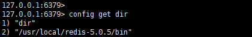
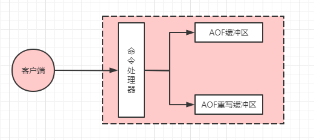

# 前言

`Redis` 作为一款内存数据库，被广泛使用于缓存，分布式锁等场景，那么假如断电或者因其他因素导致 `Reids` 服务宕机，在重启之后数据会丢失吗？

# Redis 持久化机制

`Redis` 虽然是定义为一个内存数据库，但是其也支持数据的持久化，在 `Redis` 中提供了两种持久化机制：`RDB` 持久化和 `AOF` 持久化。

## RDB 持久化机制
`RDB` 全称为：`Redis DataBase`，是 `Redis` 当中默认的持久化方案。当触发持久化条件时，`Redis` 默认会生成一个 `dump.rdb` 文件，`Redis` 在重启的时候就会通过解析 `dump.rdb` 文件进行数据恢复。

### RDB 机制触发条件
`RDB` 持久化机制有两种触发方式：自动触发和手动触发。

#### 自动触发
自动触发方式也可以分为三种：
- 执行 `flushall` 命令（`flushdb` 命令不会触发）时，不过此时生成的 `dump` 文件内的数据是空的（`dump` 文件还会存储一些头信息，所以文件本身是有内容的，只是没有数据），没有什么太大的实际意义。
- 执行 `shutdown` 命令时会触发生成 `dump` 文件。
- 通过配置文件自动生成，`Redis` 中配置文件默认配置如下，只要达到这三个条件中的任意一个，就会触发 `Redis` 的`RDB` 持久化机制。
```java
save 900 1 //900秒内至少有1个key被添加或者更新
save 300 10 //300秒内至少有10个key被添加或者更新
save 60 10000 //60秒内至少有10000个key被添加或者更新
```
#### 手动触发
除了自动触发，`Redis` 中还提供了 `2` 个手动触发 `RDB` 机制的命令（这两个命令不能同时被执行，一旦一个命令正在执行中，另一个命令会被拒绝执行）：
- `save`：这个命令会阻塞 `Redis` 服务器进程，直到成功创建 `RDB` 文件，也就是说在生成 `RDB` 文件之前，服务器不能处理客户端发送的任何命令。
- `bgsave`：父进程会执行 `fork` 操作来创建一个子进程。`RDB` 文件由子进程来负责生成，父进程可以正常处理客户端发送的命令（这里也是 `Redis` 不仅仅只是单线程的一个体现）。

如果想要知道上一次成功执行 `save` 或者 `bgsave` 命令的时间，可以执行 `lastsave` 命令进行查看，`lastsave` 命令返回的是一个 `unix` 时间戳。

### RDB 机制相关配置文件
除了上面提到的触发生成 `rdb` 文件的配置参数，`RDB` 持久化机制还有如下一些相关命令：
- `dir`：`rdb` 文件生成目录。默认是 `./`（当前目录），可以执行命令 `config get dir` 进行查看，如下图所示说明当前 `dump` 文件生成目录为 `/usr/local/redis-5.0.5/bin`：

  

- `dbfilename`：`rdb` 文件名。默认是 `dump.rdb`。

- `rdbcompression`：`rdb` 文件是否是 `LZF` 压缩文件。默认是 `yes`。

- `rdbchecksum`：是否开启数据校验。默认是 `yes`。
### RDB 机制优点
- `RDB` 是一个非常紧凑的压缩文件，保存了不同时间点上的文件，非常适合用来灾备和数据恢复。
- `RDB` 最大限度地提高了 `Redis` 的性能，因为 `Redis` 父进程需要做的唯一的工作就是派生一个子进程来完成剩下的工作，父进程永远不会执行磁盘 `I/O` 或类似的耗时操作。
- 与后面介绍的 `AOF` 持久化机制比较，`RDB` 方式恢复数据的速度更快。
### RDB 机制缺点
- `RDB` 无法做到实时备份，所以如果 `Redis` 因异常停止工作而没有正确的关机，那么从上一次备份的到异常宕机的这一段时间的数据将会丢失。
- 2、`RDB` 通常需要父进程来执行 `fork` 操作创建子线程，所以如果频繁执行 `fork` 操作而 `CPU` 性能又不是很高的话可能会造成短时间内父进程不可用。
## AOF 持久化机制
`AOF` 全称为：`Append Only File`，是 `Redis` 当中提供的另一种持久化机制。`AOF` 采用日志的形式将每个写操作追加到文件中。开启 `AOF` 机制后，只要执行更改 `Redis` 数据的命令时，命令就会被写入到 `AOF` 文件中。在 `Redis` 重启的时候会根据日志内容依次执行 `AOF` 文件中的命令来恢复数据。

**`AOF` 和 `RDB` 最大的不同是：`AOF` 记录的是执行命令（类似于 `MySQL` 中 `binlog` 的 `statement` 格式），而`RDB` 记录的是数据（类似于 `MySQL` 中 `binlog` 的 `row` 格式）。**

需要注意的是：假如同时开启了 `RDB` 和 `AOF` 两种机制，那么 `Redis` 会优先选择 `AOF` 持久化文件来进行数据恢复。

### AOF 机制如何开启
`AOF` 机制默认是关闭的，可以通过以下配置文件进行修改

```java
appendonly no  //是否开启AOF机制，默认是no表示关闭，修改为yes则表示开启
appendfilename "appendonly.aof"  //AOF文件名
```
PS：和 `RDB` 机制一样，其生成文件的路径也是通过 `dir` 属性进行配置。

### AOF 机制数据是否实时写入磁盘
`AOF` 机制下数据是否实时写入磁盘，这个和 `MySQL` 的 `redo log` 机制很类似，也是需要通过参数来进行控制。

`AOF` 数据何时写入磁盘由参数 `appendfsync` 来进行控制：

| appendfsync | 描述                                                         | 备注         |
| ----------- | ------------------------------------------------------------ | ------------ |
| always      | 写入缓存的同时通知操作系统刷新（fsync）到磁盘（但是也可能会有部分操作系统只是尽快刷盘，而不是实时刷盘） | Slow, Safest |
| everysec    | 先写入缓存，然后每秒中刷一次盘（默认值），这种模式极端情况可能会丢失 1s 的数据 | Compromise   |
| no          | 只写入缓存，什么时候刷盘由操作系统自己决定                   | Faster       |

### AOF 文件重写
`AOF` 机制主要是通过记录执行命令的方式来实现的，那么随着时间的增加，`AOF` 文件不可避免的会越来越大，而且可能会出现很多冗余命令。比如同一个 `key` 值执行了 `10000` 次 `set` 操作，实际上前面 `9999` 次对恢复数据来说都是没用的，只需要执行最后一次命令就可以把数据恢复，正是为了避免这种问题，`AOF` 机制就提供了文件重写功能。

#### 重写原理分析
`AOF` 重写时 `Redis` 并不会去分析原有的文件，因为如果原有文件过大，分析也会很耗时，所以 **`Redis` 选择的做法就是重新去 `Redis` 中读取现有的键值对，然后用一条命令记录键值对的值**。

只使用一条命令也有一个前提，那就是一个集合键或者列表键或者哈希键内包含的元素不能超过 `64` 个，一旦超过 `64` 个，就会使用多条命令来进行记录。

#### AOF 重写缓冲区

`AOF` 重写的时候一般都会有大量的写操作，所以为了不阻塞客户端的命令请求，`Redis` 会把重写操作放入到子进程中执行，但是放入子进程中执行也会带来一个问题，那就是重写期间如果同时又执行了客户端发过来的命令，又该如何保证数据的一致性？

为了解决数据不一致问题，`Redis` 中引入了一个 `AOF` 重写缓冲区。当开始执行 `AOF` 文件重写之后又接收到客户端的请求命令，不但要将命令写入原本的 `AOF` 缓冲区（根据上面提到的参数刷盘），还要同时写 入 `AOF` 重写缓冲区：



一旦子进程完成了 `AOF` 文件的重写，此时会向父进程发出信号，父进程收到信号之后会进行阻塞（阻塞期间不执行任何命令），并进行以下两项工作：

1. 将 `AOF` 重写缓冲区的文件刷新到新的 `AOF` 文件内。
2. 将新 `AOF` 文件进行改名并原子的替换掉旧的 `AOF` 文件。

完成了上面的两项工作之后，整个 `AOF` 重写工作完成，父进程开始正常接收命令。
#### AOF 机制触发条件
`AOF` 机制的触发条件同样也分为自动触发和手动触发。

- 自动触发：自动触发可以通过以下参数进行设置：
```java
auto-aof-rewrite-percentag //文件大小超过上次AOF重写之后的文件的百分比。默认100，也就是默认达到上一次AOF重写文件的2倍之后会再次触发AOF重写
auto-aof-rewrite-min-size //设置允许重写的最小AOF文件大小,默认是64M。主要是避免满足了上面的百分比，但是文件还是很小的情况。
```
- 手动触发：执行 `bgrewriteaof` 命令。

注意：`bgrewriteaof` 命令也不能和上面 `RDB` 持久化命令 `bgsave` 同时执行，这么做是为了避免同时创建两个子进程来同时执行大量写磁盘操作，影响到 `Redis` 的性能。
### AOF 机制机制优点
- 使用 `AOF` 机制，可以自由选择不同 `fsync` （刷盘）策略，而且在默认策略下最多也仅仅是损失 `1s` 的数据。
- `AOF` 日志是一个仅追加的日志，因此如果出现断电，也不存在查找或损坏问题。即使由于某些原因（磁盘已满或其他原因），日志已经写了一半的命令结束，redis-check-aof工具也能够轻松地修复它。
- 当 `AOF` 文件变得太大时，`Redis` 能够在后台自动重写。
- 不同于 `RDB` 的文件格式，`AOF` 是一种易于理解和解析的格式，依次包含所有操作的日志。
### AOF 机制机制缺点
- 对于相同的数据集，`AOF` 文件通常比等效的 `RDB` 文件大。
- 根据 `fsync` 的具体策略，`AOF` 机制可能比 `RDB` 机制慢。但是一般情况下，`fsync` 设置为每秒的性能仍然很高，禁用 `fsync` 后，即使在高负载下，它的速度也能和 `RDB` 一样快。
- 因为 `AOF` 文件是追加形式，可能会遇到 `BRPOP`、`LPUSH` 等阻塞命令的错误，从而导致生成的 `AOF` 在重新加载时不能复制完全相同的数据集，而 `RDB` 文件每次都是重新从头创建快照，这在一定程度上来说 `RDB` 文件更加健壮。

# 总结

本文主要介绍了 `Redis` 的两种持久化机制：`RDB` 和 `AOF`，并分别介绍了两种持久化机制的原理，通过对两种持久化机制的对比分析了两种持久化机制各自的优点和缺点。