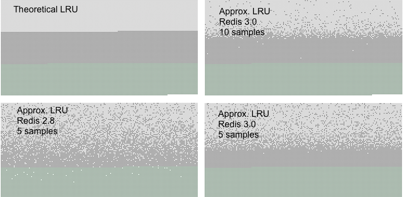

# 前言

作为一台服务器来说，内存并不是无限的，所以总会存在内存耗尽的情况，那么当 `Redis` 服务器的内存耗尽后，如果继续执行请求命令，`Redis` 会如何处理呢？

# 内存回收

使用`Redis` 服务时，很多情况下某些键值对只会在特定的时间内有效，为了防止这种类型的数据一直占有内存，我们可以给键值对设置有效期。`Redis` 中可以通过 `4` 个独立的命令来给一个键设置过期时间：

- `expire key ttl`：将 `key` 值的过期时间设置为 `ttl` **秒**。
- `pexpire key ttl`：将 `key` 值的过期时间设置为 `ttl` **毫秒**。
- `expireat key timestamp`：将 `key` 值的过期时间设置为指定的 `timestamp` **秒数**。
- `pexpireat key timestamp`：将 `key` 值的过期时间设置为指定的 `timestamp` **毫秒数**。

PS：不管使用哪一个命令，最终 `Redis` 底层都是使用 `pexpireat` 命令来实现的。另外，`set` 等命令也可以设置 `key` 的同时加上过期时间，这样可以保证设值和设过期时间的原子性。

设置了有效期后，可以通过 `ttl` 和 `pttl` 两个命令来查询剩余过期时间（如果未设置过期时间则下面两个命令返回 `-1`，如果设置了一个非法的过期时间，则都返回 `-2`）：
- `ttl key` 返回 `key` 剩余过期秒数。
- `pttl key` 返回 `key` 剩余过期的毫秒数。

## 过期策略
如果将一个过期的键删除，我们一般都会有三种策略：
- 定时删除：为每个键设置一个定时器，一旦过期时间到了，则将键删除。这种策略对内存很友好，但是对 `CPU` 不友好，因为每个定时器都会占用一定的 `CPU` 资源。
- 惰性删除：不管键有没有过期都不主动删除，等到每次去获取键时再判断是否过期，如果过期就删除该键，否则返回键对应的值。这种策略对内存不够友好，可能会浪费很多内存。
- 定期扫描：系统每隔一段时间就定期扫描一次，发现过期的键就进行删除。这种策略相对来说是上面两种策略的折中方案，需要注意的是这个定期的频率要结合实际情况掌控好，使用这种方案有一个缺陷就是可能会出现已经过期的键也被返回。

在 `Redis` 当中，其选择的是策略 `2` 和策略 `3` 的综合使用。不过 `Redis` 的定期扫描只会扫描设置了过期时间的键，因为设置了过期时间的键 `Redis` 会单独存储，所以不会出现扫描所有键的情况：
```c
typedef struct redisDb {
    dict *dict; //所有的键值对
    dict *expires; //设置了过期时间的键值对
   dict *blocking_keys; //被阻塞的key,如客户端执行BLPOP等阻塞指令时
   dict *watched_keys; //WATCHED keys
   int id; //Database ID
   //... 省略了其他属性
} redisDb;
```
## 8 种淘汰策略
假如 `Redis` 当中所有的键都没有过期，而且此时内存满了，那么客户端继续执行 `set` 等命令时 `Redis` 会怎么处理呢？`Redis` 当中提供了不同的淘汰策略来处理这种场景。

首先 `Redis` 提供了一个参数 `maxmemory` 来配置 `Redis` 最大使用内存：
```java
maxmemory <bytes>
```
或者也可以通过命令 `config set maxmemory 1GB` 来动态修改。

如果没有设置该参数，那么在 `32` 位的操作系统中 `Redis` 最多使用 `3GB` 内存，而在 `64` 位的操作系统中则不作限制。

`Redis` 中提供了 `8` 种淘汰策略，可以通过参数 `maxmemory-policy` 进行配置：

| 淘汰策略        | 说明                                                         |
| --------------- | ------------------------------------------------------------ |
| volatile-lru    | 根据 LRU 算法删除设置了过期时间的键，直到腾出可用空间。如果没有可删除的键对象，且内存还是不够用时，则报错 |
| allkeys-lru     | 根据 LRU 算法删除所有的键，直到腾出可用空间。如果没有可删除的键对象，且内存还是不够用时，则报错 |
| volatile-lfu    | 根据 LFU 算法删除设置了过期时间的键，直到腾出可用空间。如果没有可删除的键对象，且内存还是不够用时，则报错 |
| allkeys-lfu     | 根据 LFU 算法删除所有的键，直到腾出可用空间。如果没有可删除的键对象，且内存还是不够用时，则报错 |
| volatile-random | 随机删除设置了过期时间的键，直到腾出可用空间。如果没有可删除的键对象，且内存还是不够用时，则报错 |
| allkeys-random  | 随机删除所有键，直到腾出可用空间。如果没有可删除的键对象，且内存还是不够用时，则报错 |
| volatile-ttl    | 根据键值对象的 ttl 属性， 删除最近将要过期数据。 如果没有，则直接报错 |
| noeviction      | 默认策略，不作任何处理，直接报错                             |

PS：淘汰策略也可以直接使用命令 `config set maxmemory-policy <策略>` 来进行动态配置。

## LRU 算法
`LRU` 全称为：`Least Recently Used`。即：最近最长时间未被使用。这个主要针对的是使用时间。

### Redis 改进后的 LRU 算法
在 `Redis` 当中，并没有采用传统的 `LRU` 算法，因为传统的 `LRU` 算法存在 `2` 个问题：
- 需要额外的空间进行存储。
- 可能存在某些 `key` 值使用很频繁，但是最近没被使用，从而被 `LRU` 算法删除。

为了避免以上 `2` 个问题，`Redis` 当中对传统的 `LRU` 算法进行了改造，**通过抽样的方式进行删除**。

配置文件中提供了一个属性 `maxmemory_samples 5`，默认值就是 `5`，表示随机抽取 `5` 个 `key` 值，然后对这 `5` 个 `key` 值按照 `LRU` 算法进行删除，所以很明显，`key` 值越大，删除的准确度越高。

对抽样 `LRU` 算法和传统的 `LRU` 算法，`Redis` 官网当中有一个对比图：
- 浅灰色带是被删除的对象。

- 灰色带是未被删除的对象。

- 绿色是添加的对象。

  

  

左上角第一幅图代表的是传统 `LRU` 算法，可以看到，当抽样数达到 `10` 个（右上角），已经和传统的 `LRU` 算法非常接近了。

### Redis 如何管理热度数据
前面我们讲述字符串对象时，提到了 `redisObject` 对象中存在一个 `lru` 属性：
```c
typedef struct redisObject {
    unsigned type:4;//对象类型（4位=0.5字节）
    unsigned encoding:4;//编码（4位=0.5字节）
    unsigned lru:LRU_BITS;//记录对象最后一次被应用程序访问的时间（24位=3字节）
    int refcount;//引用计数。等于0时表示可以被垃圾回收（32位=4字节）
    void *ptr;//指向底层实际的数据存储结构，如：SDS等(8字节)
} robj;
```
`lru` 属性是创建对象的时候写入，对象被访问到时也会进行更新。正常人的思路就是最后决定要不要删除某一个键肯定是用当前时间戳减去 `lru`，差值最大的就优先被删除。但是 `Redis` 里面并不是这么做的，`Redis` 中维护了一个全局属性 `lru_clock`，这个属性是通过一个全局函数 `serverCron` 每隔 `100` 毫秒执行一次来更新的，记录的是当前 `unix` 时间戳。

最后决定删除的数据是通过 `lru_clock` 减去对象的 `lru` 属性而得出的。那么为什么 `Redis` 要这么做呢？直接取全局时间不是更准确吗？

这是因为这么做可以避免每次更新对象的 `lru` 属性的时候可以直接取全局属性，而不需要去调用系统函数来获取系统时间，从而提升效率（`Redis` 当中有很多这种细节考虑来提升性能，可以说是对性能尽可能的优化到极致）。

不过这里还有一个问题，我们看到，`redisObject` 对象中的 `lru` 属性只有 `24` 位，`24` 位只能存储 `194` 天的时间戳大小，一旦超过 `194` 天之后就会重新从 `0` 开始计算，所以这时候就可能会出现 `redisObject` 对象中的 `lru` 属性大于全局的 `lru_clock` 属性的情况。

正因为如此，所以计算的时候也需要分为 `2` 种情况：
- 当全局 `lruclock` > `lru`，则使用 `lruclock` - `lru` 得到空闲时间。
- 当全局 `lruclock` < `lru`，则使用 `lruclock_max`（即 `194` 天） - `lru` + `lruclock` 得到空闲时间。

需要注意的是，这种计算方式并不能保证抽样的数据中一定能删除空闲时间最长的。这是因为首先超过 `194` 天还不被使用的情况很少，再次只有 `lruclock` 第 `2` 轮继续超过 `lru` 属性时，计算才会出问题。

比如对象 `A` 记录的 `lru` 是 `1` 天，而 `lruclock` 第二轮都到 `10` 天了，这时候就会导致计算结果只有 `10-1=9` 天，实际上应该是 `194+10-1=203` 天。但是这种情况可以说又是更少发生，所以说这种处理方式是可能存在删除不准确的情况，但是本身这种算法就是一种近似的算法，所以并不会有太大影响。

## LFU 算法
`LFU` 全称为：`Least Frequently Used`。即：最近最少频率使用，这个主要针对的是使用频率。这个属性也是记录在`redisObject` 中的 `lru` 属性内。

当我们采用 `LFU` 回收策略时，`lru` 属性的高 `16` 位用来记录访问时间（last decrement time：ldt，单位为分钟），低 `8` 位用来记录访问频率（logistic counter：logc），简称 `counter`。
### 访问频次递增
`LFU` 计数器每个键只有 `8` 位，它能表示的最大值是 `255`，所以 `Redis` 使用的是一种基于概率的对数器来实现 `counter` 的递增。r

给定一个旧的访问频次，当一个键被访问时，`counter` 按以下方式递增：

1. 提取 `0` 和 `1` 之间的随机数 `R`。
2. `counter` - 初始值（默认为 `5`），得到一个基础差值，如果这个差值小于 `0`，则直接取 `0`，为了方便计算，把这个差值记为 `baseval`。 
3. 概率 `P` 计算公式为：`1/(baseval * lfu_log_factor + 1)`。
4. 如果 `R < P` 时，频次进行递增（`counter++`）。

公式中的 `lfu_log_factor` 称之为对数因子，默认是 `10` ，可以通过参数来进行控制：
```java
lfu_log_factor 10
```
下图就是对数因子 `lfu_log_factor` 和频次 `counter` 增长的关系图：


可以看到，当对数因子 `lfu_log_factor` 为 `100` 时，大概是 `10M（1000万）` 次访问才会将访问 `counter` 增长到 `255`，而默认的 `10` 也能支持到 `1M（100万）` 次访问 `counter` 才能达到 `255` 上限，这在大部分场景都是足够满足需求的。

### 访问频次递减
如果访问频次 `counter` 只是一直在递增，那么迟早会全部都到 `255`，也就是说 `counter` 一直递增不能完全反应一个 `key` 的热度的，所以当某一个 `key` 一段时间不被访问之后，`counter` 也需要对应减少。

`counter` 的减少速度由参数 `lfu-decay-time` 进行控制，默认是 `1`，单位是分钟。默认值 `1` 表示：`N` 分钟内没有访问，`counter` 就要减 `N`。

```java
lfu-decay-time 1
```
具体算法如下：

1. 获取当前时间戳，转化为**分钟**后取低 `16` 位（为了方便后续计算，这个值记为 `now`）。
2. 取出对象内的 `lru` 属性中的高 `16` 位（为了方便后续计算，这个值记为 `ldt`）。
3. 当 `lru` > `now` 时，默认为过了一个周期（`16` 位，最大 `65535`)，则取差值 `65535-ldt+now`：当 `lru` <= `now` 时，取差值 `now-ldt`（为了方便后续计算，这个差值记为 `idle_time `）。
4. 取出配置文件中的 `lfu_decay_time` 值，然后计算：`idle_time / lfu_decay_time`（为了方便后续计算，这个值记为`num_periods`）。
5. 最后将`counter`减少：`counter - num_periods`。

看起来这么复杂，其实计算公式就是一句话：取出当前的时间戳和对象中的 `lru` 属性进行对比，计算出当前多久没有被访问到，比如计算得到的结果是 `100` 分钟没有被访问，然后再去除配置参数 `lfu_decay_time`，如果这个配置默认为 `1`也即是 `100/1=100`，代表 `100` 分钟没访问，所以 `counter` 就减少 `100`。

# 总结

本文主要介绍了 `Redis` 过期键的处理策略，以及当服务器内存不够时 `Redis` 的 `8` 种淘汰策略，最后介绍了 `Redis` 中的两种主要的淘汰算法 `LRU` 和 `LFU`。