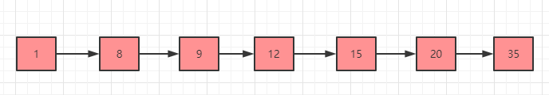
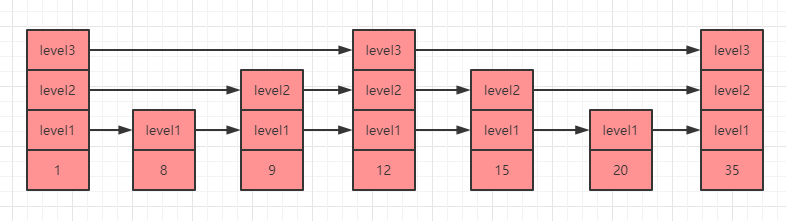

# 前言

在 `Redis` 中，有一种数据类型，当在存储的时候会同时采用两种数据结构来进行分别存储，那么 `Redis` 为什么要这么做呢？这么做会造成同一份数据占用两倍空间吗？

# 五种基本类型之集合对象

`Redis` 中的集合对象是一个包含字符串类型元素的无序集合，集合中元素唯一不可重复。

集合对象的底层数据结构有两种：`intset` 和 `hashtable`。内部通过编码来进行区分：

| 编码属性            | 描述                       | object encoding命令返回值 |
| ------------------- | -------------------------- | ------------------------- |
| OBJ_ENCODING_INTSET | 使用整数集合实现的集合对象 | intset                    |
| OBJ_ENCODING_HT     | 使用字典实现的集合对象     | hashtable                 |

## intset 编码
`intset`（整数集合）可以保存类型为 `int16_t`，`int32_t`，`int64_t` 的整数值，并且保证集合中没有重复元素。
`intset` 数据结构定义如下（源码 `inset.h` 内）：

```c
typedef struct intset {
    uint32_t encoding;//编码方式
    uint32_t length;//当前集合中的元素数量
    int8_t contents[];//集合中具体的元素
} intset;
```
下图就是一个 `intset` 的集合对象存储简图：


### encoding

在 `intset` 内部的 `encoding` 记录了当前整数集合的数据存储类型，主要有三种：

 - `INTSET_ENC_INT16`
此时 `contents[]` 内的每个元素都是一个 `int16_t` 类型的整数值，范围是：-32768 ~ 32767（-2 的 15 次方 ~ 2 的 15 次方 - 1）。
 - `INTSET_ENC_INT32`
此时 `contents[]` 内的每个元素都是一个 `int32_t` 类型的整数值，范围是：-2147483648 ~ 2147483647（-2 的 31 次方 ~ 2 的 31 次方 - 1）。
 - `INTSET_ENC_INT64`
此时 `contents[]` 内的每个元素都是一个 `int64_t` 类型的整数值，范围是：-9223372036854775808 ~ 9223372036854775807（-2 的 63 次方 ~ 2 的 63 次方 - 1）。
### contents[]
`contents[]` 虽然结构的定义上写的是 `int8_t` 类型，但是实际存储类型是由上面的 `encoding` 来决定的。

### 整数集合的升级
假如一开始整数集合中的元素都是 `16` 位的，采用 `int16_t` 类型来存储，此时需要再存储一个 `32` 位的整数，那么就需要对原先的整数集合进行升级，升级之后才能将 `32` 位的整数存储到整数集合内。这就涉及到了整数集合的类型升级，升级过程主要有 `4` 个步骤：

1. 根据新添加元素的类型来扩展底层数组空间的大小，按照升级后现有元素的位数来分配新的空间。
2. 将现有的元素进行类型转换，并将转换类型后的元素从后到前逐个重新放回到数组内。
3. 将新元素放到数组的头部或者尾部（因为触发升级的条件就是当前数组的整数类型无法存储新元素，所以新元素要么比现有元素都大，要么就比现有元素都小）。
4. 将 `encoding` 属性修改为最新的编码，并且同步修改 `length` 属性。

PS：**和字符串对象的编码一样，整数集合的类型一旦发生升级，将会保持编码，无法降级**。
### 升级示例
1. 假如我们有一个集合存储的 `encoding` 是 `int16_t`，内部存储了 `3` 个元素：
   
   
   
2. 这时候需要插入一个整数 `50000`，发现存储不下去，而 `50000` 是一个 `int32_t` 类型整数，所以需要申请新空间，申请空间大小为 `4 * 32 - 48=80`。

   

3. 现在新的数组内要放置 `4` 个元素，原来的数组排在第 `3`，所以需要将升级后的 `3` 移动到 `64-95` 位。

   

4. 继续将升级后的 `2` 移动到 `32-63` 位。

   

5. 继续将升级后的 `1` 移动到 `0-31` 位。

   

6. 然后会将 `50000` 放到 `96-127` 位。

   

7. 最后会修改 `encoding` 和 `length` 属性，修改之后就完成了本次的升级。

## hashtable 编码
`hashtable` 结构在前面讲述哈希对象的时候进行过详细分析，想详细了解的可以[点击这里](https://zhouwenxing.github.io/redis/Redis 中哈希分布不均匀该怎么办)。

## intset 和 hashtable 编码转换
当一个集合满足以下两个条件时，`Redis` 会选择使用 `intset` 编码：
 - 集合对象保存的所有元素都是整数值。
 - 集合对象保存的元素数量小于等于 `512` 个（这个阈值可以通过配置文件 `set-max-intset-entries` 来控制）。
一旦集合中的元素不满足上面两个条件，则会选择使用 `hashtable` 编码。

# 集合对象常用命令

- sadd key member1 member2：将一个或多个元素 `member` 加入到集合 `key` 当中，并返回添加成功的数目，如果元素已存在则被忽略。
- sismember key member：判断元素 `member` 是否存在集合 `key` 中。
- srem key member1 member2：移除集合 `key` 中的元素，不存在的元素会被忽略。
- smove source dest member：将元素 `member` 从集合 `source` 中移动到 `dest` 中，如果 `member` 不存在，则不执行任何操作。
- smembers key：返回集合 `key` 中所有元素。

了解了操作集合对象的常用命令，我们就可以来验证下前面提到的哈希对象的类型和编码了，在测试之前为了防止其他 `key` 值的干扰，我们先执行 `flushall` 命令清空 `Redis` 数据库。

依次执行如下命令：

```java
sadd num 1 2 3  //设置 3 个整数的集合，会使用 intset 编码
type num //查看类型
object encoding num   //查看编码

sadd name 1 2 3 test  //设置 3 个整数和 1 个字符串的集合，会使用 hashtable 编码
type name //查看类型
object encoding name //查看编码 
```

得到如下效果：


可以看到，当设置的元素里面只有整数时，集合使用的就是 `intset` 编码，当设置的元素中含有非整数时，使用的就是 `hashtable` 编码。

# 五种基本类型之有序集合对象

`Redis` 中的有序集合和集合的区别是有序集合中的每个元素都会关联一个 `double` 类型的分数，然后按照分数从小到大的顺序进行排列。换句话说，有序集合的顺序是由我们自己设值的时候通过分数来确定的。

有序集合对象的底层数据结构有两种：`skiplist` 和 `ziplist`。内部同样是通过编码来进行区分：
| 编码属性              | 描述                           | object encoding命令返回值 |
| --------------------- | ------------------------------ | ------------------------- |
| OBJ_ENCODING_SKIPLIST | 使用跳跃表实现的有序集合对象   | skiplist                  |
| OBJ_ENCODING_ZIPLIST  | 使用压缩列表实现的有序集合对象 | ziplist                   |

## skiplist 编码
`skiplist` 即跳跃表，有时候也简称为跳表。使用 `skiplist` 编码的有序集合对象使用了 `zset` 结构来作为底层实现，而`zset` 中同时包含了一个字典和一个跳跃表。

### 跳跃表
跳跃表是一种有序的数据结构，其主要特点是通过在每个节点中维持多个指向其他节点的指针，从而达到快速访问节点的目的。

大部分情况下，跳跃表的效率可以等同于平衡树，但是跳跃表的实现却远远比平衡树的实现简单，所以 `Redis` 选择了使用跳跃表来实现有序集合。

下图是一个普通的有序链表，我们如果想要找到 `35` 这个元素，只能从头开始遍历到尾（**链表中元素不支持随机访问，所以不能用二分查找，而数组中可以通过下标随机访问，所以二分查找一般适用于有序数组**），时间复杂度是 `O(n)`。



那么假如我们可以直接跳到链表的中间，那就可以节省很多资源了，这就是跳表的原理，如下图所示就是一个跳表的数据结构示例：



上图中 `level1`，`level2`，`level3` 就是跳表的层级，每一个 `level` 层级都有一个指向下一个相同 `level` 层级元素的指针，比如上图我们遍历寻找元素 `35` 的时候就有三种方案：

- 第 `1` 种就是执行 `level1` 层级的指针，需要遍历 `7` 次（1->8->9->12->15->20->35）才能找到元素 `35`。
- 第 `2` 种就是执行 `level2` 层级的指针，只需要遍历 `5` 次（1->9->12->15->35）就能找到元素 `35`。
- 第 `3` 种就是执行 `level3` 层级的元素，这时候只需要遍历 `3` 次（1->12->35）就能找到元素 `35` 了，大大提升了效率。
#### skiplist 的存储结构
跳跃表中的每个节点是一个 `zskiplistNode` 节点（源码 `server.h` 内）：
```c
typedef struct zskiplistNode {
    sds ele;//元素
    double score;//分值
    struct zskiplistNode *backward;//后退指针
    struct zskiplistLevel {//层
        struct zskiplistNode *forward;//前进指针
        unsigned long span;//当前节点到下一个节点的跨度（跨越的节点数）
    } level[];
} zskiplistNode;
```
- level（层）

`level` 即跳跃表中的层，其是一个数组，也就是说一个节点的元素可以拥有多个层，即多个指向其他节点的指针，程序可以通过不同层级的指针来选择最快捷的路径提升访问速度。

`level` 是在每次创建新节点的时候根据幂次定律（power law）随机生成的一个介于 `1~32` 之间的数字。

 - `forward`（前进指针）

每个层都会有一个指向链表尾部方向元素的指针，遍历元素的时候需要使用到前进指针。
 - `span`（跨度）

跨度记录了两个节点之间的距离,需要注意的是，如果指向了 `NULL` 的话，则跨度为 `0`。
 - `backward`（后退指针）

和前进指针不一样的是后退指针只有一个，所以每次只能后退至前一个节点（上图中没有画出后退指针）。
 - `ele`（元素）

跳跃表中元素是一个 `sds` 对象（早期版本使用的是 `redisObject` 对象），元素必须唯一不能重复。
 - `score`（分值）

节点的分值是一个 `double` 类型的浮点数，跳跃表中会将节点按照分值按照从小到大的顺序排列，不同节点的分值可以重复。

上面介绍的只是跳跃表中的一个节点，多个 `zskiplistNode` 节点组成了一个 `zskiplist` 对象：
```c
typedef struct zskiplist {
    struct zskiplistNode *header, *tail;//跳跃表的头节点和尾结点指针
    unsigned long length;//跳跃表的节点数
    int level;//所有节点中最大的层数
} zskiplist;
```
到这里你可能以为有序集合就是用这个 `zskiplist` 来实现的，然而实际上 `Redis` 并没有直接使用 `zskiplist` 来实现，而是用 `zset` 对象再次进行了一层包装。
```c
typedef struct zset {
    dict *dict;//字典对象
    zskiplist *zsl;//跳跃表对象
} zset;
```
所以最终，一个有序集合如果使用了 `skiplist` 编码，其数据结构如下图所示：


上图中上面一部分中的字典中的 `key` 就是对应了有序集合中的元素（`member`），`value` 就对应了分值（`score`）。上图中下面一部分中跳跃表整数 `1,8,9,12` 也是对应了元素（`member`），最后一排的 `double` 型数字就是分值（`score`）。
也就是说字典和跳跃表中的数据都指向了我们存储的元素（**两种数据结构最终指向的是同一个地址，所以数据并不会出现冗余存储**），`Redis` 为什么要这么做呢？

### 为什么同时选择使用字典和跳跃表
有序集合直接使用跳跃表或者单独使用字典完全可以独自实现，但是我们想一下，如果单独使用跳跃表来实现，那么虽然可以使用跨度大的指针去遍历元素来找到我们需要的数据，但是其复杂度仍然达到了 `O(logN)`，而字典中获取一个元素的复杂度是 `O(1)`，而如果单独使用字典虽然获取元素很快，但是字典是无序的，所以如果要范围查找就需要对其进行排序，这又是一个耗时的操作，所以 `Redis` 综合了两种数据结构来最大程度的提升性能，这也是 `Redis` 设计的精妙之处。
## ziplist 编码
压缩列表在列表对象和哈希对象都有使用到，想详细了解的可以[点击这里](https://zhouwenxing.github.io/redis/牺牲速度来节省内存，Redis是觉得自己太快了吗)。
## ziplist 和 skiplist 编码转换
当有序集合对象同时满足以下两个条件时，会使用 `ziplist` 编码进行存储：
 - 有序集合对象中保存的元素个数小于 `128` 个（可以通过配置 `zset-max-ziplist-entries` 修改）。
 - 有序集合对象中保存的所有元素的总长度小于 `64` 字节（可以通过配置 `zset-max-ziplist-value` 修改）。

# 有序集合对象常用命令

- zadd key score1 member1 score2 member2：将一个或多个元素（`member`）及其 `score` 添加到有序集合 `key` 中。
- zscore key member：返回有序集合 `key` 中 `member`  成员的 `score`。
- zincrby key num member：将有序集合 `key` 中的 `member` 加上 `num`，`num` 可以为负数。
- zcount key min max：返回有序集合 `key` 中 `score` 值在 `[min,max]` 区间的 `member` 数量。
- zrange key start stop：返回有序集合 `key` 中 `score` **从小到大排列后**在 `[start,stop]` 区间的所有 `member`。
- zrevrange key start stop：返回有序集合 `key` 中 `score` **从大到小排列后**在 `[start,stop]` 区间的所有 `member`。
- zrangebyscore key min max：返回有序集合中按 `score` 从小到大排列后在 `[min,max]` 区间的所有元素。注意这里**默认是闭区间，但是可以在 `max` 和 `min` 的数值前面加上 `(` 或者 `[` 来控制开闭区间**。
- zrevrangebyscore key max min：返回有序集合中按 `score` 从大到小排列后在 `[min,max]` 区间的所有元素。注意这里**默认是闭区间，但是可以在 `max` 和 `min` 的数值前面加上 `(` 或者 `[` 来控制开闭区间**。
- zrank key member：返回有序集合中 `member` 中元素排名（从小到大），返回的结果从 `0` 开始计算。
- zrevrank key member：返回有序集合中 `member` 中元素排名（从大到小），返回的结果从 `0` 开始计算。
- zlexcount key min max：返回有序集合中 `min` 和 `max` 之间的 `member` 数量。注意这个命令中的 `min` 和 `max` 前面**必须加 `(` 或者 `[` 来控制开闭区间**，特殊值 `-` 和 `+` 分别表示负无穷和正无穷。

了解了操作有序集合对象的常用命令，我们就可以来验证下前面提到的哈希对象的类型和编码了，在测试之前为了防止其他 `key` 值的干扰，我们先执行 `flushall` 命令清空 `Redis` 数据库。

在执行命令之前，我们先把配置文件中的参数 `zset-max-ziplist-entries` 修改为 `2`，然后重启 `Redis` 服务。

重启完成之后依次执行如下命令：

```java
zadd name 1 zs 2 lisi //设置 2 个元素会使用 ziplist
type name //查看类型
object encoding name //查看编码 
    
zadd address 1 beijing 2 shanghai 3 guangzhou 4 shenzhen  //设置4个元素则会使用 skiplist编码
type address  //查看类型
object encoding address //查看编码 
```

得到如下效果：


# 总结

本文主要分析了集合对象和有序集合对象的底层存储结构 `intset` 和 `skiplist` 的实现原理，并且重点分析了有序集合如何实现排序以及为何同时使用两种数据结构（字典和跳表）同时进行进行存储数据的原因。
