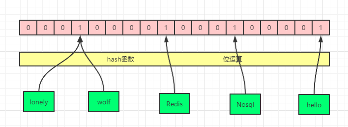

[TOC]

# 前言

当 `Redis` 用作缓存时，其目的就是为了减少数据库访问频率，降低数据库压力，但是假如我们某些数据并不存在于 `Redis` 当中，那么请求还是会直接到达数据库，而一旦在同一时间大量缓存失效或者一个不存在缓存的请求被恶意攻击访问，这些都会导致数据库压力骤增，这又该如何防止呢？
# 缓存雪崩
缓存雪崩指的是 `Redis` 当中的大量缓存在同一时间全部失效，而假如恰巧这一段时间同时又有大量请求被发起，那么就会造成请求直接访问到数据库，可能会把数据库冲垮。

缓存雪崩一般形容的是缓存中没有而数据库中有的数据，而因为时间到期导致请求直达数据库。
## 解决方案
解决缓存雪崩的方法有很多，常用的有以下几种：
- 加锁，保证单线程访问缓存。这样就不会有很多请求同时访问到数据库。
- `key` 值的失效时间不要设置成一样。典型的就是初始化预热数据的时候，将数据存入缓存时可以采用随机时间来确保不会在同一时间有大量缓存失效。
- 内存允许的情况下，可以将缓存设置为永不失效。
# 缓存击穿
缓存击穿和缓存雪崩很类似，区别就是缓存击穿一般指的是单个缓存失效，而同一时间又有很大的并发请求需要访问这个 `key`，从而造成了数据库的压力。
## 解决方案
解决缓存击穿的方法和解决缓存雪崩的方法很类似：
- 加锁，保证单线程访问缓存。这样第一个请求到达数据库后就会重新写入缓存，后续的请求就可以直接读取缓存。
- 内存允许的情况下，可以将缓存设置为永不失效。
# 缓存穿透
缓存穿透和上面两种现象的本质区别就是这时候访问的数据不但在 `Redis` 中不存在，而且在数据库中也不存在，这样如果并发过大就会造成数据源源不断的到达数据库，给数据库造成极大压力。
## 解决方案
对于缓存穿透问题，加锁并不能起到很好地效果，因为本身 `key` 就是不存在，所以即使控制了线程的访问数，但是请求还是会源源不断的到达数据库。

解决缓存穿透问题一般可以采用以下方案配合使用：
- 接口层进行校验，发现非法的 `key` 直接返回。比如数据库中采用的是自增 `id`，那么如果来了一个非整型的 `id` 或者负数 `id` 可以直接返回，或者说如果采用的是 `32` 位 `uuid`，那么发现 `id` 长度不等于 `32` 位也可以直接返回。
- 将不存在的数据也进行缓存，可以直接缓存一个空或者其他约定好的无效 `value`。采用这种方案最好将 `key` 设置一个短期失效时间，否则大量不存在的 `key` 被存储到 `Redis` 中，也会占用大量内存。
# 布隆过滤器（Bloom Filter）
针对上面缓存穿透的解决方案，我们思考一下：假如一个 `key` 可以绕过第 `1` 种方法的校验，而此时有大量的不存在 `key` 被访问（如 `1` 亿个或者 `10` 亿个），那么这时候全部存储到内存中，是不太现实的。

那么有没有一种更好的解决方案呢？这就是我们接下来要介绍的布隆过滤器，布隆过滤器就可以用尽可能小的空间存储尽可能多的数据。
## 什么是布隆过滤器
布隆过滤器（Bloom Filter）是由布隆在 `1970` 年提出的。它实际上是一个很长的二进制向量（位图）和一系列随机映射函数（哈希函数）。

布隆过滤器可以用于检索一个元素是否在一个集合中。它的优点是空间效率和查询时间都比一般的算法要好的多，缺点是有一定的误识别率而且删除困难。

## 位图（Bitmap）
`Redis` 当中有一种数据结构就是位图，布隆过滤器其中重要的实现就是位图的实现，也就是位数组，并且在这个数组中每一个位置只有 `0` 和 `1` 两种状态，每个位置只占用 `1` 个字节，其中 `0` 表示没有元素存在，`1` 表示有元素存在。如下图所示就是一个简单的布隆过滤器示例（**一个 `key` 值经过哈希运算和位运算就可以得出应该落在哪个位置**）：



## 哈希碰撞
上面我们发现，`lonely`和`wolf`落在了同一个位置，这种不同的key值经过哈希运算后得到相同值的现象就称之为**哈希碰撞**。发生哈希碰撞之后再经过位运算，那么最后肯定会落在同一个位置。

如果发生过多的哈希碰撞，就会影响到判断的准确性，所以为了减少哈希碰撞，我们一般会综合考虑以下 `2` 个因素：
- 增大位图数组的大小（位图数组越大，占用的内存越大）。
- 增加哈希函数的次数（同一个 `key` 值经过 `1` 个函数相等了，那么经过 `2` 个或者更多个哈希函数的计算，都得到相等结果的概率就自然会降低了）。

上面两个方法我们需要综合考虑：比如增大位数组，那么就需要消耗更多的空间，而经过越多的哈希计算也会消耗 `cpu` 影响到最终的计算时间，所以位数组到底多大，哈希函数次数又到底需要计算多少次合适需要具体情况具体分析。
## 布隆过滤器的 2 大特点
下图这个就是一个经过了 `2` 次哈希函数得到的布隆过滤器，根据下图我们很容易看到，假如我们的 `Redis` 根本不存在，但是 `Redis` 经过 `2` 次哈希函数之后得到的两个位置已经是 `1` 了（一个是 `wolf` 通过 `f2` 得到，一个是 `Nosql` 通过 `f1` 得到，这就是发生了哈希碰撞，也是布隆过滤器可能存在误判的原因）。


所以通过上面的现象，我们从布隆过滤器的角度可以得出布隆过滤器主要有 `2` 大特点：

1. 如果布隆过滤器判断一个元素存在，那么这个元素**可能存在**。
2. 如果布隆过滤器判断一个元素不存在，那么这个元素**一定不存在**。

而从元素的角度也可以得出 `2` 大特点：

1. 如果元素实际存在，那么布隆过滤器**一定会判断存在**。
2. 如果元素不存在，那么布隆过滤器**可能会判断存在**。

PS：**需要注意的是，如果经过 `N` 次哈希函数，则需要得到的 `N` 个位置都是 `1` 才能判定存在，只要有一个是 `0`，就可以判定为元素不存在布隆过滤器中**。

### fpp
因为布隆过滤器中总是会存在误判率，因为哈希碰撞是不可能百分百避免的。**布隆过滤器对这种误判率称之为假阳性概率**，即：False Positive Probability，简称为 `fpp`。

在实践中使用布隆过滤器时可以自己定义一个 `fpp`，然后就可以根据布隆过滤器的理论计算出需要多少个哈希函数和多大的位数组空间。需要注意的是这个 `fpp` 不能定义为 `100%`，因为无法百分保证不发生哈希碰撞。

## 布隆过滤器的实现（Guava）
在 `Guava` 的包中提供了布隆过滤器的实现，下面就通过 `Guava` 来体会一下布隆过滤器的应用：

1. 引入 `pom` 依赖

```java
<dependency>
   <groupId>com.google.guava</groupId>
   <artifactId>guava</artifactId>
   <version>29.0-jre</version>
</dependency>
```
2. 新建一个测试类 `BloomFilterDemo`：

```java
package com.lonely.wolf.note.redis;

import com.google.common.base.Charsets;
import com.google.common.hash.BloomFilter;
import com.google.common.hash.Funnels;

import java.text.NumberFormat;
import java.util.ArrayList;
import java.util.List;
import java.util.UUID;

public class GuavaBloomFilter {
    private static final int expectedInsertions = 1000000;

    public static void main(String[] args) {
        BloomFilter<String> bloomFilter = BloomFilter.create(Funnels.stringFunnel(Charsets.UTF_8),expectedInsertions);

        List<String> list = new ArrayList<>(expectedInsertions);

        for (int i = 0; i < expectedInsertions; i++) {
            String uuid = UUID.randomUUID().toString();
            bloomFilter.put(uuid);
            list.add(uuid);
        }

        int mightContainNum1 = 0;

        NumberFormat percentFormat =NumberFormat.getPercentInstance();
        percentFormat.setMaximumFractionDigits(2); //最大小数位数

        for (int i=0;i < 500;i++){
            String key = list.get(i);
            if (bloomFilter.mightContain(key)){
                mightContainNum1++;
            }
        }
        System.out.println("【key真实存在的情况】布隆过滤器认为存在的key值数：" + mightContainNum1);
        System.out.println("-----------------------分割线---------------------------------");

        int mightContainNum2 = 0;

        for (int i=0;i < expectedInsertions;i++){
            String key = UUID.randomUUID().toString();
            if (bloomFilter.mightContain(key)){
                mightContainNum2++;
            }
        }

        System.out.println("【key不存在的情况】布隆过滤器认为存在的key值数：" + mightContainNum2);
        System.out.println("【key不存在的情况】布隆过滤器的误判率为：" + percentFormat.format((float)mightContainNum2 / expectedInsertions));
    }
}

```
运行之后的结果为：


第一部分输出的 `mightContainNum1`一定是和 `for` 循环内的值相等，也就是百分百匹配。即满足了原则 `1`：**如果元素实际存在，那么布隆过滤器一定会判断存在**。
第二部分的输出的误判率即 `fpp` 总是在 `3%` 左右，而且随着 `for` 循环的次数越大，越接近 `3%`。即满足了原则 `2`：**如果元素不存在，那么布隆过滤器可能会判断存在**。

这个 `3%` 的误判率是如何来的呢？我们进入创建布隆过滤器的 `create` 方法，发现默认的fpp就是 `0.03`：


对于这个默认的 `3%` 的 `fpp` 需要多大的位数组空间和多少次哈希函数得到的呢？在 `BloomFilter` 类下面有两个 `default` 方法可以获取到位数组空间大小和哈希函数的个数：

- optimalNumOfHashFunctions：获取哈希函数的次数
- optimalNumOfBits：获取位数组大小

`debug` 进去看一下：


得到的结果是 `7298440 bit=0.87M`，然后经过了 `5` 次哈希运算。可以发现这个空间占用是非常小的，`100W` 的 `key` 才占用了 `0.87M`。

PS：[点击这里](https://hur.st/bloomfilter/?n=1000000&p=0.03&m=&k=)可以进入网站计算 `bit` 数组大小和哈希函数个数。

## 布隆过滤器的如何删除
布隆过滤器判断一个元素存在就是判断对应位置是否为 `1` 来确定的，但是如果要删除掉一个元素是不能直接把 `1` 改成 `0` 的，因为这个位置可能存在其他元素，所以如果要支持删除，那我们应该怎么做呢？最简单的做法就是加一个计数器，就是说位数组的每个位如果不存在就是 `0`，存在几个元素就存具体的数字，而不仅仅只是存 `1`，那么这就有一个问题，本来存 `1` 就是一位就可以满足了，但是如果要存具体的数字比如说 `2`，那就需要 `2` 位了，所以**带有计数器的布隆过滤器会占用更大的空间**。
### 带有计数器的布隆过滤器
下面就是一个带有计数器的布隆过滤器示例：

1. `pom` 文件引入依赖：

```java
<dependency>
    <groupId>com.baqend</groupId>
    <artifactId>bloom-filter</artifactId>
    <version>1.0.7</version>
</dependency>
```
2. 新建一个带有计数器的布隆过滤器 `CountingBloomFilter`：

```java
package com.lonelyWolf.redis.bloom;

import orestes.bloomfilter.FilterBuilder;

public class CountingBloomFilter {
    public static void main(String[] args) {
        orestes.bloomfilter.CountingBloomFilter<String> cbf = new FilterBuilder(10000,
                0.01).countingBits(8).buildCountingBloomFilter();

        cbf.add("zhangsan");
        cbf.add("lisi");
        cbf.add("wangwu");
        System.out.println("是否存在王五：" + cbf.contains("wangwu")); //true
        cbf.remove("wangwu");
        System.out.println("是否存在王五：" + cbf.contains("wangwu")); //false
    }
}
```
构建布隆过滤器前面 `2` 个参数一个就是期望的元素数，一个就是 `fpp` 值，后面的 `countingBits` 参数就是计数器占用的大小，**这里传了一个 `8` 位，即最多允许 `255` 次重复，如果不传的话这里默认是 `16` 位大小，即允许 `65535`次重复。**
# 总结
本文主要讲述了使用 `Redis` 存在的三种问题：缓存雪崩，缓存击穿和缓存穿透。并分别对每种问题的解决方案进行了描述，最后着重介绍了缓存穿透的解决方案：布隆过滤器。原生的布隆过滤器不支持删除，但是可以引入一个计数器实现带有计数器的布隆过滤器来实现删除功能，同时在最后也提到了，带有计数器的布隆过滤器会占用更多的空间问题。