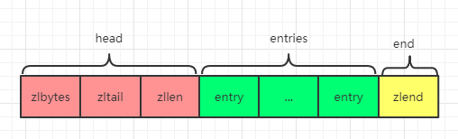

# 前言

正常情况下我们选择使用 `Redis` 就是为了提升查询速度，然而让人意外的是，`Redis` 当中却有一种比较有意思的数据结构，这种数据结构通过牺牲部分读写速度来达到节省内存的目的，这就是 `ziplist`（压缩列表），`Redis` 为什么要这么做呢？难道真的是觉得自己的速度太快了，牺牲一点速度也不影响吗？

# 什么是压缩列表

`ziplist` 是为了节省内存而设计出来的一种数据结构。`ziplist` 是由一系列特殊编码组成的连续内存块的顺序型数据结构，一个 `ziplist` 可以包含任意多个 `entry`，而每一个 `entry` 又可以保存一个字节数组或者一个整数值。

`ziplist` 作为一种列表，其和普通的双端列表，如 `linkedlist` 的最大区别就是 `ziplist` 并不存储前后节点的指针，而 `linkedlist` 一般每个节点都会维护一个指向前置节点和一个指向后置节点的指针。那么 `ziplist` 不维护前后节点的指针，它又是如何寻找前后节点的呢？

`ziplist` 虽然不维护前后节点的指针，但是它却维护了上一个节点的长度和当前节点的长度，然后每次通过长度来计算出前后节点的位置。既然涉及到了计算，那么相对于直接存储指针的方式肯定有性能上的损耗，这就是一种典型的用**时间来换取空间**的做法。因为每次读取前后节点都需要经过计算才能得到前后节点的位置，所以会消耗更多的时间，而在 `Redis` 中，一个指针是占了 `8` 个字节，但是大部分情况下，如果直接存储长度是达不到 `8` 个字节的，所以采用存储长度的设计方式在大部分场景下是可以节省内存空间的。

# ziplist 的存储结构

`ziplist` 的组成结构为：

```properties
<zlbytes> <zltail> <zllen> <entry> <entry> ... <entry> <zlend>
```

其中 `zlbytes`，`zltail`，`zllen` 为 `ziplist` 的 `head` 部分，`entry` 为 `ziplist` 的 `entries` 部分，每一个 `entry` 代表一个数据，最后 `zlend` 表示 `ziplist` 的 `end` 部分，如下图所示：



`ziplist` 中每个属性代表的含义如下表格所示：

| 属性    | 类型     | 长   度 | 说明                                                         |
| ------- | :------- | ------- | ------------------------------------------------------------ |
| zlbytes | uint32_t | 4字节   | 记录压缩列表占用内存字节数（包括本身所占用的 `4` 个字节）。  |
| zltail  | uint32_t | 4字节   | 记录压缩列表尾节点距离压缩列表的起始地址有多少个字节（通过这个值可以计算出尾节点的地址） |
| zllen   | uint16_t | 2字节   | 记录压缩列表中包含的节点数量，当列表值超过可以存储的最大值（`65535`）时，此值固定存储 `65535`（即 `2` 的 `16` 次方 减 `1`），因此此时需要遍历整个压缩列表才能计算出真实节点数。 |
| entry   | 节点     | -       | 压缩列表中的各个节点，长度由存储的实际数据决定。             |
| zlend   | uint8_t  | 1字节   | 特殊字符 `0xFF`（即十进制 `255`），用来标记压缩列表的末端（其他正常的节点没有被标记为 `255` 的，因为 `255` 用来标识末尾，后面可以看到，正常节点都是标记为 `254`）。 |

## entry 存储结构

`ziplist` 的 `head` 和 `end` 存的都是长度和标记，而 `entry` 存储的是具体元素，这又是经过特殊的设计的一种存储格式，每个 `entry` 都以包含两段信息的元数据作为前缀，每一个 `entry` 的组成结构为：

```properties
<prevlen> <encoding> <entry-data>
```

### prevlen

`prevlen` 属性存储了前一个 `entry` 的长度，通过此属性能够从后到前遍历列表。 `prevlen` 属性的长度可能是 `1` 字节也可能是 `5` 字节：

 - 当链表的前一个 `entry` 占用字节数小于 `254`，此时 `prevlen` 只用 `1` 个字节进行表示。
```java
<prevlen from 0 to 253> <encoding> <entry>
```
 - 当链表的前一个 `entry` 占用字节数大于等于 `254`，此时 `prevlen` 用 `5` 个字节来表示，其中第 `1` 个字节的值固定是 `254`（相当于是一个标记，代表后面跟了一个更大的值），后面 `4` 个字节才是真正存储前一个 `entry` 的占用字节数。
```java
0xFE <4 bytes unsigned little endian prevlen> <encoding> <entry>
```
注意：**`1` 个字节完全你能存储 `255` 的大小，之所以只取到 `254` 是因为 `zlend` 就是固定的 `255`，所以 `255` 这个数要用来判断是否是 `ziplist` 的结尾**。

### encoding

`encoding` 属性存储了当前 `entry` 所保存数据的类型以及长度。`encoding` 长度为 `1` 字节，`2` 字节或者 `5` 字节长。前面我们提到，每一个 `entry` 中可以保存字节数组和整数，而 `encoding` 属性的第 `1` 个字节就是用来确定当前 `entry` 存储的是整数还是字节数组。当存储整数时，第 `1` 个字节的前两位总是 `11`，而存储字节数组时，则可能是 `00`、`01` 和 `10` 三种中的一种。

 - 当存储整数时，第 `1` 个字节的前 `2` 位固定为 `11`，其他位则用来记录整数值的类型或者整数值（下表所示的编码中前两位均为 `11`）：

| 编码     | 长度  | entry保存的数据                                              |
| -------- | ----- | ------------------------------------------------------------ |
| 11000000 | 1字节 | int16_t类型整数                                              |
| 11010000 | 1字节 | int32_t类型整数                                              |
| 11100000 | 1字节 | int64_t类型整数                                              |
| 11110000 | 1字节 | 24位有符号整数                                               |
| 11111110 | 1字节 | 8位有符号整数                                                |
| 1111xxxx | 1字节 | `xxxx` 代表区间 `0001-1101`，存储了一个介于 `0-12` 之间的整数，此时 `entry-data` 属性被省略 |

注意：`xxxx` 四位编码范围是 `0000-1111`，但是 `0000`，`1111` 和 `1110` 已经被表格中前面表示的数据类型占用了，所以实际上的范围是 `0001-1101`，此时能保存数据 `1-13`，再减去 `1` 之后范围就是 `0-12`。至于为什么要减去 `1` 是从使用习惯来说 `0` 是一个非常常用的数据，所以才会选择统一减去 `1` 来存储一个 `0-12` 的区间而不是直接存储 `1-13` 的区间。

- 当存储字节数组时，第 `1` 个字节的前 `2` 位为 `00`、`01` 或者 `10`，其他位则用来记录字节数组的长度：

| 编码                                         | 长度  | entry保存的数据                                              |
| -------------------------------------------- | ----- | ------------------------------------------------------------ |
| 00pppppp                                     | 1字节 | 长度小于等于 `63` 字节（`6` 位）的字节数组                   |
| 01pppppp qqqqqqqq                            | 2字节 | 长度小于等于 `16383` 字节（`14` 位）的字节数组               |
| 10000000 qqqqqqqq rrrrrrrr ssssssss tttttttt | 5字节 | 长度小于等于 `2` 的 `32` 次方减 `1` （`32` 位）的字节数组，其中第 `1` 个字节的后 `6` 位设置为 `0`，暂时没有用到，后面的 `32` 位（`4` 个字节）存储了数据 |
### entry-data

`entry-data` 存储的是具体数据。当存储小整数（`0-12`）时，因为 `encoding` 就是数据本身，此时 `entry-data` 部分会被省略，省略了 `entry-data` 部分之后的 `ziplist` 中的 `entry` 结构如下：

 ```properties
 <prevlen> <encoding>
 ```


压缩列表中 `entry` 的数据结构定义如下（源码 `ziplist.c` 文件内），当然实际存储并没有直接使用到这个结构定义，这个结构只是用来接收数据，所以大家了解一下就可以了：

```c
typedef struct zlentry {
    unsigned int prevrawlensize;//存储prevrawlen所占用的字节数
    unsigned int prevrawlen;//存储上一个链表节点需要的字节数
    unsigned int lensize;//存储len所占用的字节数
    unsigned int len;//存储链表当前节点的字节数
    unsigned int headersize;//当前链表节点的头部大小(prevrawlensize + lensize)即非数据域的大小
    unsigned char encoding;//编码方式
    unsigned char *p;//指向当前节点的起始位置(因为列表内的数据也是一个字符串对象)
} zlentry;
```

## ziplist 数据示例

上面讲解了大半天，可能大家都觉得枯燥无味了，也可能会觉得云里雾里，这个没有关系，这些只要心里有个概念，用到的时候再查询对应资料就可以了，并不需要全部记住，接下来让我们一起通过两个例子来体会一下 `ziplist` 到底是如何来组织存储数据的。

下面就是一个压缩列表的存储示例，这个压缩列表里面存储了 `2` 个节点，节点中存储的是整数 `2` 和 `5`：

```c
[0f 00 00 00] [0c 00 00 00] [02 00] [00 f3] [02 f6] [ff]
      |             |          |       |       |     |
   zlbytes        zltail     zllen    "2"     "5"   end
```

1. 第一组 `4` 个字节为 `zlbytes` 部分，`0f` 转成二进制就是 `1111` 也就是 `15`，代表整个 `ziplist` 长度是 `15` 个字节。
2. 第二组 `4` 个字节 `zltail` 部分，`0c` 转成二进制就是 `1100` 也就是 `12`，这里记录的是压缩列表尾节点距离起始地址有多少个字节，也就是就是说 `[02 f6]` 这个尾节点距离起始位置有 `12` 个字节。
3. 第三组 `2` 个字节就是记录了当前 `ziplist` 中 `entry` 的数量，`02` 转成二进制就是 `10`，也就是说当前 `ziplist` 有 `2` 个节点。
4. 第四组 `2` 个字节 `[00 f3]` 就是第一个 `entry`，`00` 表示 `0`，因为这是第 `1` 个节点，所以前一个节点长度为 `0`，`f3` 转成二进制就是 `11110011`，刚好对应了表格中的编码 `1111xxxx`，所以后面四位就是存储了一个 `0-12`位的整数。`0011` 转成十进制就是 `3`，减去 `1` 得到 `2`，所以第一个 `entry` 存储的数据就是 `2`。
5. 第五组 `2` 个字节 `[02 f6]` 就是第二个 `entry`，`02` 即为 `2`，表示前一个节点的长度为 `2`，注意，因为这里算出来的结果是小于 `254`，所以就代表了这里只用到了 `1` 个字节来存储上一个节点的长度（如果等于 `254`，这说明接下来 `4` 个字节才存储的是长度），所以后面的 `f6` 就是当前节点的数据，转换成二进制为 `11110110`，对应了表格中的编码 `1111xxxx`，同样的后四位 `0110` 存储的是真实数据，计算之后得出是5。
6. 最后一组1个字节[ff]转成二进制就是 `11111111`，代表这是整个 `ziplist` 的结尾。

假如这时候又添加了一个 `Hello World` 字符串到列表中，那么就会新增一个 `entry`，如下所示：
```java
[02] [0b] [48 65 6c 6c 6f 20 57 6f 72 6c 64]
```
1. 第一组的 `1` 个字节 `02` 转成十进制就是 `2` ，表示前一个节点（即上面示例中的 `[02 f6]`）长度是 `2`。
2. 第 二组的`2` 个字节 `0b` 转成二进制为 `00001011`，以 `00` 开头，符合编码 `00pppppp`，而除掉最开始的两位 `00`，计算之后得到十进制 `11`，这就说明后面字节数组的长度是 `11`。
3. 第三组刚好是 `11` 个字节，对应了上面的长度，所以这里就是真正存储了 `Hello World` 的字节数组。

## ziplist 连锁更新问题

上面提到 `entry` 中的 `prevlen` 属性可能是 `1` 个字节也可能是 `5` 个字节，那么我们来设想这么一种场景：假设一个 `ziplist` 中，连续多个 `entry` 的长度都是一个接近但是又不到 `254` 的值（介于 `250~253` 之间），那么这时候 `ziplist` 中每个节点都只用了 `1` 个字节来存储上一个节点的长度，假如这时候添加了一个新节点，如 `entry1` ，其长度大于 `254` 个字节，此时 `entry1` 的下一个节点 `entry2` 的 `prelen` 属性就必须要由 `1` 个字节变为 `5` 个字节，也就是需要执行空间重分配，而此时 `entry2` 因为增加了 `4` 个字节，导致长度又大于 `254` 个字节了，那么它的下一个节点 `entry3` 的 `prelen` 属性也会被改变为 `5` 个字节。依此类推，这种产生连续多次空间重分配的现象就称之为**连锁更新**。同样的，不仅仅是新增节点，执行删除节点操作同样可能会发生连锁更新现象。

虽然 `ziplist` 可能会出现这种连锁更新的场景，但是一般如果只是发生在少数几个节点之间，那么并不会严重影响性能，而且这种场景发生的概率也比较低，所以实际使用时不用过于担心。

# 总结

本文主要讲解了 `Redis` 当中的 `ziplist`（压缩列表），一种用时间换取空间的数据结构，在介绍压缩列表存储结构的同时通过一个存储示例来分析了 `ziplist` 是如何存储数据的，最后介绍了 `ziplist` 中可能发生的连锁更新问题。