[TOC]

# 前言

`Redis` 当中提供了许多重要的高级特性，比如发布与订阅，`Lua` 脚本等。`Redis` 当中提供了自增的原子命令，但是假如我们需要同时执行好几个命令的同时又想让这些命令保持原子性，该怎么办呢？

# 发布与订阅
理论上来说通过双端链表就可以实现发布与订阅功能，但是这种通过链表来实现的发布与订阅功能有两个局限性：

# 发布与订阅
发布与订阅功能理论上来说可以直接通过一个双端链表就可以实现了，然而这种通过普通的双端链表来实现的发布与订阅功能有两个局限性：
- 如果生产者生产消息的速度远大于消费者消费消息的速度，那么链表中未消费的消息会占用大量的内存。
- 基于链表实现的消息队列，不支持一对多的消息分发。

因为普通双端链表来实现发布与订阅功能有这两个局限性，故而 `Redis` 当中并没有直接通过双端列表来实现。在 `Redis` 中的发布与订阅可以分为两种类型：**基于频道**和**基于模式**。

## 基于频道的实现
基于频道的实现方式主要通过以下三个命令：
- subscribe channel-1 channel-2：订阅一个或者多个频道。
- unsubscribe channel-1：取消频道的订阅（基于命令操作，界面上无法退订）。
- publish channel-1 message：向频道 `channel-1` 发送消息 `message`。

打开一个客户端 一，输入订阅命令 `subscribe music movie`，表示当前客户端订阅了 `music` 和 `movie` 两个频道的消息：

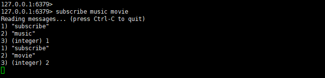

然后再打开一个客户端二，执行以下发布消息命令：

```java
publish movie myCountry //发布消息 myCountry 到 movie 频道
publish music love  //发布消息 love 到 music 频道
publish tv myHome  //发布消息 myHome 到 tv 频道
```

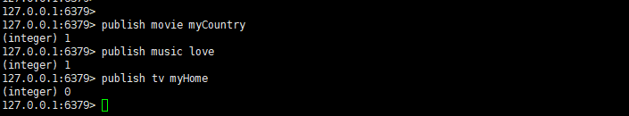

前面两个频道发布之后返回 `1` 就表示当前有 `1` 个客户端订阅了该频道，消息已经发送到这个客户端。

这时候我们再回到之前的客户端一，就会发现客户端一收到了消息 `myCountry` 和 `love` 两条消息，而 `myHome` 这条消息是属于频道 `tv`，客户端一并没有订阅，故而不会收到：


同时，还有以下 `2` 个命令可以查看当前客户端订阅的频道信息

- punsub channels [channel_name] ：查看当前服务器被订阅的频道。不带参数则返回所有频道，后面的参数可以使用通配符 `?` 或者 `*`。
- pubsub numsub channel-1 channel-2：查看指定频道的订阅数。
### 实现原理分析
客户端与其订阅的频道信息被保存在 `redisServer` 对象中的 `pubsub_channels` 属性中。
```c
struct redisServer {
	dict *pubsub_channels;//保存了客户端及其订阅的频道信息
	//... 省略其他信息
};
```
`pubsub_channels` 属性是一个字典，其 `key` 值保存的就是频道名，`value` 是一个链表，链表中保存的就是每个客户端的 `id`，下图就是基于频道订阅的存储结构示意图：

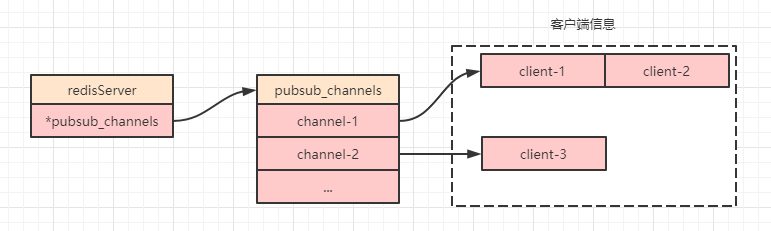

- 订阅
订阅的时候首先会检查字典内是否存在这个频道：如果不存在，则需要为当前频道创建一个字典，同时创建一个链表作为 `value`，并将当前客户端 `id` 放入链表；如果存在，则直接将当前客户端 `id` 放入链表末尾即可。
- 取消订阅
取消订阅的时候需要将客户端 `id` 从对应的链表中移除，如果移除之后链表为空，则需要同时将该频道从字典内删除。
- 发送消息
发送消息时首先会去 `pubsub_channels` 字典内寻找键，如果发现有可以匹配上的键，则会找到对应的链表，进行遍历发送消息。
## 基于模式的实现
基于模式的发布与订阅实现方式主要通过以下三个命令：
- psubscribe pattern-1 pattern-2：订阅一个或者多个模式，模式可以通过通配符 `?` 和 `*` 来表示。
- punsubscribe pattern-1 pattern-1：取消模式的订阅（基于命令操作，界面上无法退订）
- publish channel-1 message ：向频道 `channel-1` 发送消息 `message`。这里和上面基于频道命令是一样的。

打开一个客户端 一，输入订阅命令 `psubscribe m*`，表示当前客户端订阅了所有以 `m` 开头的频道：


然后再打开一个客户端二，执行一下发布消息命令：

```java
publish movie myCountry //发布消息 myCountry 到 movie 频道
publish music love  //发布消息 love 到 music 频道
publish tv myHome  //发布消息 myHome 到 tv 频道
```


前面两个频道发布之后返回 `1` 就表示当前有 `1` 个客户端订阅了该频道（上面基于频道订阅的客户端关闭之后会自动取消订阅），消息已经发送到这个客户端。

这时候我们再回到之前的客户端一，就会发现客户端一收到了消息 `myCountry` 和 `love` 两条消息，因为这两个频道都是以 `m` 开头的，而 `myHome` 这条消息是属于频道 `tv`，客户端一并没有订阅，故而不会收到：


同样的，基于模式的订阅也提供了一个查询命令：

- pubsub numpat：查询当前服务器被订阅模式的数量。
### 实现原理分析
客户端与其订阅的模式信息被保存在 `redisServer` 对象中的 `pubsub_patterns` 属性中。
```c
struct redisServer {
	list pubsub_patterns;//保存了客户端及其订阅的模式信息
	//...省略其他信息
};
```
`pubsub_patterns` 属性是一个列表，其列表内结构（源码 `serer.h` 内）定义如下：
```c
typedef struct pubsubPattern {
    client *client;//订阅模式的客户端
    robj *pattern;//被订阅的模式
} pubsubPattern;
```
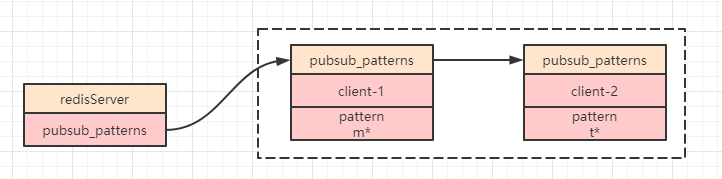
- 订阅
新建一个 `pubsubPattern` 数据结构加入到链表 `pubsub_patterns` 的结尾。
- 取消订阅
从链表中将当前取消订阅的客户端 `pubsubPattern ` 从链表 `pubsub_patterns` 中移除
- 发送消息
此时需要遍历整个链表来寻找能匹配的模式。之所以基于模式场景使用链表是因为模式支持通配符，所以没有办法直接用字典实现。

PS：当基于频道和基于模式两种订阅都存在时，`Redis` 会先去寻找频道字典，再去遍历模式链表进行消息发送。
# Lua 脚本
`Redis` 从 `2.6` 版本开始支持 `Lua` 脚本，为了支持 `Lua` 脚本，`Redis` 在服务器中嵌入了 `Lua` 环境。

使用 `Lua` 脚本最大的好处是 `Redis` 会将整个脚本作为一个整体执行，不会被其他请求打断，可以保持原子性且减少了网络开销。
## Lua 脚本的调用
`Lua` 脚本的执行语法如下：

```java
eval lua-script numkeys key [key ...] arg [arg ...]
```
- eval：执行 `Lua` 脚本的命令。
- lua-script：`Lua` 脚本内容
- numkeys：表示的是 `Lua` 脚本中需要用到多少个 `key`，如果没用到则写 `0`。
- key [key ...]：将 `key` 作为参数按顺序传递到 `Lua` 脚本，`numkeys` 是 `0` 时则可省略。
- arg：`Lua` 脚本中用到的参数，如果没有可省略。

接下来我们执行一个不带任何参数的简单 `Lua` 脚本命令：

```java
`eval "return 'Hello Redis'" 0`
```


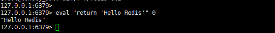

### Lua 脚本中执行 Redis 命令
在 `Lua` 脚本中执行 `Redis` 命令时需要使用以下语法：
```java
redis.call(command, key [key ...] argv [argv…])
```
- command：`Redis` 中的命令，如 `set`、`get` 等。
- key：操作 `Redis` 中的 `key` 值，相当于我们调用方法时的形参。
- param：代表参数，相当于我们调用方法时的实参。

假如我们想执行一个命令 `set name lonely_wolf`，那么利用 `Lua` 脚本则应该这么执行：

```java
eval "return redis.call('set',KEYS[1],ARGV[1])" 1 name lonely_wolf
```

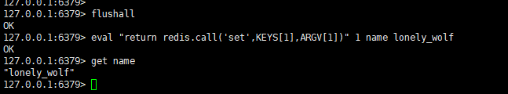


需要注意的是：**`KEYS` 和 `ARGV` 必须要大写，参数的下标从 `1` 开始**。上面命令中 `1` 表示当前需要传递 `1` 个 `key`

### Lua 脚本摘要
有时候如果我们执行的一个 `Lua` 脚本很长的话，那么直接这么调用 `Lua` 脚本的话非常不方便，所以 `Redis` 当中提供了一个命令 `script load` 来为手动给每一个 `Lua` 脚本生成摘要，**这里之所以要说手动的原因是即使我们不使用这个命令，每次调用完 `Lua` 脚本的时候，`Redis` 也会为每个 `Lua` 脚本生成一个摘要**。

其他相关命令：

- `script exists 摘要`：判断一个摘要是否存在。`0` 表示不存在，`1` 表示存在。
- `script flush`：清除所有 `Lua` 脚本缓存。

接下来我们来验证一下，依次执行以下命令：

```java
script load "return redis.call('set',KEYS[1],ARGV[1])"  //给当前 Lua脚本生成摘要，这时候会返回一个摘要
evalsha "c686f316aaf1eb01d5a4de1b0b63cd233010e63d" 1 address china  //相当于执行命令 set address china
get address //获取 adress，确认上面的脚本是否执行成功
script exists "c686f316aaf1eb01d5a4de1b0b63cd233010e63d"  //判断当前摘要的 Lua脚本是否存在
script flush //清除所有 Lua脚本缓存
script exists "c686f316aaf1eb01d5a4de1b0b63cd233010e63d"  //清除之后这里就不存在了
```

执行之后得到如下效果：

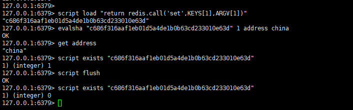

### Lua 脚本文件

当我们的 `Lua` 脚本很长时，直接在命令窗口中写脚本是不直观的，也很难发现语法问题，所以 `Redis` 当中也支持我们直接把先把脚本写入文件中，然后直接调用文件。
比如我们新建一个 `test.lua` 脚本：

```lua
redis.call('set',KEYS[1],ARGV[1])
return redis.call('get',KEYS[1])
```
将文件上传到指定目录之后，执行如下命令：

```java
redis-cli --eval test.lua 1 age , 18 //注意 key 和 arg 参数之间要以逗号隔开，且逗号两边的空格不能省略
```

这时候就可以正常返回 `18`：

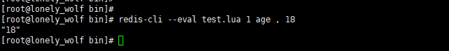

### 脚本异常
我们知道，`Redis` 的指令是单线程执行的，而现在使用了 `Lua` 脚本，我们就可以通过 `Lua` 脚本来实现一些业务逻辑，那么如果 `Lua` 脚本执行超时或者陷入了死循环，这个时候其他的指令就会被阻塞，导致 `Redis` 无法正常使用。这个时候应该如何处理呢？

#### 脚本超时
为了解决 `Lua` 脚本超时的问题，`Redis` 提供了一个超时时间的参数 `lua-time-limit` 来控制 `Lua` 脚本执行的超时时间，单位是毫秒，默认是 `5000` （即 `5` 秒），到达超时时间之后 `Lua` 会自动中断脚本。
#### 脚本陷入死循环
假如脚本陷入了死循环，这时候超时时间就不起作用了，我们来模拟一下：
首先打开客户端一，执行一个死循环的 `lua` 脚本：

```java
eval 'while(true) do end' 0
```


然后打开另一个客户端二，任意执行一个命令：

```java
get name
```
这时候会返回 `busy`，表示当前无法执行这个命令：

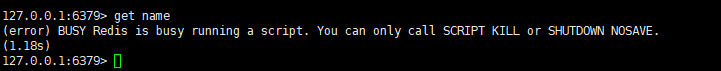

提示 `busy` 之后，又给出了解决方案，我们只能只用 `script kill` 或者 `shutdown nosave` 命令，这两个命令又是做什么用的呢？

- script kill：当脚本陷入死循环之后，执行这个命令可以强制 `Lua` 脚本中断执行。这个脚本的局限性就是当前陷入死循环的 `Lua` 脚本必须没有成功执行过命令。
- shutdown nosave：强制退出 `Lua` 脚本，可以解决 `script kill` 命令的局限性。

接下来让我们在客户端二执行命令 `script kill`，然后再去看看陷入死循环的客户端一的效果：

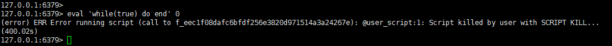

然后我们重新用客户端一执行下面这个 `Lua` 脚本，这个脚本和上面的脚本区别就是这里执行成功了一个 `Redis` 命令之后才开始死循环：

```java
eval "redis.call('set','age','28') while true do end" 0
```
这时候再去客户端二执行 `script kill` 命令，发现无法中止 `Lua` 脚本了：

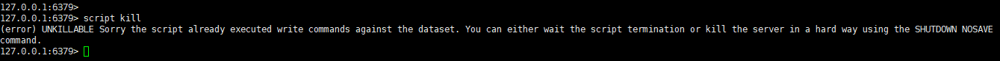

这里不允许直接中断 `Lua` 脚本是因为在死循环前已经有 `Redis` 命令被成功执行了，如果直接中断，那么就会造成数据不一致问题。

在这种场景下，只能通过执行 `shutdown nosave` 命令来强行中断 `Lua` 脚本，这里因为加了 `nosave` 之后不会触发 `Redis` 的持久化，所以当重启 `Redis` 服务之后，可以保证数据的一致性，下图就是执行 `shutdown nosave` 命令之后客户端一的效果图：


#### 为什么可以执行 script kill 命令
`Redis` 当中执行指令是单线程的，那么为什么 `Lua` 脚本陷入死循环之后其他客户端还可以执行 `script kill` 命令呢？

这是因为 `Lua` 脚本引擎提供了钩子（hook）函数，它允许在内部虚拟机执行指令时运行钩子代码，所以 `Redis` 正是利用了这一原理，在执行 `Lua` 脚本之前设置了一个钩子，也就是说 `script kill` 命令是通过钩子（hook）函数来执行的。
# 总结
本文主要介绍了 `Redis` 中的发布订阅功能和 `Lua` 脚本的使用，使用 `Lua` 脚本可以让多个命令原子执行，减少网络开销，但是同时也要注意 `Lua` 脚本引发的死循环问题。