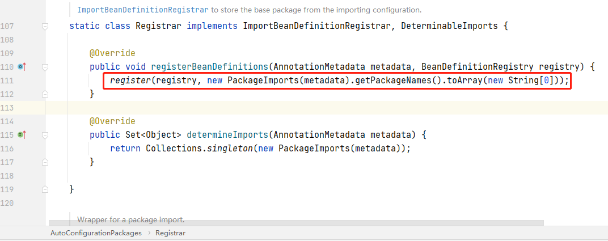

[TOC]

# 前言

如果我们想要使用传统意义上的 `Spring` 应用，那么需要配置大量的 `xml` 文件才可以启动，而且随着项目的越来越庞大，配置文件也会越来越繁琐，这在一定程度上也给开发者带来了困扰，于是 `SpringBoot` 就应运而生了。

# 什么是 SpringBoot

`2012` 年 `10` 月，一个叫 `Mike Youngstrom` 的人在 `Spring Jira` 中创建了一个功能请求，要求在 `Spring Framework` 中支持无容器 `Web` 应用程序体系结构，提出了在主容器引导 `Spring` 容器内配置 `Web` 容器服务。这件事情对 `SpringBoot` 的诞生应该说是起到了一定的推动作用。

`SpringBoot` 的诞生就是为了简化 `Spring` 中繁琐的 `XML` 配置，其本质依然是 `Spring` 框架，使用 `SpringBoot` 之后可以不使用任何 `XML` 配置来启动一个服务，使得我们在使用微服务架构时可以更加快速的建立一个应用。

`SpringBoot` 具有以下特点：

- 创建独立的 `Spring` 应用。
- 直接嵌入了 `Tomcat`、`Jetty` 或 `Undertow`（不需要部署 `WAR` 文件）。
- 提供了固定的配置来简化配置。
- 尽可能地自动配置 `Spring` 和第三方库。
- 提供可用于生产的特性，如度量、运行状况检查和外部化配置。
- 完全不需要生成代码，也不需要 `XML` 配置。

`SpringBoot` 这些特点中最重要的两条就是**约定优于配置**和**自动装配**。

## 约定优于配置

`SpringBoot` 的约定由于配置主要体现在以下方面：

- `maven` 项目的配置文件存放在 `resources` 资源目录下。
- `maven` 项目默认编译后的文件放于 `target` 目录。
- `maven` 项目默认打包成 `jar` 格式。
- 配置文件默认为 `application.yml` 或者 `application.yaml` 或者 `application.properties`。
- 默认通过配置文件 `spring.profiles.active` 来激活配置。

## 自动装配

自动装配则是 `SpringBoot` 的核心，自动装配是如何实现的呢？为什么我们只要引入一个 `starter` 组件依赖就能实现自动装配呢，接下来就让我们一起来探讨下 `SpringBoot` 的自动装配机制。

相比较于传统的 `Spring` 应用，搭建一个 `SpringBoot` 应用，我们只需要引入一个注解 `@SpringBootApplication`，就可以成功运行。

我们就从 `SpringBoot` 的这个注解开始入手，看看这个注解到底替我们做了什么。


前面四个不用说，是定义一个注解所必须的，关键就在于后面三个注解：`@SpringBootConfiguration`，`@EnableAutoConfiguration`，`@ComponentScan`。也就是说我们如果不用 `@SpringBootApplication` 这个复合注解，而是直接使用最下面这三个注解，也能启动一个 `SpringBoot` 应用。

### @SpringBootConfiguration 注解

这个注解我们点进去就可以发现，它实际上就是一个 `@Configuration` 注解，这个注解大家应该很熟悉了，加上这个注解就是为了让当前类作为一个配置类交由 `Spring` 的 `IOC` 容器进行管理，因为前面我们说了，`SpringBoot` 本质上还是 `Spring`，所以原属于 `Spring` 的注解 `@Configuration` 在 `SpringBoot` 中也可以直接应用。

### @ComponentScan 注解

这个注解也很熟悉，用于定义 `Spring` 的扫描路径，等价于在 `xml` 文件中配置 `<context:component-scan>`，假如不配置扫描路径，那么 `Spring` 就会默认扫描当前类所在的包及其子包中的所有标注了 `@Component`，`@Service`，`@Controller` 等注解的类。

### @EnableAutoConfiguration

这个注解才是实现自动装配的关键，点进去之后发现，它是一个由 `@AutoConfigurationPackage` 和 `@Import` 注解组成的复合注解。


`@EnableXXX` 注解也并不是 `SpringBoot` 中的新注解，这种注解在 `Spring 3.1` 版本就开始出现了，比如开启定时任务的注解 `@EnableScheduling` 等。

#### @Import 注解

这个注解比较关键，我们通过一个例子来说明一下。

定义一个普通类 `TestImport`，不加任何注解，我们知道这个时候这个类并不会被 `Spring` 扫描到，也就是无法直接注入这个类：

```java
public class TestImport {
}
```

现实开发中，假如就有这种情况，定义好了一个类，即使加上了注解，也不能保证这个类一定被 `Spring` 扫描到，这个时候该怎么做呢？

这时候我们可以再定义一个类 `MyConfiguration`，保证这个类可以被 `Spring` 扫描到，然后通过加上 `@Import` 注解来导入 `TestImport` 类，这时候就可以直接注入 `TestImport` 了：

```java
@Configuration
@Import(TestImport.class)
public class MyConfiguration {
}
```

所以这里的 `@Import` 注解其实就是为了去导入一个类 `AutoConfigurationImportSelector`，接下来我们需要分析一下这个类。

##### AutoConfigurationImportSelector 类

进入这个类之后，有一个方法，这个方法很好理解，首先就是看一下 `AnnotationMetadata`（注解的元信息），有没有数据，没有就说明没导入直接返回一个空数组，否则就调用 `getAutoConfigurationEntry` 方法：


进入 `getAutoConfigurationEntry` 方法：


这个方法里面就是通过调用 `getCandidateConfigurations` 来获取候选的 `Bean`，并将其存为一个集合，最后经过去重，校验等一系列操作之后，被封装成 `AutoConfigurationEntry` 对象返回。

继续进入 `getCandidateConfigurations` 方法，这时候就几乎看到输光了：


这里面再继续点击去就没必要了，看错误提示大概就知道了，`loadFactoryNames` 方法会去 `META-INF/spring.factories` 文件中根据 `EnableAutoConfiguration` 的全限定类名获取到我们需要导入的类，而 `EnableAutoConfiguration` 类的全限定类名为 `org.springframework.boot.autoconfigure.EnableAutoConfiguration`，那么就让我们打开这个文件看一下：


可以看到，这个文件中配置了大量的需要自动装配的类，当我们启动 `SpringBoot` 项目的时候，`SpringBoot` 会扫描所有 `jar` 包下面的 `META-INF/spring.factories` 文件，并根据 `key` 值进行读取，最后在经过去重等一些列操作得到了需要自动装配的类。

需要注意的是：上图中的 `spring.factories` 文件是在 `spring-boot-autoconfigure` 包下面，这个包记录了官方提供的 `stater` 中几乎所有需要的自动装配类，所以并不是每一个官方的 `starter` 下都会有 `spring.factories` 文件。

#### 谈谈 SPI 机制

通过 `SpringFactoriesLoader` 来读取配置文件 `spring.factories` 中的配置文件的这种方式是一种 `SPI` 的思想。那么什么是 `SPI` 呢？

SPI，Service Provider Interface。即：接口服务的提供者。就是说我们应该面向接口（抽象）编程，而不是面向具体的实现来编程，这样一旦我们需要切换到当前接口的其他实现就无需修改代码。

在 `Java` 中，数据库驱动就使用到了 `SPI` 技术，每次我们只需要引入数据库驱动就能被加载的原因就是因为使用了 `SPI` 技术。

打开 `DriverManager` 类，其初始化驱动的代码如下：

 

进入 `ServiceLoader` 方法，发现其内部定义了一个变量：

```java
private static final String PREFIX = "META-INF/services/";
```

这个变量在下面加载驱动的时候有用到，下图中的 `service` 即 `java.sql.Driver`：


所以就是说，在数据库驱动的 `jar` 包下面的 `META-INF/services/` 下有一个文件 `java.sql.Driver`，里面记录了当前需要加载的驱动，我们打开这个文件可以看到里面记录的就是驱动的全限定类名：


#### @AutoConfigurationPackage 注解

从这个注解继续点进去之后可以发现，它最终还是一个 `@Import` 注解：


这个时候它导入了一个 `AutoConfigurationPackages` 的内部类 `Registrar`， 而这个类其实作用就是读取到我们在最外层的 `@SpringBootApplication` 注解中配置的扫描路径（没有配置则默认当前包下），然后把扫描路径下面的类都加到数组中返回。



# 手写一个 stater 组件 

了解完自动装配的原理，接下来就可以动手写一个自己的 `starter` 组件了。

## starter 组件命名规则

`SpringBoot` 官方的建议是，如果是我们开发者自己开发的 `starter` 组件（即属于第三方组件），那么命名规范是`{name}-spring-boot-starter`，而如果是 `SpringBoot` 官方自己开发的组件，则命名为 `spring-boot-starter`-{name}`。

当然，这只是一个建议，如果非不按这个规则也没什么问题，但是为了更好的识别区分，还是建议按照这个规则来命名。

## 手写 starter

写一个非常简单的组件，这个组件只做一件事，那就是实现 `fastjson` 序列化。

- 新建一个 `SpringBoot` 应用 `lonelyWolf-spring-boot-starter`。
- 修改 `pom` 文件，并新增 `fastjson` 依赖（省略了部分属性）。

```xml
<parent>
    <groupId>org.springframework.boot</groupId>
    <artifactId>spring-boot-starter-parent</artifactId>
    <version>2.4.0</version>
    <relativePath/>
</parent>

<groupId>com.lonely.wolf.note</groupId>
<artifactId>lonelyWolf-spring-boot-starter</artifactId>
<version>1.0.0-SNAPSHOT</version>

<dependencies>
    <dependency>
      <groupId>org.springframework.boot</groupId>
      <artifactId>spring-boot-starter</artifactId>
    </dependency>

    <dependency>
      <groupId>com.alibaba</groupId>
      <artifactId>fastjson</artifactId>
      <version>1.2.72</version>
    </dependency>
</dependencies>
```

- 新建一个序列化类 `JsonSerial` 类来实现 `fastjson` 序列化。

```java
public class JsonSerial {
    public <T> String serial(T t){
        return JSONObject.toJSONString(t);
    }
}
```

- 新建一个自动装配类 `MyAutoConfiguration` 来生成 `JsonSerial`。

```java
@Configuration
public class MyAutoConfiguration {

    @Bean
    public JsonSerial jsonSerial(){
        return new JsonSerial();
    }
}
```

- 完成之后将其打成一个 `jar` 包，然后再另一个 `SpringBoot` 中引入依赖：

```xml
 <dependency>
     <groupId>com.lonely.wolf.note</groupId>
     <artifactId>lonelyWolf-spring-boot-starter</artifactId>
     <version>1.0.0-SNAPSHOT</version>
</dependency>
```

- 这时候在这个 `SpringBoot` 应用中直接注入 `JsonSerial` 对象会直接提示找不到这个对象：


这是因为 `MyAutoConfiguration` 这个类是在外部 `jar` 包之中，并没有被扫描到（需要注意的是，**假如刚好 `jar` 包的路径和扫描的路径相同，那么是可以被扫描到的，但是在实际项目中，我们不可能确保引入的 `jar` 包能被扫描到，所以才需要通过配置的方式来导入**），所以我们还需要导入这个外部配置类。

- 在 `resources` 目录下新建一个文件 `META-INF/spring.factories` 文件，文件内新增一个如下配置：

```properties
org.springframework.boot.autoconfigure.EnableAutoConfiguration=\
com.lonely.wolf.note.MyAutoConfiguration
```

这样，`SpringBoot` 就会将 `MyAutoConfiguration` 进行管理，从而得到 `JsonSerial` 对象，这样就可以直接注入使用了。

# 总结

本文从为什么要有 `SpringBoot`，以及 `SpringBoot` 到底方便在哪里开始入手，逐步分析了 `SpringBoot` 自动装配的原理，最后手写了一个简单的 `start` 组件，通过实战来体会了 `SpringBoot` 自动装配机制的奥妙。

