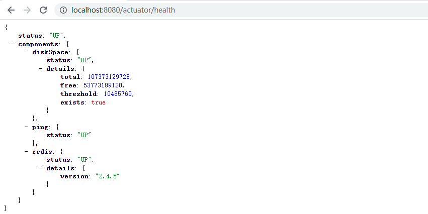
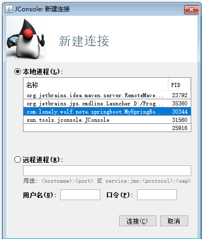

[TOC]

# 前言

任何一个服务如果没有监控，那就是两眼一抹黑，无法知道当前服务的运行情况，也就无法对可能出现的异常状况进行很好的处理，所以对任意一个服务来说，监控都是必不可少的。

就目前而言，大部分微服务应用都是基于 `SpringBoot` 来构建，所以了解 `SpringBoot` 的监控特性是非常有必要的，而 `SpringBoot` 也提供了一些特性来帮助我们监控应用。

本文基于 `SpringBoot 2.3.1.RELEASE` 版本演示。

# SpringBoot 监控

`SpringBoot` 中的监控可以分为 `HTTP` 端点和 `JMX` 两种方式来监控当前应用的运行状况和指标收集

## HTTP Endpoints 监控

执行器端点允许您监视应用程序并与之交互。`SpringBoot` 包括许多内置的端点，并允许我们添加自己的端点。可以通过 `HTTP` 或 `JMX` 启用或禁用每个端点，并公开（使其可以远程访问）。每个端点都有一个唯一的 `id`，访问时可以通过如下地址进行访问：`http:ip:port/{id}`（SpringBoot 1.x ），而在 `SpringBoot 2.x` 版本中，默认新增了一个 `/actuator` 作为基本路，访问地址则对应为 :`http:ip:port/actuator/{id}`。

使用 `HTTP` 监控非常简单，在 `SpringBoot` 项目中，引入如下依赖：

```xml
<dependencies>
    <dependency>
        <groupId>org.springframework.boot</groupId>
        <artifactId>spring-boot-starter-actuator</artifactId>
    </dependency>
</dependencies>
```

默认就可以通过地址 `http:localhost:8080/actuator/health`，访问之后得到如下结果：


`SpringBoot` 中提供了非常多的默认端点监控，但是出于安全考虑，默认情况下有些端点并不是开启状态，如 `shutdown` 端点就是默认关闭的。

### 内置端点

`SpringBoot` 中默认提供的常用内置端点如下：

| 端点 id          | 描述                                                         |
| ---------------- | ------------------------------------------------------------ |
| auditevents      | 公开当前应用程序的审计事件信息，需要 AuditEventRepository Bean。 |
| beans            | 展示程序中所有的 Bean。                                      |
| caches           | 公开可用的缓存。                                             |
| conditions       | 展示配置类或者自动装配类中的条件，以及它们匹配或者不匹配的原因。 |
| configprops      | 显示所有 @ConfigurationProperties 中的配置属性。             |
| env              | 显示 ConfigurableEnvironment 中的所有环境。                  |
| health           | 显示应用程序运行状况信息。                                   |
| httptrace        | 显示 HTTP 跟踪信息（默认情况下统计最近 100 次请求），需要 HttpTraceRepository Bean。 |
| info             | 显示任意程序信息。                                           |
| integrationgraph | 显示 Spring 集成图，需要依赖 spring-integration-core。       |
| loggers          | 展示和修改应用中的 loggers 配置。                            |
| metrics          | 展示当前应用监控指标的度量。                                 |
| mappings         | 展示所有 @RequestMapping 路径。                              |
| scheduledtasks   | 展示应用中的所有定时任务信息。                               |
| sessions         | 允许从 Spring 会话支持的会话存储中检索和删除用户会话。需要使用基于 Spring Session web应用程序。 |
| shutdown         | 优雅的关闭程序，默认禁止了该端点的访问。                     |

虽然说这里的大部分端点都是默认开启的，但是默认暴露（允许对外访问）的只有 `health` 和 `info` 端点，所以如果需要允许端点对外暴露，可以通过如下配置（如果想要暴露所有的端点，则可以直接配置 `"*"` ）：

```yaml
management:
  endpoints:
    web:
      exposure:
        include: [health,info,mappings] //或者直接配置 "*"
```

另外，开启或禁用某一个端点，也可以通过通过如下配置进行动态控制：

```properties
management.endpoint.<id>.enabled=true
```

接下来我们挑选几个重点的端点来介绍一下。

#### health 端点

`health` 断点默认只是展示当前应用健康信息，但是我们可以通过另一个配置打开详细信息，这样不仅仅会监控当前应用，还会监控与当前应用相关的其他第三方应用，如 `Redis`。

```yaml
management:
  endpoint:
    health:
      show-details: always
```

这个配置打开之后，我们连接上 `Redis` 之后再次访问 `health` 端点，就可以展示 `Redis` 服务的健康信息了：



#### loggers 端点

访问 `http://localhost:8080/actuator/loggers` 可以查看当前应用的日志级别等信息：


这里面本身并不特别，但是有一个功能却非常有用，比如我们生产环境日志级别一般都是 `info`，但是现在有一个 `bug` 通过 `info` 级别无法排查，那么我们就可以临时修改 `log` 级别。

比如上图中的 `ROOT` 节点是 `info` 级别，那么我们可以通过 `postman` 等工具来发一个 `post` 请求修改日志级别。


修改之后就会发现，日志由原来的 `info` 变成了 `debug`：


#### metrics 端点

`metrics` 是一个非常重要的监控端点，其监控内容覆盖了 `JVM` 内存、堆、类加载、处理器和 `tomcat` 容器等一些重要指标：


可以看到这里面包含了非常多的指标，任意访问一个指标就可以查看对应的指标信息：


### 自定义监控端点

通过上面的介绍，可以看到 `SpringBoot` 提供的监控非常强大，但是就算再全面的监控也不可能满足所有人的需求，所以 `SpringBoot` 也支持自定义监控端点。

#### 自定义监控端点常用注解

自定义一个监控端点主要有如下常用注解：

- @Endpoint：定义一个监控端点，同时支持 `HTTP` 和 `JMX` 两种方式。
- @WebEndpoint：定义一个监控端点，只支持 `HTTP` 方式。
- @JmxEndpoint：定义一个监控端点，只支持 `JMX` 方式。

以上三个注解作用在类上，表示当前类是一个监控端点，另外还有一些注解会用在方法和参数上：

- @ReadOperation：作用在方法上，可用来返回端点展示的信息（通过 `Get` 方法请求）。
- @WriteOperation：作用在方法上，可用来修改端点展示的信息（通过 `Post` 方法请求）。
- @DeleteOperation：作用在方法上，可用来删除对应端点信息（通过 `Delete` 方法请求）。
- @Selector：作用在参数上，用来定位一个端点的具体指标路由。

#### 来，一起写一个自己的监控端点

- 定义一个类，并使用 `@Endpoint` 注解标注标识，同时定义几个方法用 `@ReadOperation` 和 `@WriteOperation` 注解来标注：

```java
@Endpoint(id="myEndpoint")
@Component
public class MyEndpoint {
    private String STATUS = "up";
    private String DETAIL = "一切正常";

//    @ReadOperation
//    public String test1(){
//        return "wolf";
//    }

//    @ReadOperation
//    public Map<String,String> test2(){
//        Map<String,String> map = new HashMap();
//        map.put("status","up");
//        return map;
//    }

    @ReadOperation
    public JSONObject test3(){
        JSONObject jsonObject= new JSONObject();
        jsonObject.put("status",STATUS);
        jsonObject.put("detail",DETAIL);
        return jsonObject;
    }

    @ReadOperation
    public JSONObject test3_1(@Selector String name){
        JSONObject jsonObject= new JSONObject();
        if ("status".equals(name)){
            jsonObject.put("status",STATUS);
        }else if ("detail".equals(name)){
            jsonObject.put("detail",DETAIL);
        }
        return jsonObject;
    }

    @WriteOperation//动态修改指标
    public void test4(@Selector String name,@Nullable String value){
        if (!StringUtils.isEmpty(value)){
            if ("status".equals(name)){
                STATUS = value;
            }else if ("detail".equals(name)){
                DETAIL = value;
            }
        }
    }
}
```

1. `@Component` 注解表示将该类交给 `Spring` 进行管理，或者也可以再定义一个 `Configuration` 类来加载该 `Bean` 也可以，当然，如果我们需要提供给第三方使用，如果无法保证当前包名被扫描，则需要使用 `SpringBoot` 的自动装配机制将该类进行管理。
2. `@ReadOperation` 方法可以返回 `String` 或者 `JSONObject` 或者 `Map` 集合等。
3. 参数上加了 `@Selector` 注解则表示访问断端点的时候可以直接访问子节点。

完成了上面的类，启动 `SpringBoot` 应用，接下来就可以直接通过 `http://localhost:8080/actuator/myEndpoint` 进行访问了：


同时，因为 `test3_1` 方法使用了 `@Selector` 注解，所以我们可以通过这个方法每一个指标的明细：


而带有 `@WriteOperation` 注解的方法可以用来修改指标，这个方法需要用 `post` 进行访问，访问的参数可以直接使用字符串传参，也可以直接使用 `json` 进行传参，修改之后再次查看就可以发现指标已经被动态修改：


## JMX 监控

`JMX` 全称为 Java Management Extensions，即 `Java` 管理扩展。它提供了对 `Java` 应用程序和 `JVM` 的监控管理。通过`JMX` 我们可以监控服务器中各种资源的使用情况以及线程，内存和 `CPU` 等使用情况。

打开 `jdk` 下提供的工具 `jConsole`：



打开之后这里会监控到我们已经启动的应用，双击进入：


### 如何手动注册一个 JMX MBean

- 定义一个接口 `SystemInfoMBean`（注意名字必须要用 `MBean` 结尾）：

```java
public interface SystemInfoMBean {
    int getCpuCore();
    long getTotalMemory();
    void shutdown();
}
```

- 再定义一个类实现 `SystemInfoMBean` 接口，实现类的明明方式为接口名去掉 `MBean`：

```java
public class SystemInfo implements SystemInfoMBean {
    @Override
    public int getCpuCore() {
        return Runtime.getRuntime().availableProcessors();
    }
    @Override
    public long getTotalMemory() {
        return Runtime.getRuntime().totalMemory();
    }

    @Override
    public void shutdown() {
        System.exit(0);
    }
}
```

- 最后就是需要将该实现类进行注册：

```java
public class JmxRegisterMain {
    public static void main(String[] args) throws NotCompliantMBeanException, InstanceAlreadyExistsException, MBeanRegistrationException, MalformedObjectNameException, IOException {
        MBeanServer mBeanServer= ManagementFactory.getPlatformMBeanServer();
        ObjectName objectName=new ObjectName("com.lonely.wolf.note.springboot.actuator.jmx:type=SystemInfo");
        SystemInfo SystemInfo =new SystemInfo();
        mBeanServer.registerMBean(SystemInfo,objectName);//注册
        System.in.read();//防止程序结束
    }
}
```

运行该 `main` 方法，再打开 `jConsole` 就可以看到成功注册了一个 `MBean`：


同样的，`Spring` 当中只要我们使用了 `@@Endpoint` 或者 `@JmxEndpoint` 注解，就会自动帮我们注册一个 `MBean`，其原理也是利用了自动装配机制。

# 其他监控

除了 `SpringBoot` 自带的监控之外，也有其他第三方开源的强大监控系统，如 `Prometheus`，而且 `SpringBoot` 也将其进行了集成，使用 `Prometheus` 时只需要引入如下 `jar` 包即可：

```xml
<dependency>
    <groupId>io.micrometer</groupId>
    <artifactId>micrometer-registry-prometheus</artifactId>
</dependency>
```

当然，如果使用 `Prometheus` 的话需要单独安装，而且一般会选择 `Prometheus` + `Grafana` 来共同实现一个监控平台，在这里就不做过多介绍，如果感兴趣的朋友可以自己去了解下这两种软件的使用。

# 总结

本文主要讲述了 `Spring Boot actuator` 的使用，并分别介绍了其中两种监控类型 `HTTP` 和 `JMX`，最后通过一个例子来实现了自定义的端点，同时也实现了手动注册一个 `MBean` 的方法。